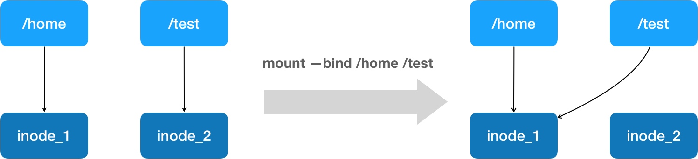
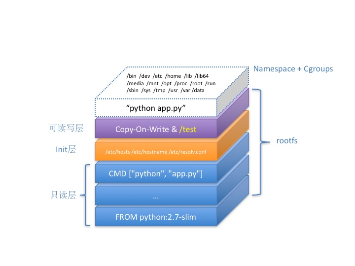

## 使用 Docker

+ Dockerfile

```docker
# 使用官方提供的 Python 开发镜像作为基础镜像
FROM python:2.7-slim

# 将工作目录切换为 /app
WORKDIR /app

# 将当前目录下的所有内容复制到 /app 下
ADD . /app

# 使用 pip 命令安装这个应用所需要的依赖
RUN pip install --trusted-host pypi.python.org -r requirements.txt

# 允许外界访问容器的 80 端口
EXPOSE 80

# 设置环境变量
ENV NAME World

# 设置容器进程为：python app.py，即：这个 Python 应用的启动命令
CMD ["python", "app.py"]
```

+ `app.py`

```py
from flask import Flask
import socket
import os

app = Flask(__name__)

@app.route('/')
def hello():
    html = "<h3>Hello {name}!</h3>" \
           "<b>Hostname:</b> {hostname}<br/>"
    return html.format(name=os.getenv("NAME", "world"), hostname=socket.gethostname())

if __name__ == "__main__":
    app.run(host='0.0.0.0', port=80)
```

+ `requirements.txt`

```
Flask
```


Dockerfile 的设计思想，是使用一些标准的原语（即大写高亮的词语），描述我们所要构建的 Docker 镜像。并且这些原语，都是按顺序处理的。

在使用 Dockerfile 时，你可能还会看到一个叫作 ENTRYPOINT 的原语。实际上，它和 CMD 都是 Docker 容器进程启动所必需的参数，完整执行格式是：“ENTRYPOINT CMD”。

默认情况下，Docker 会为你提供一个隐含的 ENTRYPOINT，即：/bin/sh -c。所以，在不指定 ENTRYPOINT 时，比如在我们这个例子里，实际上运行在容器里的完整进程是：/bin/sh -c “python app.py”，即 CMD 的内容就是 ENTRYPOINT 的参数。

需要注意的是，Dockerfile 中的每个原语执行后，都会生成一个对应的镜像层。即使原语本身并没有明显地修改文件的操作（比如，ENV 原语），它对应的层也会存在。只不过在外界看来，这个层是空的。

```sh
docker build -t helloworld .
docker image ls
docker run -p 4000:80 helloworld
docker ps
curl http://localhost:4000

docker login
docker tag helloworld geektime/helloworld:v1
docker push geektime/helloworld:v1


docker exec -it 4ddf4638572d /bin/sh
# 在容器内部新建了一个文件
root@4ddf4638572d:/app# touch test.txt
root@4ddf4638572d:/app# exit

# 将这个新建的文件提交到镜像中保存
docker commit 4ddf4638572d geektime/helloworld:v2

docker push geektime/helloworld:v2
```

### dokcer exec

```sh
# 获取 当前正在运行的 Docker 容器的进程号（PID）
docker inspect --format '{{ .State.Pid }}'  4ddf4638572d
# 25686

# 可以通过查看宿主机的 proc 文件，看到这个 25686 进程的所有 Namespace 对应的文件：
ls -l  /proc/25686/ns
total 0
lrwxrwxrwx 1 root root 0 Aug 13 14:05 cgroup -> cgroup:[4026531835]
lrwxrwxrwx 1 root root 0 Aug 13 14:05 ipc -> ipc:[4026532278]
lrwxrwxrwx 1 root root 0 Aug 13 14:05 mnt -> mnt:[4026532276]
lrwxrwxrwx 1 root root 0 Aug 13 14:05 net -> net:[4026532281]
lrwxrwxrwx 1 root root 0 Aug 13 14:05 pid -> pid:[4026532279]
lrwxrwxrwx 1 root root 0 Aug 13 14:05 pid_for_children -> pid:[4026532279]
lrwxrwxrwx 1 root root 0 Aug 13 14:05 user -> user:[4026531837]
lrwxrwxrwx 1 root root 0 Aug 13 14:05 uts -> uts:[4026532277]
```

一个进程，可以选择加入到某个进程已有的 Namespace 当中，从而达到“进入”这个进程所在容器的目的，这正是 docker exec 的实现原理。

而这个操作所依赖的，乃是一个名叫 setns() 的 Linux 系统调用。

```sh
# 一旦一个进程加入到了另一个 Namespace 当中，在宿主机的 Namespace 文件上，也会有所体现。

# 在宿主机上
ps aux | grep /bin/bash
root     28499  0.0  0.0 19944  3612 pts/0    S    14:15   0:00 /bin/bash

ls -l /proc/28499/ns/net
lrwxrwxrwx 1 root root 0 Aug 13 14:18 /proc/28499/ns/net -> net:[4026532281]

ls -l  /proc/25686/ns/net
lrwxrwxrwx 1 root root 0 Aug 13 14:05 /proc/25686/ns/net -> net:[4026532281]

# 两个进程，共享了这个名叫 net:[4026532281] 的 Network Namespace。


# Docker 还专门提供了一个参数，可以让你启动一个容器并“加入”到另一个容器的 Network Namespace 里，这个参数就是 -net

docker run -it --net container:4ddf4638572d busybox ifconfig

# –net=host
# 这个容器拆除了 Network Namespace 的“隔离墙”，所以，它会和宿主机上的其他普通进程一样，直接共享宿主机的网络栈。这就为容器直接操作和使用宿主机网络提供了一个渠道。
```

### docker commit

在容器运行起来后，把最上层的“可读写层”，加上原先容器镜像的只读层，打包组成了一个新的镜像。当然，下面这些只读层在宿主机上是共享的，不会占用额外的空间。

### Registry

+ [Docker Registry](https://docs.docker.com/registry/)
+ [VMware 的 Harbor 项目](https://github.com/goharbor/harbor)

### docker volume

Volume 机制，允许你将宿主机上指定的目录或者文件，挂载到容器里面进行读取和修改操作。

#### 把一个宿主机上的目录或者文件，挂载到容器里面去

```sh
# 把一个宿主机的目录挂载进了容器的 /test 目录
docker run -v /test ... # 默认在宿主机上创建一个临时目录 /var/lib/docker/volumes/[VOLUME_ID]/_data
docker run -v /home:/test ... # 把宿主机的 /home 目录挂载到容器的 /test 目录上
```

我们只需要在 rootfs 准备好之后，在执行 chroot 之前，把 Volume 指定的宿主机目录（比如 /home 目录），挂载到指定的容器目录（比如 /test 目录）在宿主机上对应的目录（即 /var/lib/docker/aufs/mnt/[可读写层 ID]/test）上，这个 Volume 的挂载工作就完成了。

更重要的是，由于执行这个挂载操作时，“容器进程”已经创建了，也就意味着此时 Mount Namespace 已经开启了。所以，这个挂载事件只在这个容器里可见。你在宿主机上，是看不见容器内部的这个挂载点的。这就保证了容器的隔离性不会被 Volume 打破。

> 注意：这里提到的 " 容器进程 "，是 Docker 创建的一个容器初始化进程 (dockerinit)，而不是应用进程 (ENTRYPOINT + CMD)。dockerinit 会负责完成根目录的准备、挂载设备和目录、配置 hostname 等一系列需要在容器内进行的初始化操作。最后，它通过 execv() 系统调用，让应用进程取代自己，成为容器里的 PID=1 的进程。


绑定挂载（bind mount）机制




不会被 docker commit 提交掉。

docker commit，都是发生在宿主机空间的。而由于 Mount Namespace 的隔离作用，宿主机并不知道这个绑定挂载的存在。所以，在宿主机看来，容器中可读写层的 /test 目录（/var/lib/docker/aufs/mnt/[可读写层 ID]/test），始终是空的。

```sh
docker run -d -v /test helloworld
cf53b766fa6f

docker volume ls
DRIVER              VOLUME NAME
local               cb1c2f7221fa9b0971cc35f68aa1034824755ac44a034c0c0a1dd318838d3a6d


ls /var/lib/docker/volumes/cb1c2f7221fa/_data/


docker exec -it cf53b766fa6f /bin/sh
cd test/
touch text.txt


ls /var/lib/docker/volumes/cb1c2f7221fa/_data/
text.txt


ls /var/lib/docker/aufs/mnt/6780d0778b8a/test

# 可以确认，容器 Volume 里的信息，并不会被 docker commit 提交掉；但这个挂载点目录 /test 本身，则会出现在新的镜像当中。
```

如果你执行 docker run -v /home:/test 的时候，容器镜像里的 /test 目录下本来就有内容的话，你会发现，在宿主机的 /home 目录下，也会出现这些内容。（Docker 的“copyData”功能。）

### 全景图




