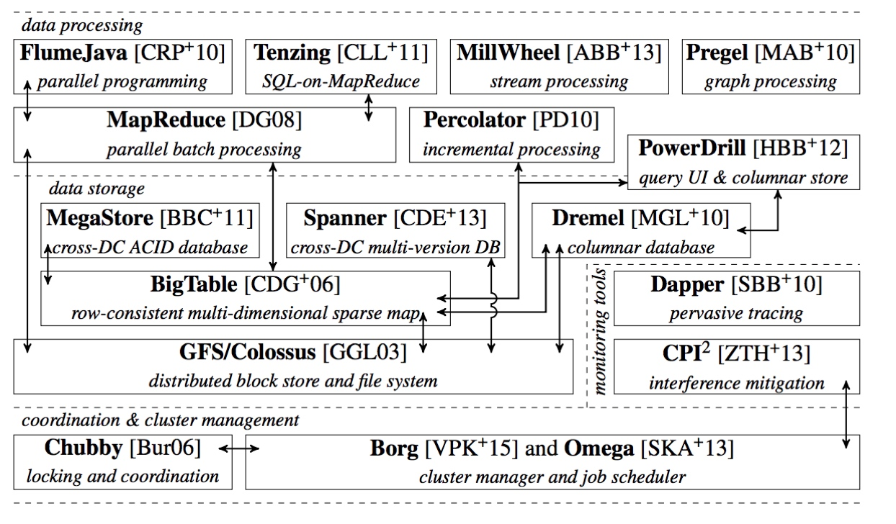
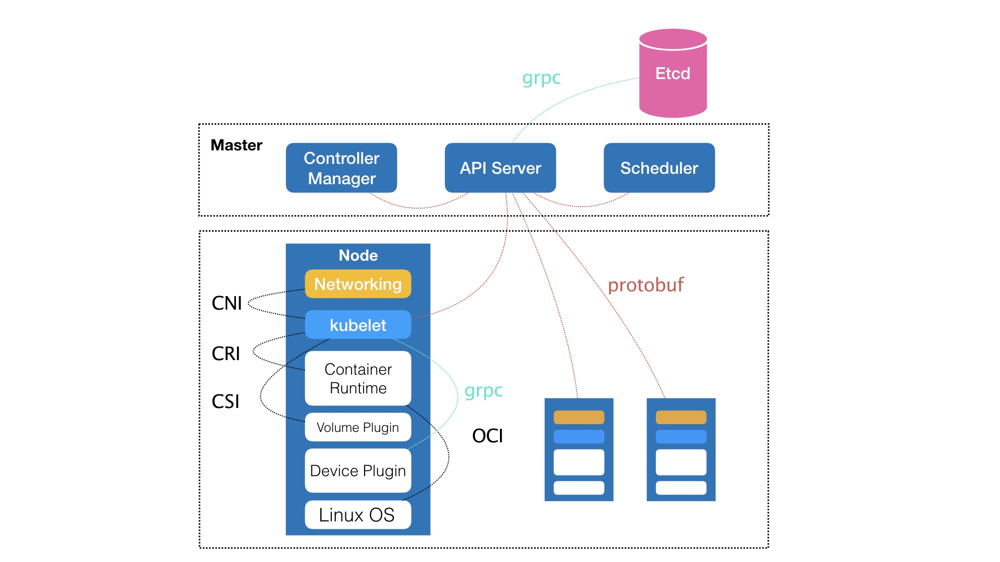
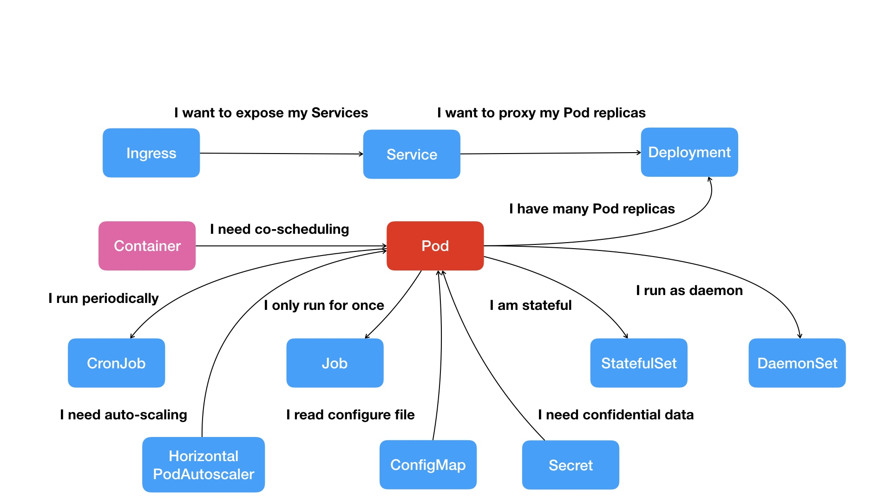

## Kubernetes 介绍

一个“容器”，实际上是一个由 Linux Namespace、Linux Cgroups 和 rootfs 三种技术构建出来的进程的隔离环境。

+ 一个正在运行的 Linux 容器分为

    1. 一组联合挂载在 `/var/lib/docker/aufs/mnt` 上的 rootfs，这一部分我们称为“容器镜像”（Container Image），是容器的静态视图；
    2. 一个由 `Namespace+Cgroups` 构成的隔离环境，这一部分我们称为“容器运行时”（Container Runtime），是容器的动态视图。

在整个“开发 - 测试 - 发布”的流程中，真正承载着容器信息进行传递的，是容器镜像，而不是容器运行时。

Google 公司的基础设施体系

Kubernetes 全局架构

控制节点，即 Master 节点，由三个紧密协作的独立组件组合而成，它们分别是负责 API 服务的 kube-apiserver、负责调度的 kube-scheduler，以及负责容器编排的 kube-controller-manager。整个集群的持久化数据，则由 kube-apiserver 处理后保存在 Etcd 中。

### kubelet

计算节点上最核心的部分，则是一个叫作 kubelet 的组件。

#### CRI

在 Kubernetes 项目中，kubelet 主要负责同容器运行时（比如 Docker 项目）打交道。而这个交互所依赖的，是一个称作 CRI（Container Runtime Interface）的远程调用接口，这个接口定义了容器运行时的各项核心操作，比如：启动一个容器需要的所有参数。

这也是为何，Kubernetes 项目并不关心你部署的是什么容器运行时、使用的什么技术实现，只要你的这个容器运行时能够运行标准的容器镜像，它就可以通过实现 CRI 接入到 Kubernetes 项目当中。

而具体的容器运行时，比如 Docker 项目，则一般通过 OCI 这个容器运行时规范同底层的 Linux 操作系统进行交互，即：把 CRI 请求翻译成对 Linux 操作系统的调用（操作 Linux Namespace 和 Cgroups 等）。

#### CNI / CSI

kubelet 的另一个重要功能，则是调用网络插件和存储插件为容器配置网络和持久化存储。这两个插件与 kubelet 进行交互的接口，分别是 CNI（Container Networking Interface）和 CSI（Container Storage Interface）。

### 解决的问题

运行在大规模集群中的各种任务之间，实际上存在着各种各样的关系。这些关系的处理，才是作业编排和管理系统最困难的地方。

Kubernetes 项目最主要的设计思想是，从更宏观的角度，以统一的方式来定义任务之间的各种关系，并且为将来支持更多种类的关系留有余地。

Web 应用与数据库之间的访问关系，Kubernetes 项目则提供了一种叫作“Service”的服务。

Kubernetes 项目的做法是给 Pod 绑定一个 Service 服务，而 Service 服务声明的 IP 地址等信息是“终生不变”的。这个Service 服务的主要作用，就是作为 Pod 的代理入口（Portal），从而代替 Pod 对外暴露一个固定的网络地址。

这样，对于 Web 应用的 Pod 来说，它需要关心的就是数据库 Pod 的 Service 信息。不难想象，Service 后端真正代理的 Pod 的 IP 地址、端口等信息的自动更新、维护，则是 Kubernetes 项目的职责。

Kubernetes 项目核心功能的“全景图”

#### 如何容器化这个应用

1. 应用与应用之间的关系
2. 应用运行的形态

在 Kubernetes 项目中，我们所推崇的使用方法是：

1. 首先，通过一个“编排对象”，比如 Pod、Job、CronJob 等，来描述你试图管理的应用；
2. 然后，再为它定义一些“服务对象”，比如 Service、Secret、Horizontal Pod Autoscaler（自动水平扩展器）等。这些对象，会负责具体的平台级功能。

这种使用方法，就是所谓的“声明式 API”。这种 API 对应的“编排对象”和“服务对象”，都是 Kubernetes 项目中的 API 对象（API Object）。

Kubernetes 项目的本质，是为用户提供一个具有普遍意义的容器编排工具。

不过，更重要的是，Kubernetes 项目为用户提供的不仅限于一个工具。它真正的价值，乃在于提供了一套基于容器构建分布式系统的基础依赖。

