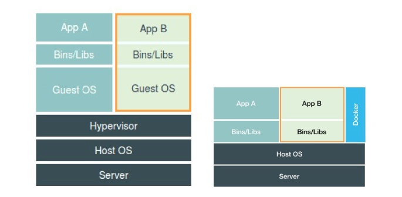

## Namespace

```c
// 当我们用 clone() 系统调用创建一个新进程时，就可以在参数中指定 CLONE_NEWPID 参数，新创建的这个进程将会“看到”一个全新的进程空间，在这个进程空间里，它的 PID 是 1。

// 在宿主机真实的进程空间里，这个进程的 PID 还是真实的数值，比如 100。

int pid = clone(main_function, stack_size, CLONE_NEWPID | SIGCHLD, NULL);
```

Linux 操作系统还提供了 PID、 Mount、UTS、IPC、Network 和 User 这些 Namespace，用来对各种不同的进程上下文进行“障眼法”操作。

比如，Mount Namespace，用于让被隔离进程只看到当前 Namespace 里的挂载点信息；Network Namespace，用于让被隔离进程看到当前 Namespace 里的网络设备和配置。

### 总结

容器技术的核心功能，就是通过约束和修改进程的动态表现，从而为其创造出一个“边界”。

对于 Docker 等大多数 Linux 容器来说，Cgroups 技术是用来制造约束的主要手段，而 Namespace 技术则是用来修改进程视图的主要方法。

### 容器使用 Linux Namespace 作为隔离手段的优势和劣势



+ 优势（“敏捷”和“高性能”是容器相较于虚拟机最大的优势，也是它能够在 PaaS 这种更细粒度的资源管理平台上大行其道的重要原因。）
    + 容器化后的用户应用，却依然还是一个宿主机上的普通进程，这就意味着这些因为虚拟化而带来的性能损耗都是不存在的
    + 使用 Namespace 作为隔离手段的容器并不需要单独的 Guest OS，这就使得容器额外的资源占用几乎可以忽略不计。

+ 劣势（隔离得不彻底）
    + 共享宿主机内核（导致要在 Windows 宿主机上运行 Linux 容器，或者在低版本的 Linux 宿主机上运行高版本的 Linux 容器，都是行不通的。）
    + 在 Linux 内核中，有很多资源和对象是不能被 Namespace 化的，最典型的例子就是：时间。
