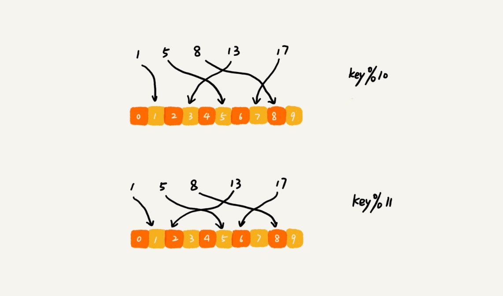

# 哈希算法

将任意长度的二进制值串映射为固定长度的二进制值串，这个映射的规则就是哈希算法，而通过原始数据映射之后得到的二进制值串就是哈希值。

## 设计一个优秀的哈希算法

1. 从哈希值不能反向推导出原始数据（所以哈希算法也叫单向哈希算法）；
2. 对输入数据非常敏感，哪怕原始数据只修改了一个 Bit，最后得到的哈希值也大不相同；
3. 散列冲突的概率要很小，对于不同的原始数据，哈希值相同的概率非常小；
4. 哈希算法的执行效率要尽量高效，针对较长的文本，也能快速地计算出哈希值。

## 应用

### 安全加密

+ MD5（MD5 Message-Digest Algorithm，MD5 消息摘要算法）
+ SHA（Secure Hash Algorithm，安全散列算法）。
+ DES（Data Encryption Standard，数据加密标准）
+ AES（Advanced Encryption Standard，高级加密标准）。

+ 为什么哈希算法无法做到零冲突？（鴿巢原理）

    > 如前面举的 MD5 的例子，哈希值是固定的 128 位二进制串，能表示的数据是有限的，最多能表示 2^128 个数据，而我们要哈希的数据是无穷的。基于鸽巢原理，如果我们对 2^128+1 个数据求哈希值，就必然会存在哈希值相同的情况。

+ 字典攻击

    > 针对字典攻击，我们可以引入一个盐（salt），跟用户的密码组合在一起，增加密码的复杂度。我们拿组合之后的字符串来做哈希算法加密，将它存储到数据库中，进一步增加破解的难度。
    > 不过我这里想多说一句，我认为安全和攻击是一种博弈关系，不存在绝对的安全。所有的安全措施，只是增加攻击的成本而已。
    > 彩虹表是一个用于加密散列函数逆运算的预先计算好的表，常用于破解加密过的密码散列。

### 唯一标识

+ 我们可以给每一个图片取一个唯一标识，或者说信息摘要。
    > 比如，我们可以从图片的二进制码串开头取 100 个字节，从中间取 100 个字节，从最后再取 100 个字节，然后将这 300 个字节放到一块，通过哈希算法（比如 MD5），得到一个哈希字符串，用它作为图片的唯一标识。通过这个唯一标识来判定图片是否在图库中，这样就可以减少很多工作量。

### 数据校验

### 散列函数

相对哈希算法的其他应用，散列函数对于散列算法冲突的要求要低很多。即便出现个别散列冲突，只要不是过于严重，我们都可以通过开放寻址法或者链表法解决。

散列函数对于散列算法计算得到的值，是否能反向解密也并不关心。散列函数中用到的散列算法，更加关注散列后的值是否能平均分布，也就是，一组数据是否能均匀地散列在各个槽中。除此之外，散列函数执行的快慢，也会影响散列表的性能，所以，散列函数用的散列算法一般都比较简单，比较追求效率。

## 分布式应用

### 负载均衡

可以通过哈希算法，对客户端 IP 地址或者会话 ID 计算哈希值，将取得的哈希值与服务器列表的大小进行取模运算，最终得到的值就是应该被路由到的服务器编号。

### 数据分片

#### 1. 如何统计“搜索关键词”出现的次数？

假如我们有 1T 的日志文件，这里面记录了用户的搜索关键词，我们想要快速统计出每个关键词被搜索的次数，该怎么做呢？

我们可以先对数据进行分片，然后采用多台机器处理的方法，来提高处理速度。

为了提高处理的速度，我们用 n 台机器并行处理。我们从搜索记录的日志文件中，依次读出每个搜索关键词，并且通过哈希函数计算哈希值，然后再跟 n 取模，最终得到的值，就是应该被分配到的机器编号。

也是 MapReduce 的基本设计思想。

#### 2. 如何快速判断图片是否在图库中？

我们同样可以对数据进行分片，然后采用多机处理。我们准备 n 台机器，让每台机器只维护某一部分图片对应的散列表。我们每次从图库中读取一个图片，计算唯一标识，然后与机器个数 n 求余取模，得到的值就对应要分配的机器编号，然后将这个图片的唯一标识和图片路径发往对应的机器构建散列表。

当我们要判断一个图片是否在图库中的时候，我们通过同样的哈希算法，计算这个图片的唯一标识，然后与机器个数 n 求余取模。假设得到的值是 k，那就去编号 k 的机器构建的散列表中查找。

### 分布式存储

扩容。所有的数据都要重新计算哈希值，然后重新搬移到正确的机器上。这样就相当于，缓存中的数据一下子就都失效了。所有的数据请求都会穿透缓存，直接去请求数据库。这样就可能发生雪崩效应，压垮数据库。

一致性哈希算法（不需要做大量的数据搬移）

假设我们有 k 个机器，数据的哈希值的范围是 [0, MAX]。我们将整个范围划分成 m 个小区间（m 远大于 k），每个机器负责 m/k 个小区间。当有新机器加入的时候，我们就将某几个小区间的数据，从原来的机器中搬移到新的机器中。这样，既不用全部重新哈希、搬移数据，也保持了各个机器上数据数量的均衡。

