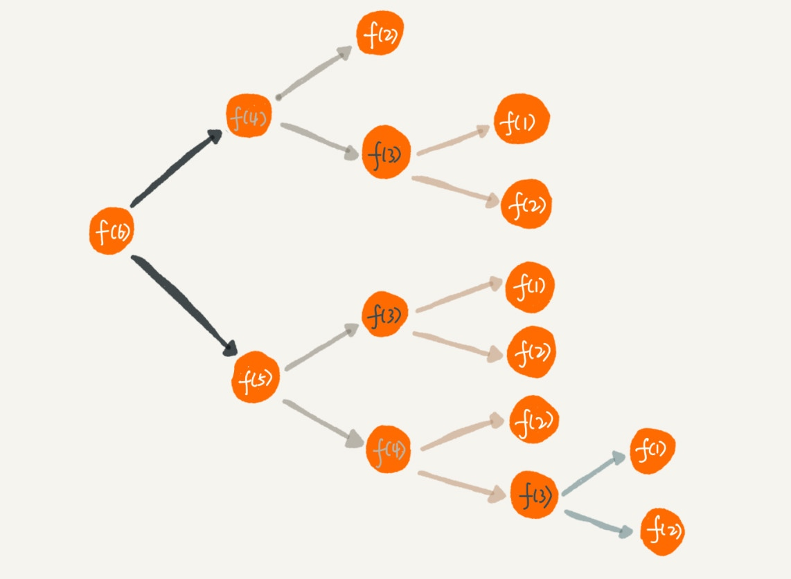

# 递归

这就是一个非常标准的递归求解问题的分解过程，去的过程叫“递”，回来的过程叫“归”。

## 递归需要满足的三个条件

1. 一个问题的解可以分解为几个子问题的解
2. 这个问题与分解之后的子问题，除了数据规模不同，求解思路完全一样
3. 存在递归终止条件

写递归代码的关键就是找到如何将大问题分解为小问题的规律，并且基于此写出递推公式，然后再推敲终止条件，最后将递推公式和终止条件翻译成代码。

**编写递归代码的关键是，只要遇到递归，我们就把它抽象成一个递推公式，不用想一层层的调用关系，不要试图用人脑去分解递归的每个步骤。**

## 警惕

+ 警惕堆栈溢出
    + 限制递归深度
    + 改为非递归的实现方式
+ 警惕重复计算
    + 散列表

+ 如果有脏数据，出现环

## 复杂度

+ 空间复杂度是 O(n)。

