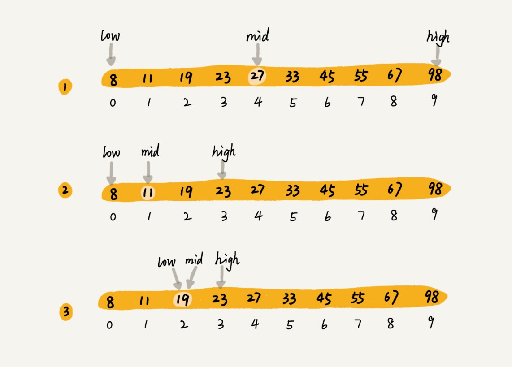

# 二分查找（Binary Search）



二分查找针对的是一个有序的数据集合，查找思想有点类似分治思想。每次都通过跟区间的中间元素对比，将待查找的区间缩小为之前的一半，直到找到要查找的元素，或者区间被缩小为 0。

```md
// 复杂度是 O(logn)
n+n/2+n/4+...+n/2^k

n/2^k = 1

// 每一次缩小操作只涉及两个数据的大小比较，所以，经过了 k 次区间缩小操作，时间复杂度就是 O(k)。
// 通过 n/2k=1，我们可以求得 k=log2n，所以时间复杂度就是 O(logn)。
```

O(logn) 有的时候甚至比时间复杂度是常量级 O(1)（可能表示的是一个非常大的常量值） 的算法还要高效

指数时间复杂度的算法在大规模数据面前是无效的。

+ 注意
    1. 循环退出条件 low<=high
    2.mid 的取值 low+((high-low)>>1)
    3.low 和 high 的更新 low=mid+1，high=mid-1 （low=mid 或者 high=mid，就可能会发生死循环。）

+ 局限性
    + 依赖的是顺序表结构，简单点说就是数组。
    + 针对的是有序数据 (二分查找只能用在插入、删除操作不频繁，一次排序多次查找的场景中。针对动态变化的数据集合，二分查找将不再适用。)
    + 数据量太小不适合二分查找 (例外：如果数据之间的比较操作非常耗时，不管数据量大小，我都推荐使用二分查找。比如，数组中存储的都是长度超过 300 的字符串)
    + 数据量太大也不适合二分查找 （二分查找的底层需要依赖数组这种数据结构，而数组为了支持随机访问的特性，要求内存空间连续，对内存的要求比较苛刻。）

### 问题

1. 如何在 1000 万个整数中快速查找某个整数？我们的内存限制是 100MB，每个数据大小是 8 字节

    + 二分法，将数据存储在数组中，内存占用差不多是 80MB（二分查找底层依赖的是数组，除了数据本身之外，不需要额外存储其他信息）
    + 散列表还是二叉树，都会需要比较多的额外的内存空间，存不下

2. 如何编程实现“求一个数的平方根”？要求精确到小数点后 6 位。

## 二分查找的变形问题

+ 变体一：查找第一个值等于给定值的元素
+ 变体二：查找最后一个值等于给定值的元素
+ 变体三：查找第一个大于等于给定值的元素
+ 变体四：查找最后一个小于等于给定值的元素

### 问题

+ 我们有 12 万条这样的 IP 区间与归属地的对应关系，如何快速定位出一个 IP 地址的归属地呢？

    + IP 地址可以转化为 32 位的整型数。所以，我们可以将起始地址，按照对应的整型值的大小关系，从小到大进行排序。
    + 找到最后一个起始 IP 小于等于这个 IP 的 IP 区间
    + 检查这个 IP 是否在这个 IP 区间内，如果在，我们就取出对应的归属地显示；如果不在，就返回未查找到。

+ 如果有序数组是一个循环有序数组，比如 4，5，6，1，2，3。针对这种情况，如何实现一个求“值等于给定值”的二分查找算法呢？
    + 分为两个有序数组，二分查找
    + 以数组中间点为分区，会将数组分成一个有序数组和一个循环有序数组。目标元素在有序数组范围中，使用二分查找


