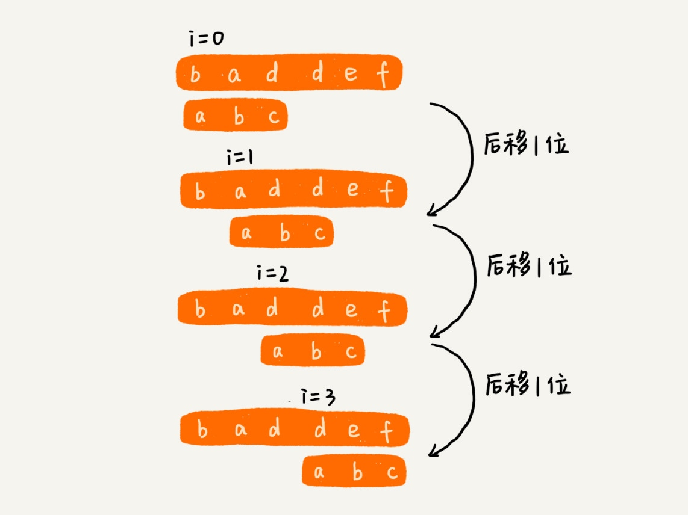
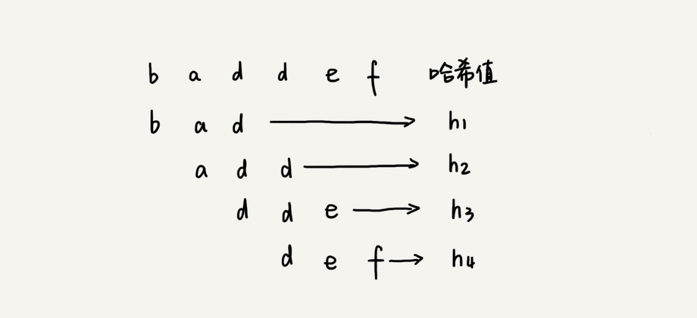

# 字符串匹配算法（String searching algorithms）

主串 / 模式串 （在字符串 A 中查找字符串 B，那字符串 A 就是主串，字符串 B 就是模式串。）

## 单模式串匹配

### BF / Brute Force / 暴力匹配算法

在主串中，检查起始位置分别是 0、1、2…n-m 且长度为 m 的 n-m+1 个子串，看有没有跟模式串匹配的。

最坏情况时间复杂度是 `O(n*m)`

### RK / Rabin-Karp

通过哈希算法对主串中的 n-m+1 个子串分别求哈希值，然后逐个与模式串的哈希值比较大小。

可以使用 s[i-1] 的哈希值很快的计算出 s[i] 的哈希值。

26^(m-1) 这部分的计算，我们可以通过查表的方法来提高效率。事先计算好 26^0、26^1、26^2……26^(m-1)，并且存储在一个长度为 m 的数组中，公式中的“次方”就对应数组的下标。当我们需要计算 26 的 x 次方的时候，就可以从数组的下标为 x 的位置取值

整个 RK 算法包含两部分，计算子串哈希值和模式串哈希值与子串哈希值之间的比较。第一部分，我们前面也分析了，可以通过设计特殊的哈希算法，只需要扫描一遍主串就能计算出所有子串的哈希值了，所以这部分的时间复杂度是 O(n)。

模式串哈希值与每个子串哈希值之间的比较的时间复杂度是 O(1)，总共需要比较 n-m+1 个子串的哈希值，所以，这部分的时间复杂度也是 O(n)。所以，RK 算法整体的时间复杂度就是 O(n)。

通过上面的哈希算法计算得到的哈希值就可能很大，如果超过了计算机中整型数据可以表示的范围，那该如何解决呢？

+ 允许哈希冲突（改进 hash 算法，每一个字母对应 1，2，3 自然数，或者 对应 素数）
+ 哈希算法的冲突概率要相对控制得低一些，如果存在大量冲突，就会导致 RK 算法的时间复杂度退化，效率下降。
+ 极端情况下，如果存在大量的冲突，每次都要再对比子串和模式串本身，那时间复杂度就会退化成 `O(n*m)`。

### BM Boyer-Moore

在模式串与主串匹配的过程中，当模式串和主串某个字符不匹配的时候，能够跳过一些肯定不会匹配的情况，将模式串往后多滑动几位。

1. 坏字符规则（bad character rule）

    我们从模式串的末尾往前倒着匹配，当我们发现某个字符没法匹配的时候。我们把这个没有匹配的字符叫作坏字符（主串中的字符）。

    往后移动 si - xi

    1. 坏字符在模式串中不存在

        将模式串滑动到 c 后面的位置，再从模式串的末尾字符开始比较。

    2. 坏字符在模式串中多处出现

        选择最靠后的那个匹配字符

2. 好后缀规则（good suffix shift）

    把已经匹配的 bc 叫作好后缀，记作{u}。

    1. 在模式串中，找到了另一个跟{u}相匹配的子串{u*}，那我们就将模式串滑动到子串{u*}与主串中{u}对齐的位置。
    2. 在模式串中，找不到另一个等于{u}的子串，我们就直接将模式串，滑动到主串中{u}的后面

    过度滑动（主串中的{u}与模式串有重合）

    针对这种情况，我们不仅要看好后缀在模式串中，是否有另一个匹配的子串，我们还要考察好后缀的后缀子串，是否存在跟模式串的前缀子串匹配的。

    我们从好后缀的后缀子串中，找一个最长的并且能跟模式串的前缀子串匹配的，假设是{v}，然后将模式串滑动。

如何选择用好后缀规则还是坏字符规则，来计算模式串往后滑动的位数？

分别计算好后缀和坏字符往后滑动的位数，然后取两个数中最大的，作为模式串往后滑动的位数。

+ 复杂度分析

    整个算法用到了额外的 3 个数组，其中 bc 数组的大小跟字符集大小有关，suffix 数组和 prefix 数组的大小跟模式串长度 m 有关。

    如果我们处理字符集很大的字符串匹配问题，bc 数组对内存的消耗就会比较多。因为好后缀和坏字符规则是独立的，如果我们运行的环境对内存要求苛刻，可以只使用好后缀规则，不使用坏字符规则，这样就可以避免 bc 数组过多的内存消耗。不过，单纯使用好后缀规则的 BM 算法效率就会下降一些了。

### KMP /  Knuth Morris Pratt

## 多模式串

### Trie 树

Trie 树的本质，就是利用字符串之间的公共前缀，将重复的前缀合并在一起。

+ 操作
    + 一个是将字符串集合构造成 Trie 树。这个过程分解开来的话
    + 一个将字符串插入到 Trie 树的过程。另一个是在 Trie 树中查询一个字符串。

构建好 Trie 树后，在其中查找字符串的时间复杂度是 O(k)，k 表示要查找的字符串的长度。

+ 解决内存消耗
    + 缩点优化

+ 缺点
    + 字符串中包含的字符集不能太大。我们前面讲到，如果字符集太大，那存储空间可能就会浪费很多。即便可以优化，但也要付出牺牲查询、插入效率的代价。

    + 要求字符串的前缀重合比较多，不然空间消耗会变大很多。

    + 如果要用 Trie 树解决问题，那我们就要自己从零开始实现一个 Trie 树，还要保证没有 bug，这个在工程上是将简单问题复杂化，除非必须，一般不建议这样做。

    + 我们知道，通过指针串起来的数据块是不连续的，而 Trie 树中用到了指针，所以，对缓存并不友好，性能上会打个折扣。

Trie 树比较适合的是查找前缀匹配的字符串。

### AC 自动机 / Aho-Corasick

### 问题

+ 类比到二维字符串，如何在其中查找

