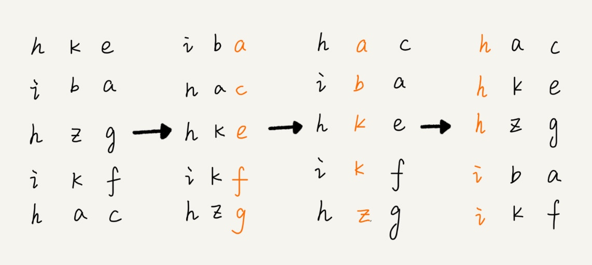

# 排序 O(n)

线性排序

之所以能做到线性的时间复杂度，主要原因是，这三个算法是非基于比较的排序算法，都不涉及元素之间的比较操作。

## 桶排序（Bucket algo.sort）

将要排序的数据分到几个有序的桶里，每个桶里的数据再单独进行排序。桶内排完序之后，再把每个桶里的数据按照顺序依次取出，组成的序列就是有序的了。

> 如果要排序的数据有 n 个，我们把它们均匀地划分到 m 个桶内，每个桶里就有 k=n/m 个元素。每个桶内部使用快速排序，时间复杂度为 O(k * logk)。

> m 个桶排序的时间复杂度就是 `O(m * k * logk)`，因为 k=n/m，所以整个桶排序的时间复杂度就是 `O(n*log(n/m))`。

> 当桶的个数 m 接近数据个数 n 时，log(n/m) 就是一个非常小的常量，这个时候桶排序的时间复杂度接近 O(n)。

+ 条件
    + 要排序的数据需要很容易就能划分成 m 个桶，并且，桶与桶之间有着天然的大小顺序。
    + 数据在各个桶之间的分布是比较均匀的。（数据很不平均，退化为 O(nlogn) ）

**桶排序比较适合用在外部排序中。所谓的外部排序就是数据存储在外部磁盘中，数据量比较大，内存有限，无法将数据全部加载到内存中。**

1. 扫描数据，划分桶（数据量大桶的继续划分）
2. 快排
3. 合并

### 实例

+ 根据年龄给 100 万用户排序
+ 10GB 的订单数据，我们希望按订单金额（假设金额都是正整数）进行排序，但是我们的内存有限，只有几百 MB

## 计数排序（Counting algo.sort）

计数排序其实是桶排序的一种特殊情况。当要排序的 n 个数据，所处的范围并不大的时候，比如最大值是 k，我们就可以把数据划分成 k 个桶。每个桶内的数据值都是相同的，省掉了桶内排序的时间。

跟桶排序非常类似，只是桶的大小粒度不一样。

+ 条件
    + 计数排序只能用在数据范围不大的场景中，如果数据范围 k 比要排序的数据 n 大很多，就不适合用计数排序了。
    + 计数排序只能给非负整数排序，如果要排序的数据是其他类型的，要将其在不改变相对大小的情况下，转化为非负整数。

### 实例

考生成绩

## 基数排序（Radix algo.sort）

+ 长度不够可以补齐

+ 条件
    + 基数排序对要排序的数据是有要求的，需要可以分割出独立的“位”来比较，而且位之间有递进的关系，如果 a 数据的高位比 b 数据大，那剩下的低位就不用比较了。
    + 除此之外，每一位的数据范围不能太大，要可以用线性排序算法来排序，否则，基数排序的时间复杂度就无法做到 O(n) 了。

### 实例

+ 有 10 万个手机号码，希望将这 10 万个手机号码从小到大排序（范围太大，显然不适合用桶排序、计数排序）
    + 借助稳定排序算法，先按照最后一位来排序手机号码，然后，再按照倒数第二位重新排序，以此类推，最后按照第一位重新排序。经过 11 次排序之后，手机号码就都有序了。

## 比较

+ 桶内使用归并或者插入排序 就是稳定排序
+ 桶排序和计数排序的排序思想是非常相似的，都是针对范围不大的数据，将数据划分成不同的桶来实现排序。
+ 基数排序要求数据可以划分成高低位，位之间有递进关系。比较两个数，我们只需要比较高位，高位相同的再比较低位。而且每一位的数据范围不能太大，因为基数排序算法需要借助桶排序或者计数排序来完成每一个位的排序工作。

## 问题

字符串进行排序，要求将其中所有小写字母都排在大写字母的前面，但小写字母内部和大写字母内部不要求有序。（左右指针移动交换）

