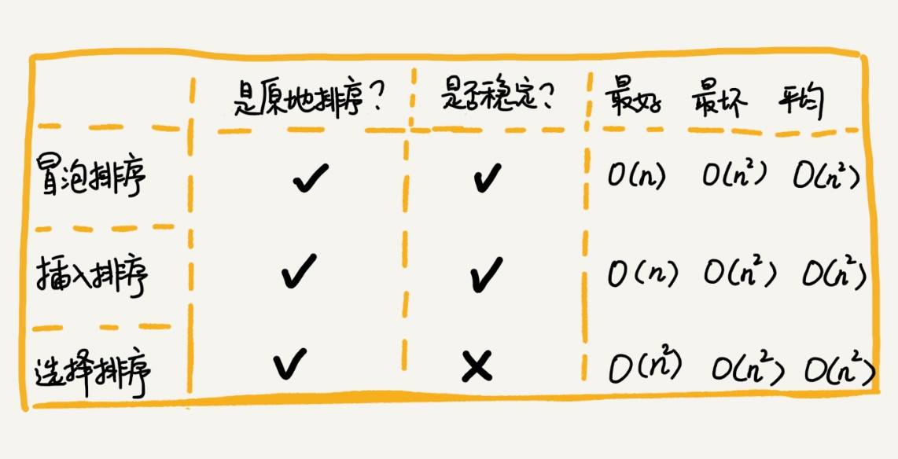
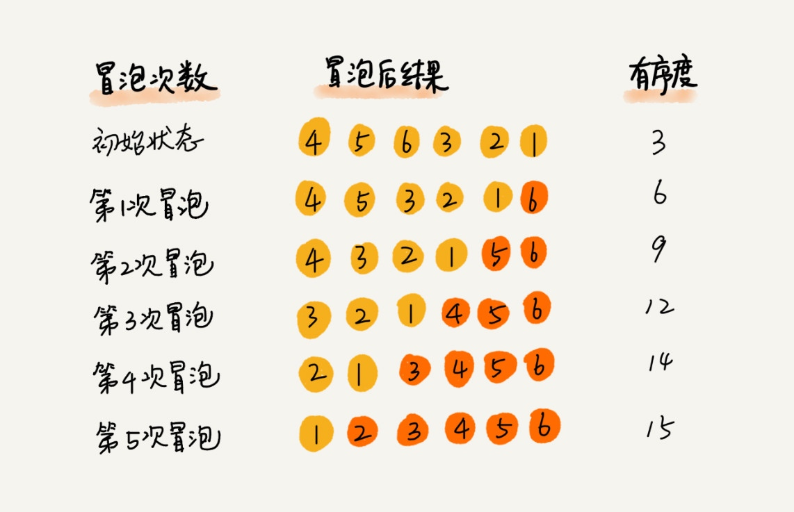
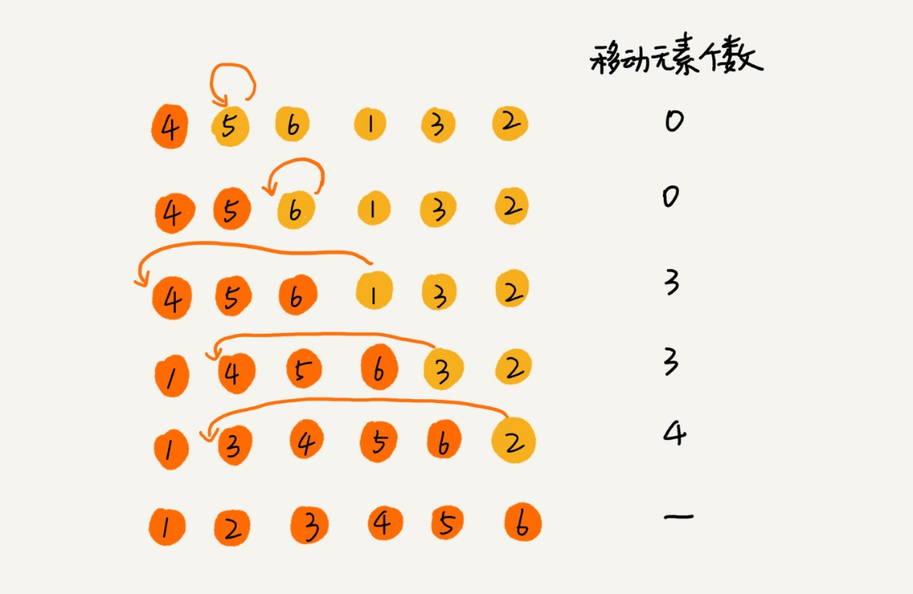
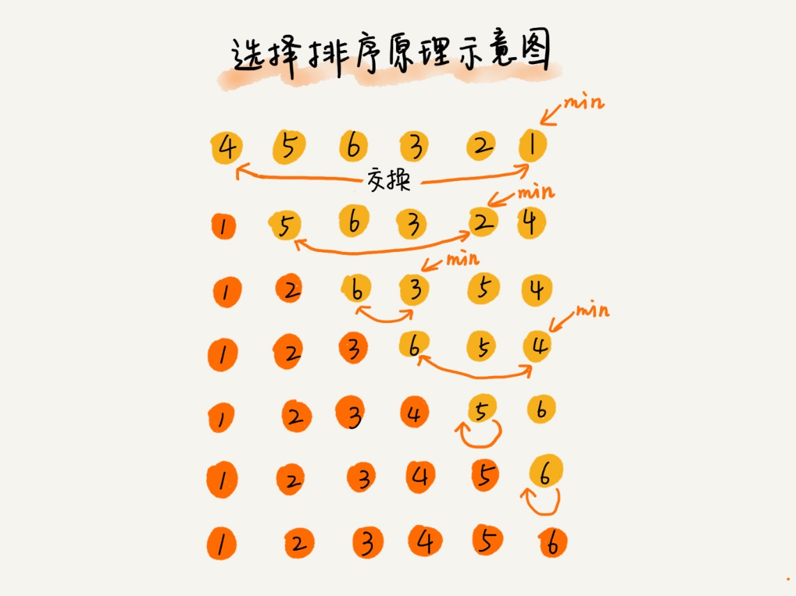

# 排序 O(n2)

## 冒泡排序（Bubble Sort）

冒泡排序只会操作相邻的两个数据。每次冒泡操作都会对相邻的两个元素进行比较，看是否满足大小关系要求。如果不满足就让它俩互换。

一次冒泡会让至少一个元素移动到它应该在的位置，重复 n 次，就完成了 n 个数据的排序工作。

### 分析

1. 是原地排序算法
2. 是稳定的排序算法
3. 时间复杂度
    + 最好情况 O(n)
    + 最坏情况 O(n2)
    + 平均情况 O(n2)

## 插入排序（Insertion Sort）

+ 分已排序区间和未排序区间
+ 初始已排序区间只有一个元素，就是数组的第一个元素。
+ 取未排序区间中的元素，在已排序区间中找到合适的插入位置将其插入，并保证已排序区间数据一直有序。
+ 对于不同的查找插入点方法（从头到尾、从尾到头），元素的比较次数是有区别的。但对于一个给定的初始序列，移动操作的次数总是固定的，就等于逆序度。

### 分析

1. 是原地排序算法
2. 是稳定的排序算法
3. 时间复杂度
    + 最好情况 O(n) (从尾到头遍历已经有序的数据)
    + 最坏情况 O(n2)
    + 平均情况 O(n2) (对于插入排序来说，每次插入操作都相当于在数组中插入一个数据，循环执行 n 次插入操作，所以平均时间复杂度为 O(n2)。)

## 选择排序（Selection Sort）

+ 分已排序区间和未排序区间
+ 每次会从未排序区间中找到最小的元素，将其放到已排序区间的末尾。(最小的元素和未排序区间首个元素交换)

### 分析

1. 是原地排序算法
2. 不是稳定的排序算法（找剩余未排序元素中的最小值，并和前面的元素交换位置，破坏了稳定性）
3. 时间复杂度
    + 最好情况 O(n2)
    + 最坏情况 O(n2)
    + 平均情况 O(n2)

## 比较

冒泡排序不管怎么优化，元素交换的次数是一个固定值，是原始数据的逆序度。
插入排序是同样的，不管怎么优化，元素移动的次数也等于原始数据的逆序度。

**冒泡排序的数据交换要比插入排序的数据移动要复杂，冒泡排序需要 3 个赋值操作，而插入排序只需要 1 个。**

