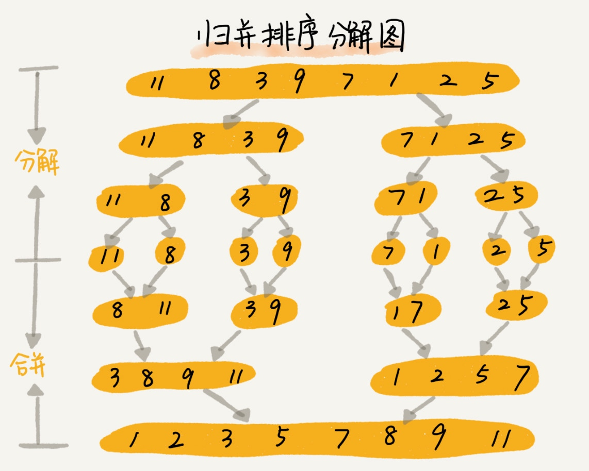
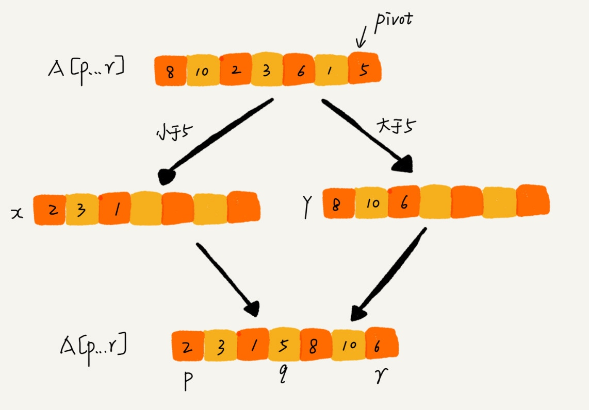
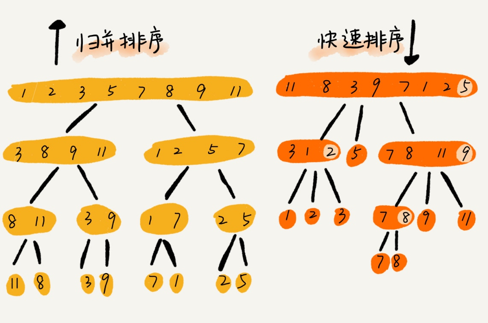

# 排序 O(nlogn)

## 归并排序（Merge Sort）



1. 先把数组从中间分成前后两部分，然后对前后两部分分别排序
2. 再将排好序的两部分合并在一起

分治思想

### 分析

1. 不是原地排序算法
2. 是稳定的排序算法
3. 时间复杂度
    + 最好情况 O(nlogn)
    + 最坏情况 O(nlogn)
    + 平均情况 O(nlogn)

+ 时间复杂度

    ```md
    // 一个问题 a 可以分解为多个子问题 b、c，其中 K 等于将两个子问题 b、c 的结果合并成问题 a 的结果所消耗的时间。

    T(a) = T(b) + T(c) + K

    T(1) = C；   n=1 时，只需要常量级的执行时间，所以表示为 C。
    T(n) = 2*T(n/2) + n； n>1

    T(n) = 2*T(n/2) + n
         = 2*(2*T(n/4) + n/2) + n = 4*T(n/4) + 2*n
         = 4*(2*T(n/8) + n/4) + 2*n = 8*T(n/8) + 3*n
         = 8*(2*T(n/16) + n/8) + 3*n = 16*T(n/16) + 4*n
         ......
         = 2^k * T(n/2^k) + k * n
         ......

    T(n) = 2^kT(n/2^k)+kn

    T(n/2^k)=T(1) -> k=log2n

    T(n)=Cn+nlog2n

    O(nlogn)
    ```

+ 空间复杂度 O(n)

    递归代码的空间复杂度并不能像时间复杂度那样累加。

    尽管每次合并操作都需要申请额外的内存空间，但在合并完成之后，临时开辟的内存空间就被释放掉了。

## 快速排序（Quick Sort）



1. 如果要排序数组中下标从 p 到 r 之间的一组数据，我们选择 p 到 r 之间的任意一个数据作为 pivot（分区点）。
2. 遍历 p 到 r 之间的数据，将小于 pivot 的放到左边，将大于 pivot 的放到右边，将 pivot 放到中间。
3. 用递归排序下标从 p 到 q-1 之间的数据和下标从 q+1 到 r 之间的数据，直到区间缩小为 1，就说明所有的数据都有序了。


> 通过游标 i 把 A[p…r-1] 分成两部分。A[p…i-1] 的元素都是小于 pivot 的，我们暂且叫它“已处理区间”，A[i…r-1] 是“未处理区间”。我们每次都从未处理的区间 A[i…r-1] 中取一个元素 A[j]，与 pivot 对比，如果小于 pivot，则将其加入到已处理区间的尾部，也就是 A[i] 的位置。

### 分析

1. 是原地排序算法
2. 不是稳定的排序算法（6，8，7，6，3，5，9，4）
3. 时间复杂度
    + 最好情况 O(nlogn)
    + 最坏情况 O(n2) （1，3，5，6，8）
    + 平均情况 O(nlogn)

## 对比



归并排序的处理过程是由下到上的，先处理子问题，然后再合并。
而快排正好相反，它的处理过程是由上到下的，先分区，然后再处理子问题。

## 问题

O(n) 时间复杂度内求无序数组中的第 K 大元素。比如，4， 2， 5， 12， 3 这样一组数据

我们选择数组区间 A[0…n-1] 的最后一个元素 A[n-1] 作为 pivot，对数组 A[0…n-1] 原地分区，这样数组就分成了三部分，A[0…p-1]、A[p]、A[p+1…n-1]。

如果 p+1=K，那 A[p] 就是要求解的元素；如果 K>p+1, 说明第 K 大元素出现在 A[p+1…n-1] 区间，我们再按照上面的思路递归地在 A[p+1…n-1] 这个区间内查找。同理，如果 K<p+1，那我们就在 A[0…p-1] 区间查找。


第一次分区查找，我们需要对大小为 n 的数组执行分区操作，需要遍历 n 个元素。第二次分区查找，我们只需要对大小为 n/2 的数组执行分区操作，需要遍历 n/2 个元素。依次类推，分区遍历元素的个数分别为、n/2、n/4、n/8、n/16.……直到区间缩小为 1。

n+n/2+n/4+n/8+…+1 = 2n-1


