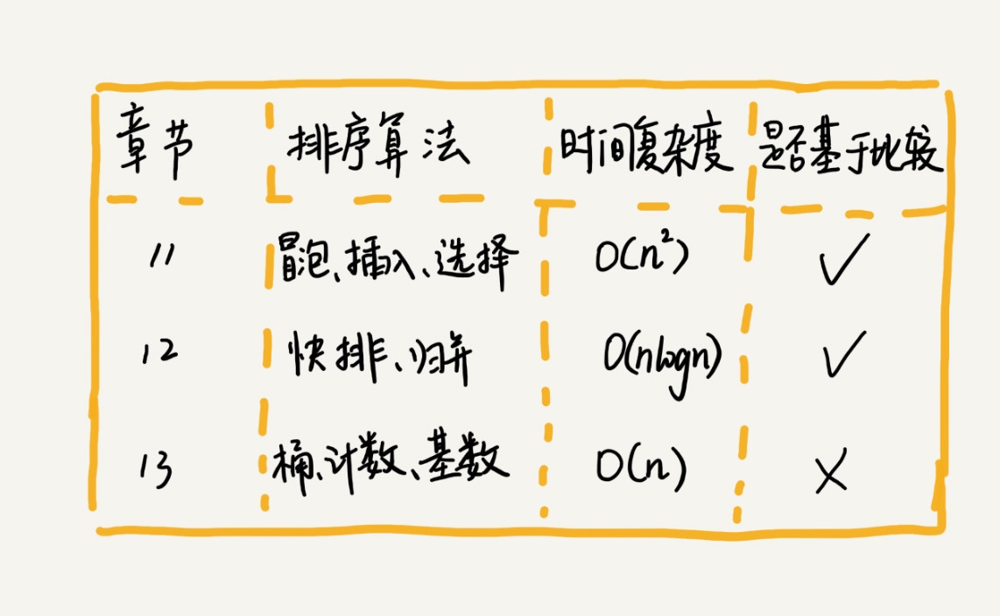
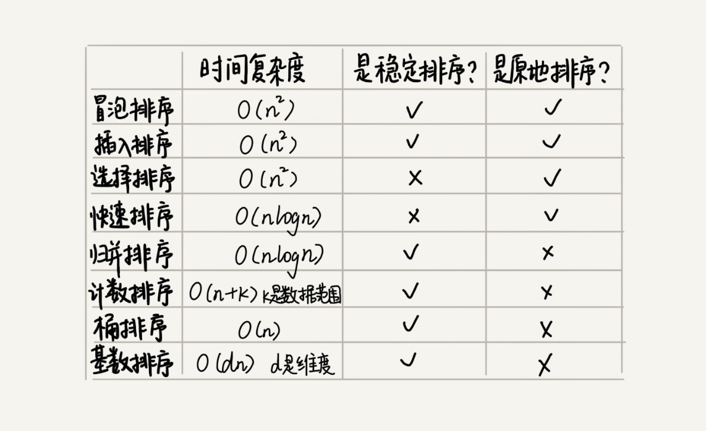

# 排序

## 如何分析一个“排序算法”？

1. 排序算法的执行效率
    1. 最好情况、最坏情况、平均情况时间复杂度
    2. 时间复杂度的系数、常数 、低阶
    3. 比较次数和交换（或移动）次数
2. 排序算法的内存消耗
    + 原地排序。是特指空间复杂度是 O(1) 的排序算法。
3. 排序算法的稳定性
    + 如果待排序的序列中存在值相等的元素，经过排序之后，相等元素之间原有的先后顺序不变。（稳定的排序算法）

## 平均情况时间复杂度分析

有序度（这组数据有序对是多少）

满有序度是 `n*(n-1)/2`

> 冒泡排序包含两个操作原子，比较和交换。

> 不管算法怎么改进，交换次数总是确定的，即为逆序度，也就是 `n*(n-1)/2 – 初始有序度`。

> 最坏情况下，初始状态的有序度是 0，所以要进行 `n*(n-1)/2` 次交换。最好情况下，初始状态的有序度是 `n*(n-1)/2`，就不需要进行交换。我们可以取个中间值 `n*(n-1)/4`，来表示初始有序度既不是很高也不是很低的平均情况。

> 平均情况下，需要 `n*(n-1)/4` 次交换操作，比较操作肯定要比交换操作多，而复杂度的上限是 O(n2)，所以平均情况下的时间复杂度就是 O(n2)。

# [实现一个通用的、高性能的排序函数](https://time.geekbang.org/column/article/42359)

**在小规模数据面前，O(n2) 时间复杂度的算法并不一定比 O(nlogn) 的算法执行时间长。**

## 快排优化 - 通过分区算法

+ 三数取中法
    + 从区间的首、尾、中间，分别取出一个数，然后对比大小，取这 3 个数的中间值作为分区点。
    + 如果要排序的数组比较大，那“三数取中”可能就不够了，可能要“五数取中”或者“十数取中”。

+ 随机法
    + 从概率的角度来看，也不大可能会出现每次分区点都选的很差的情况，所以平均情况下。

## Glibc qsort()

1. 优先使用归并排序来排序输入数据
2. 要排序的数据量比较大的时候，qsort() 会改为用快速排序算法来排序。
3. 快排 选择分区点的方法就是“三数取中法”。
4. 递归太深会导致堆栈溢出，自己实现一个堆上的栈，手动模拟递归来解决的。
5. 当要排序的区间中，元素的个数小于等于 4 时，qsort() 就退化为插入排序，不再继续用递归来做快速排序
6. 哨兵来简化代码，少做一次判断

