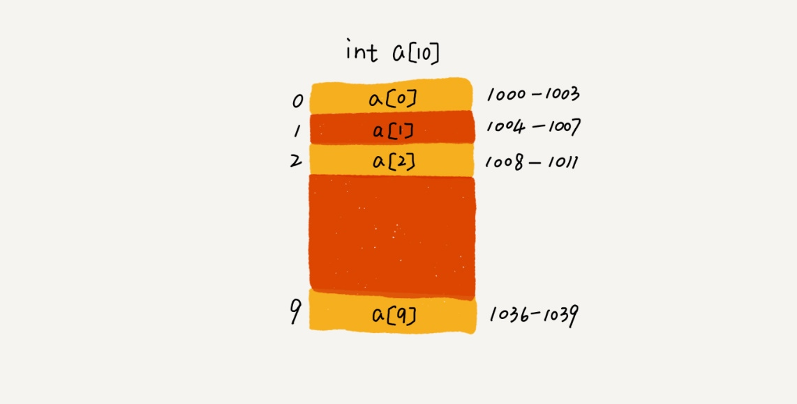

# 数组（Array）

数组（Array）是一种线性表数据结构。它用一组连续的内存空间，来存储一组具有相同类型的数据。

1. 线性表
2. 连续的内存空间和相同类型的数据

## 寻址公式



`a[i]_address = base_address + i * data_type_size`

数组支持随机访问，根据下标随机访问的时间复杂度为 O(1)。

## 低效的“插入”和“删除” 改进

数组为了保持内存数据的连续性，会导致插入、删除这两个操作比较低效。

### O(n) 插入

如果数组中的数据是有序的，我们在某个位置插入一个新的元素时，就必须按照刚才的方法搬移 k 之后的数据。
如果数组中存储的数据并没有任何规律，数组只是被当作一个存储数据的集合。在这种情况下，如果要将某个数组插入到第 k 个位置，为了避免大规模的数据搬移，我们还有一个简单的办法就是，直接将第 k 位的数据搬移到数组元素的最后，把新的元素直接放入第 k 个位置。O(1)

### O(n) 删除

先记录下已经删除的数据。当数组没有更多空间存储数据时，我们再触发执行一次真正的删除操作，这样就大大减少了删除操作导致的数据搬移。

JVM 标记清除垃圾回收算法的核心思想

## 警惕访问越界问题

```c
int main(int argc, char* argv[]){
    int i = 0;
    int arr[3] = {0};
    for(; i<=3; i++){
        arr[i] = 0;
        printf("hello world\n");
    }
    return 0;
}
```

在 C 语言中，只要不是访问受限的内存，所有的内存空间都是可以自由访问的。根据我们前面讲的数组寻址公式，a[3] 也会被定位到某块不属于数组的内存地址上，而这个地址正好是存储变量 i 的内存地址，那么 a[3]=0 就相当于 i=0，所以就会导致代码无限循环。

函数体内的局部变量存在栈上，且是连续压栈。在Linux进程的内存布局中，栈区在高地址空间，从高向低增长。变量i和arr在相邻地址，且i比arr的地址大，所以arr越界正好访问到i。当然，前提是i和arr元素同类型，否则那段代码仍是未决行为。

## 容器

动态扩容
最好在创建 ArrayList 的时候事先指定数据大小。

### 适合数组的场景

1. Java ArrayList 无法存储基本类型，比如 int、long，需要封装为 Integer、Long 类，而 Autoboxing、Unboxing 则有一定的性能消耗，所以如果特别关注性能，或者希望使用基本类型，就可以选用数组。
2. 如果数据大小事先已知，并且对数据的操作非常简单，用不到 ArrayList 提供的大部分方法，也可以直接使用数组。

3. 当要表示多维数组时，用数组往往会更加直观。比如 Object[][] struct.array；而用容器的话则需要这样定义：ArrayList<ArrayList > struct.array。

## 实现

1. 优化的插入删除
2. 容器


