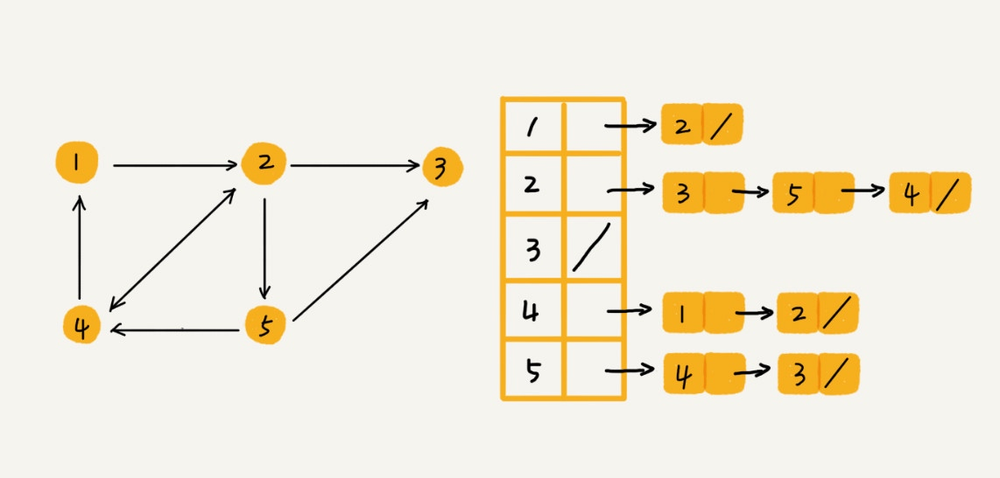

# 图（Graph）

图的搜索、最短路径、最小生成树、二分图等等

## 概念

1. 顶点（vertex）图中的元素
2. 边（edge）一个顶点可以与任意其他顶点建立连接关系，建立的关系叫作边
3. 度（degree）跟顶点相连接的边的条数。叫作顶点的度

4. 方向
    + 无向图（微信的好友）
    + 有向图（微博的粉丝和关注）
        + 入度（In-degree）顶点的入度，表示有多少条边指向这个顶点
        + 出度（Out-degree）顶点的出度，表示有多少条边是以这个顶点为起点指向其他顶点

5. 权重
    + 带权图，每条边都有一个权重（weight）（QQ 好友间的亲密度）

## 存储

时间、空间复杂度互换

### 邻接矩阵

+ 邻接矩阵的底层依赖一个二维数组
    + 对于无向图来说，如果顶点 i 与顶点 j 之间有边，我们就将 A[i][j] 和 A[j][i] 标记为 1
    + 对于有向图来说，如果顶点 i 到顶点 j 之间，有一条箭头从顶点 i 指向顶点 j 的边，那我们就将 A[i][j] 标记为 1。同理，如果有一条箭头从顶点 j 指向顶点 i 的边，我们就将 A[j][i] 标记为 1
    + 对于带权图，数组中就存储相应的权重

+ 缺点
    + 用邻接矩阵来表示一个图，虽然简单、直观，但是比较浪费存储空间
        1. 无向图，重复存储，浪费一半空间
        2. 稀疏图（Sparse Matrix），顶点很多，但每个顶点的边并不多，更加浪费空间
+ 优点
    + 存储方式简单、直接，因为基于数组，所以在获取两个顶点的关系时，就非常高效
    + 方便计算，可以将很多图的运算转换成矩阵之间的运算

### 邻接表

每个顶点对应一条链表，链表中存储的是与这个顶点相连接的其他顶点。

在基于链表法解决冲突的散列表中，如果链过长，为了提高查找效率，我们可以将链表换成其他更加高效的数据结构，比如平衡二叉查找树等。

我们可以将邻接表中的链表改成平衡二叉查找树。实际开发中，我们可以选择用红黑树。这样，我们就可以更加快速地查找两个顶点之间是否存在边了。当然，这里的二叉查找树可以换成其他动态数据结构，比如跳表、散列表等。除此之外，我们还可以将链表改成有序动态数组，可以通过二分查找的方法来快速定位两个顶点之间否是存在边。

## 问题

### 如何存储微博、微信等社交网络中的好友关系？

+ 操作
    + 判断用户 A 是否关注了用户 B；
    + 判断用户 A 是否是用户 B 的粉丝；
    + 用户 A 关注用户 B；
    + 用户 A 取消关注用户 B；
    + 根据用户名称的首字母排序，分页获取用户的粉丝列表；
    + 根据用户名称的首字母排序，分页获取用户的关注列表。

邻接表中存储了用户的关注关系，

逆邻接表中存储的是用户的被关注关系。

基础的邻接表不适合快速判断两个用户之间是否是关注与被关注的关系，所以我们选择改进版本，将邻接表中的链表改为支持快速查找的动态数据结构。

因为我们需要按照用户名称的首字母排序，分页来获取用户的粉丝列表或者关注列表，用跳表这种结构再合适不过了。这是因为，跳表插入、删除、查找都非常高效，时间复杂度是 O(logn)，空间复杂度上稍高，是 O(n)。最重要的一点，跳表中存储的数据本来就是有序的了，分页获取粉丝列表或关注列表，就非常高效。

如果对于小规模的数据，比如社交网络中只有几万、几十万个用户，我们可以将整个社交关系存储在内存中。

数据规模太大，可以通过哈希算法等数据分片方式，将邻接表存储在不同的机器上。当要查询顶点与顶点关系的时候，我们就利用同样的哈希算法，先定位顶点所在的机器，然后再在相应的机器上查找。

另外一种解决思路，就是利用外部存储（比如硬盘）。

user_id, follower_id 给这两列都建立索引。

