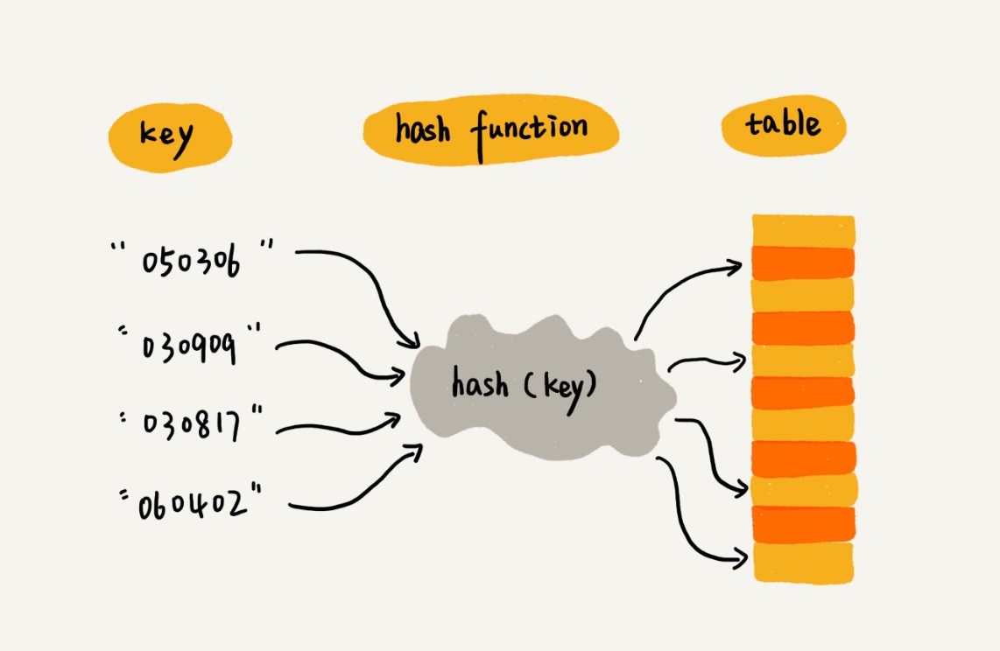
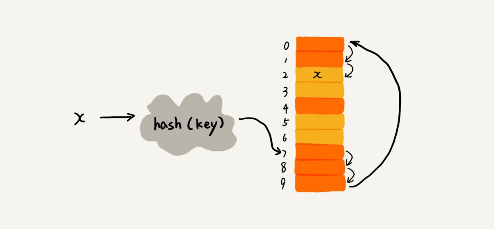
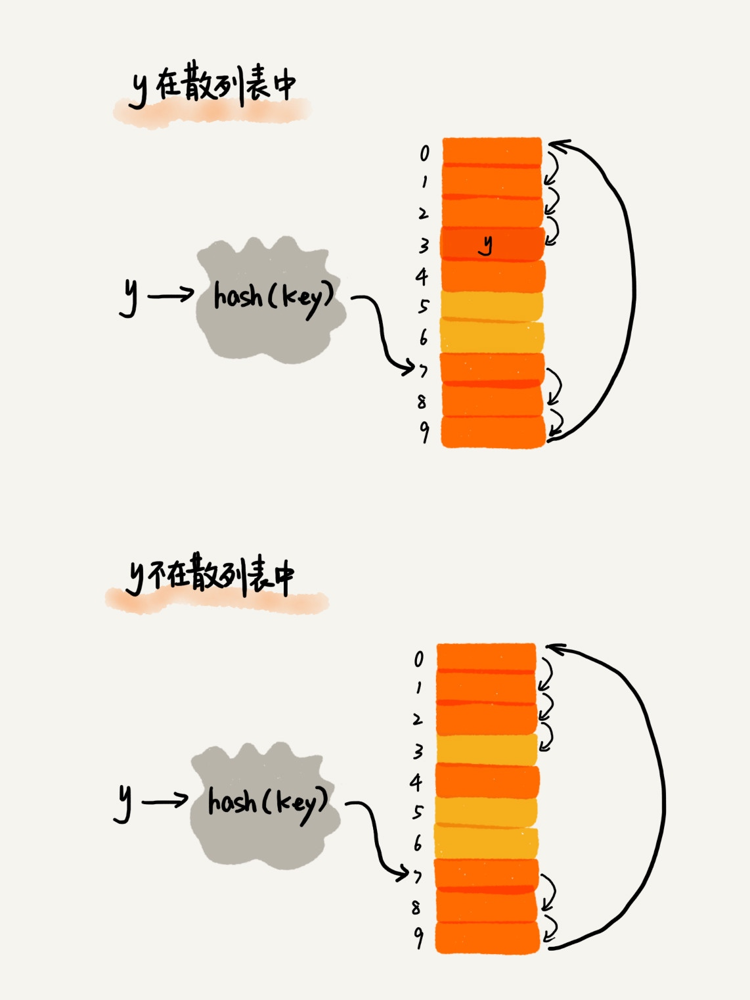
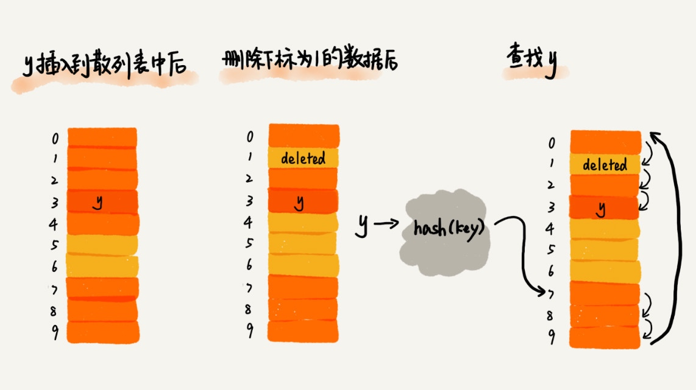
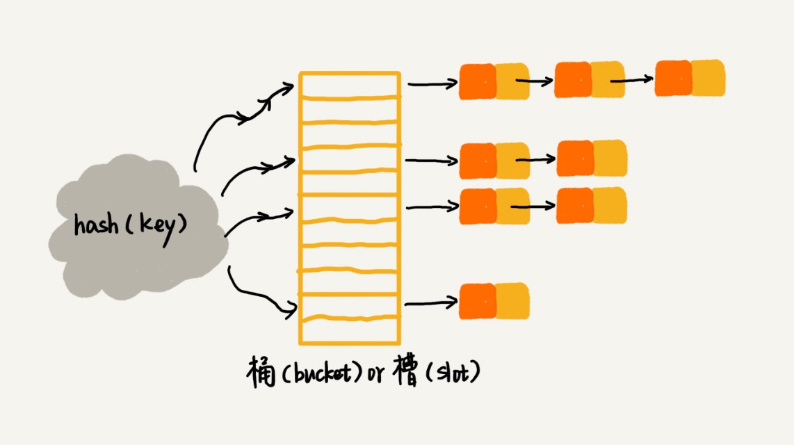
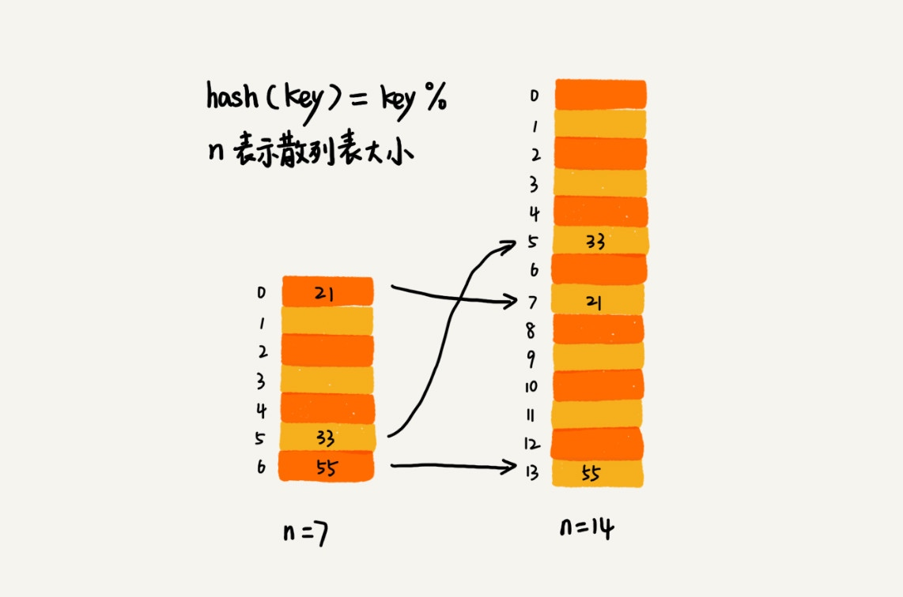
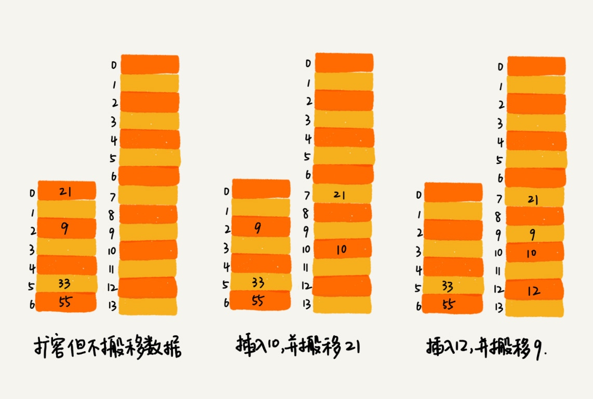
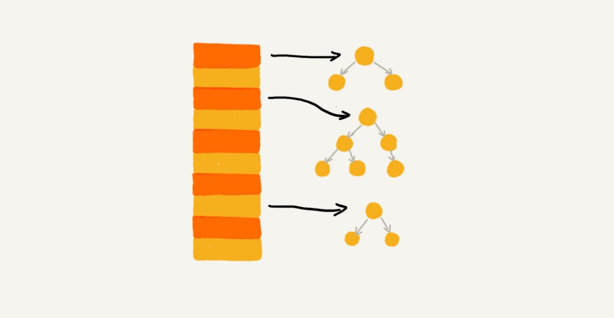
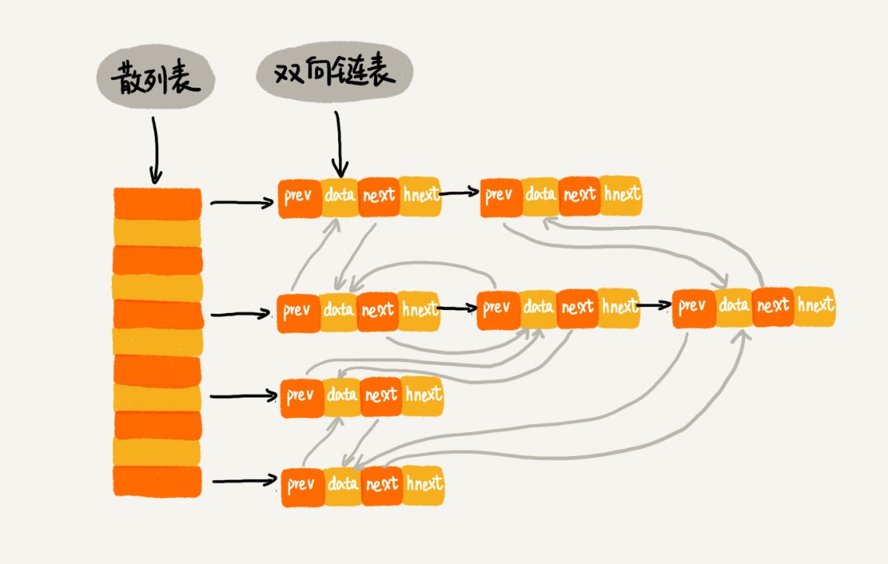

# 散列表（Hash Table）

散列表用的是数组支持按照下标随机访问数据的特性，所以散列表其实就是数组的一种扩展，由数组演化而来。

+ 键（key）或者关键字。
+ 散列函数（或“Hash 函数”“哈希函数”）
+ 散列值（或“Hash 值”“哈希值”）

## 散列函数

+ 三点散列函数设计的基本要求

    + 散列函数计算得到的散列值是一个非负整数；
    + 如果 key1 = key2，那 hash(key1) == hash(key2)；
    + 如果 key1 ≠ key2，那 hash(key1) ≠ hash(key2)。（有散列冲突的问题）

## 散列冲突

### 开放寻址法（open addressing）

**如果出现了散列冲突，我们就重新探测一个空闲位置**

不管采用哪种探测方法，当散列表中空闲位置不多的时候，散列冲突的概率就会大大提高。为了尽可能保证散列表的操作效率，一般情况下，我们会尽可能保证散列表中有一定比例的空闲槽位。我们用装载因子（load factor）来表示空位的多少。

散列表的装载因子 = 填入表中的元素个数 / 散列表的长度

装载因子越大，说明空闲位置越少，冲突越多，散列表的性能会下降。

#### 线性探测（Linear Probing）

1. 插入冲突。就顺序地往后一个一个找，看有没有空闲的位置，遍历到尾部都没有找到空闲的位置，于是我们再从表头开始找
2. 查找 遍历到数组中的空闲位置，还没有找到，就说明要查找的元素并没有在散列表中。
3. 删除，将删除的元素 特殊标记为 deleted，当线性探测查找的时候，遇到标记为 deleted 的空间，并不是停下来，而是继续往下探测。

+ 问题

    + 当散列表中插入的数据越来越多时，散列冲突发生的可能性就会越来越大，空闲位置会越来越少，线性探测的时间就会越来越久。
    + 极端情况下，我们可能需要探测整个散列表，所以最坏情况下的时间复杂度为 O(n)。
    + 同理，在删除和查找时，也有可能会线性探测整张散列表，才能找到要查找或者删除的数据。

#### 二次探测（Quadratic probing）

线性探测每次探测的步长是 1，那它探测的下标序列就是 hash(key)+0，hash(key)+1，hash(key)+2……而二次探测探测的步长就变成了原来的“二次方”，也就是说，它探测的下标序列就是 hash(key)+0，hash(key)+12，hash(key)+22……

#### 双重散列（Double hashing）

用一组散列函数 hash1(key)，hash2(key)，hash3(key)……我们先用第一个散列函数，如果计算得到的存储位置已经被占用，再用第二个散列函数，依次类推，直到找到空闲的存储位置。

### 链表法（chaining）

在散列表中，每个“桶（bucket）”或者“槽（slot）”会对应一条链表，所有散列值相同的元素我们都放到相同槽位对应的链表中。

当插入的时候，我们只需要通过散列函数计算出对应的散列槽位，将其插入到对应链表中即可，所以插入的时间复杂度是 O(1)。

查找或删除操作，时间复杂度跟链表的长度 k 成正比，也就是 O(k)。对于散列比较均匀的散列函数来说，理论上讲，k=n/m，其中 n 表示散列中数据的个数，m 表示散列表中“槽”的个数。

## 散列问题

散列表碰撞攻击

### 如何设计散列函数？

1. 散列函数的设计不能太复杂。（过于复杂的散列函数，势必会消耗很多计算时间）
2. 散列函数生成的值要尽可能随机并且均匀分布 （减少 散列冲突）

### 装载因子过大

+ 动态扩容，通过散列函数重新计算每个数据的存储位置

+ 动态缩容
    + 动态散列表，随着数据的删除，散列表中的数据会越来越少，空闲空间会越来越多。

### 避免低效地扩容

为了解决一次性扩容耗时过多的情况，我们可以将扩容操作穿插在插入操作的过程中，分批完成。当装载因子触达阈值之后，我们只申请新空间，但并不将老的数据搬移到新散列表中。

当有新数据要插入时，我们将新数据插入新散列表中，并且从老的散列表中拿出一个数据放入到新散列表。每次插入一个数据到散列表，我们都重复上面的过程。经过多次插入操作之后，老的散列表中的数据就一点一点全部搬移到新散列表中了。

对于查询操作，为了兼容了新、老散列表中的数据，我们先从新散列表中查找，如果没有找到，再去老的散列表中查找。

通过这样均摊的方法，将一次性扩容的代价，均摊到多次插入操作中，就避免了一次性扩容耗时过多的情况。这种实现方式，任何情况下，插入一个数据的时间复杂度都是 O(1)。

### 如何选择冲突解决方法？

+ 开放寻址法
    + 当数据量比较小、装载因子小的时候，适合采用开放寻址法。这也是 Java 中的ThreadLocalMap使用开放寻址法解决散列冲突的原因。

+ 链表法
    + 基于链表的散列冲突处理方法比较适合存储大对象、大数据量的散列表，而且，比起开放寻址法，它更加灵活，支持更多的优化策略，比如用红黑树代替链表。
    + 将链表法中的链表改造为其他高效的动态数据结构，比如跳表、红黑树。这样，即便出现散列冲突，极端情况下，所有的数据都散列到同一个桶内，那最终退化成的散列表的查找时间也只不过是 O(logn)。

## 举例分析

+ Java
    1. 初始大小 （16）
    2. 装载因子和动态扩容（0.75 扩容为两倍）
    3. 散列冲突解决方法
        + 链表法
        + 当链表长度太长（默认超过 8）时，链表就转换为红黑树。
        + 当红黑树结点个数少于 8 个的时候，又会将红黑树转化为链表。（在数据量较小的情况下，红黑树要维护平衡，比起链表来，性能上的优势并不明显。）
    4. 散列函数

## 工业级的散列表应该具有哪些特性？

1. 支持快速的查询、插入、删除操作；
2. 内存占用合理，不能浪费过多的内存空间；
3. 性能稳定，极端情况下，散列表的性能也不会退化到无法接受的情况。

## 如何实现这样一个散列表呢？

1. 设计一个合适的散列函数；
2. 定义装载因子阈值，并且设计动态扩容策略；
3. 选择合适的散列冲突解决方法。

## 为什么散列表和链表经常会一起使用

> 散列表这种数据结构虽然支持非常高效的数据插入、删除、查找操作，但是散列表中的数据都是通过散列函数打乱之后无规律存储的。也就说，它无法支持按照某种顺序快速地遍历数据。

> 如果希望按照顺序遍历散列表中的数据，那我们需要将散列表中的数据拷贝到数组中，然后排序，再遍历。

> 因为散列表是动态数据结构，不停地有数据的插入、删除，所以每当我们希望按顺序遍历散列表中的数据的时候，都需要先排序，那效率势必会很低。为了解决这个问题，我们将散列表和链表（或者跳表）结合在一起使用。

### LRU 缓存淘汰算法

+ 包含操作
    + 往缓存中添加一个数据
    + 从缓存中删除一个数据
    + 在缓存中查找一个数据

散列表 + 双向列表

+ 因为我们的散列表是通过链表法解决散列冲突的，所以每个结点会在两条链中。
    + 一个链是刚刚我们提到的双向链表
    + 另一个链是散列表中的拉链。前驱和后继指针是为了将结点串在双向链表中，hnext 指针是为了将结点串在散列表的拉链中。

### Redis 有序集合

+ 包含操作
    + 添加一个成员对象；
    + 按照键值来删除一个成员对象；
    + 按照键值来查找一个成员对象；
    + 按照分值区间查找数据，比如查找积分在 [100, 356] 之间的成员对象；
    + 按照分值从小到大排序成员变量；

+ 按照分值将成员对象组织成跳表的结构
+ 再按照键值构建一个散列表，这样按照 key 来删除、查找一个成员对象的时间复杂度就变成了 O(1)。同时，借助跳表结构，其他操作也非常高效。

### Java LinkedHashMap

LinkedHashMap 是通过双向链表和散列表这两种数据结构组合实现的。LinkedHashMap 中的“Linked”实际上是指的是双向链表，并非指用链表法解决散列冲突。

不仅支持按照插入顺序遍历数据，还支持按照访问顺序来遍历数据。

get 操作 和 第二次的 put 操作 会更新元素顺序

