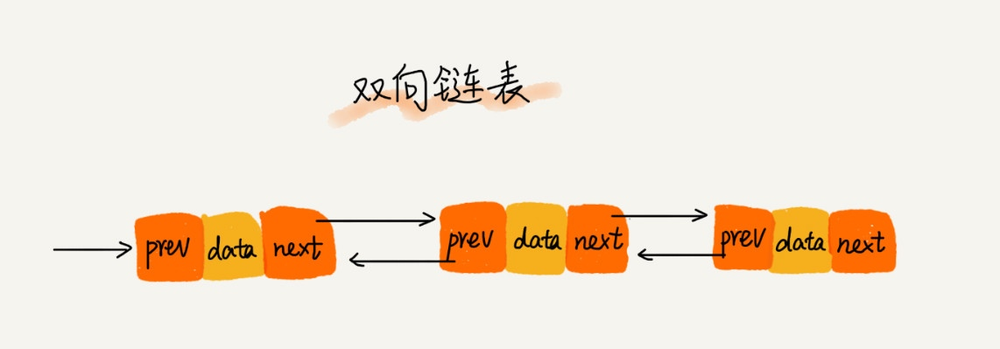

# 链表（LinkedList）

通过“指针”将一组零散的内存块串联起来使用

## 缓存淘汰策略

+ 先进先出策略 FIFO（First In，First Out）
+ 最少使用策略 LFU（Least Frequently Used）
+ 最近最少使用策略 LRU（Least Recently Used）

## 单链表/双向链表/循环链表/双向循环链表

### 双向链表优势（用空间换时间的设计思想）

+ 删除/插入
+ 对于一个有序链表，双向链表的按值查询的效率也要比单链表高一些。因为，我们可以记录上次查找的位置 p，每次查询时，根据要查找的值与 p 的大小关系，决定是往前还是往后查找，所以平均只需要查找一半的数据。

### 删除/插入

+ 删除结点中“值等于某个给定值”的结点；O(n)
+ 删除给定指针指向的结点。
    + 单链表 O(n)
    + 双向链表 O(1)

单链表也是可以实现 O(1) 时间复杂度删除结点（通过替换需要删除节点的值）

## 对比链表数组

1. 复杂度
2. 缓存。
    + 数组简单易用，在实现上使用的是连续的内存空间，可以借助 CPU 的缓存机制，预读数组中的数据，所以访问效率更高。
    + 而链表在内存中并不是连续存储，所以对 CPU 缓存不友好，没办法有效预读。

3. 大小
    + 数组的缺点是大小固定（过大可能 out of memory / 过小需要扩容）
    + 链表本身没有大小的限制，天然地支持动态扩容。

4. 内存使用
    + 对内存的使用非常苛刻，那数组就更适合
    + 链表中的每个结点都需要消耗额外的存储空间去存储一份指向下一个结点的指针，所以内存消耗会翻倍。
    + 对链表进行频繁的插入、删除操作，还会导致频繁的内存申请和释放，容易造成内存碎片，如果是 Java 语言，就有可能会导致频繁的 GC（Garbage Collection，垃圾回收）。

## 技巧

+ 插入结点时，一定要注意操作的顺序
+ 删除链表结点时，也一定要记得手动释放内存空间（non-java）
+ 利用哨兵简化实现难度(带头链表 / 不带头链表)
+ 检查链表代码是否正确的边界条件
    + 如果链表为空时，代码是否能正常工作？
    + 如果链表只包含一个结点时，代码是否能正常工作？
    + 如果链表只包含两个结点时，代码是否能正常工作？
    + 代码逻辑在处理头结点和尾结点的时候，是否能正常工作？
+ 举例画图

## 实现

+ 单链表/双向链表/循环链表/双向循环链表
+ 链表 - LRU 缓存淘汰算法
    + 我们维护一个有序单链表，越靠近链表尾部的结点是越早之前访问的。当有一个新的数据被访问时，我们从链表头开始顺序遍历链表。
      1. 如果此数据之前已经被缓存在链表中了，我们遍历得到这个数据对应的结点，并将其从原来的位置删除，然后再插入到链表的头部。
      2. 如果此数据没有在缓存链表中，又可以分为两种情况：
        + 如果此时缓存未满，则将此结点直接插入到链表的头部；
        + 如果此时缓存已满，则链表尾结点删除，将新的数据结点插入链表的头部。
+ 如何判断一个字符串是否是回文字符串

### 问题

+ 单链表反转
+ 链表中环的检测
+ 两个有序的链表合并
+ 删除链表倒数第 n 个结点
+ 求链表的中间结点

### 方法

+ 单链表反转 尾插法
+ 环的检测(存在循环链表) 追击法（快慢指针）
+ 删除链表倒数第 n 个结点 差值遍历
+ 求链表的中间结点

