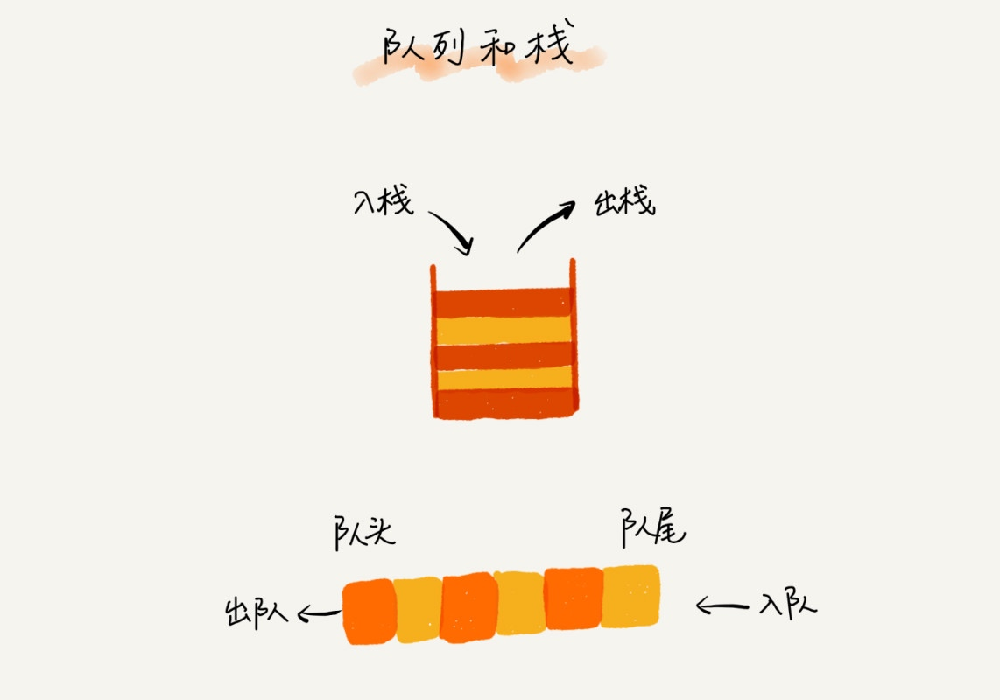

# 队列（Queue）

+ 先进者先出

入队 enqueue 和出队 dequeue

## 顺序队列和链式队列

head / tail 指针

## 循环队列

+ 关键的是，确定好队空和队满的判定条件。
+ 当队满时，(tail+1)%n=head。
+ tail 指向的位置实际上是没有存储数据的。所以，循环队列会浪费一个数组的存储空间。

## 阻塞队列

+ 阻塞队列其实就是在队列基础上增加了阻塞操作。简单来说，就是在队列为空的时候，从队头取数据会被阻塞。因为此时还没有数据可取，直到队列中有了数据才能返回；如果队列已经满了，那么插入数据的操作就会被阻塞，直到队列中有空闲位置后再插入数据，然后再返回。

## 并发队列

+ 线程安全的队列我们叫作并发队列。
+ 基于数组的循环队列，利用 CAS 原子操作，可以实现非常高效的并发队列。

## 循环并发队列

# 场景

**我们希望公平地处理每个排队的请求，先进者先服务，所以队列这种数据结构很适合来存储排队请求。**

> 基于链表的实现方式，可以实现一个支持无限排队的无界队列（unbounded struct.queue），但是可能会导致过多的请求排队等待，请求处理的响应时间过长。所以，针对响应时间比较敏感的系统，基于链表实现的无限排队的线程池是不合适的。

> 而基于数组实现的有界队列（bounded struct.queue），队列的大小有限，所以线程池中排队的请求超过队列大小时，接下来的请求就会被拒绝，这种方式对响应时间敏感的系统来说，就相对更加合理。不过，设置一个合理的队列大小，也是非常有讲究的。队列太大导致等待的请求太多，队列太小会导致无法充分利用系统资源、发挥最大性能。

+ 固定大小的线程池
+ 数据库连接池
+ 排队买票

**对于大部分资源有限的场景，当没有空闲资源时，基本上都可以通过“队列”这种数据结构来实现请求排队。**

