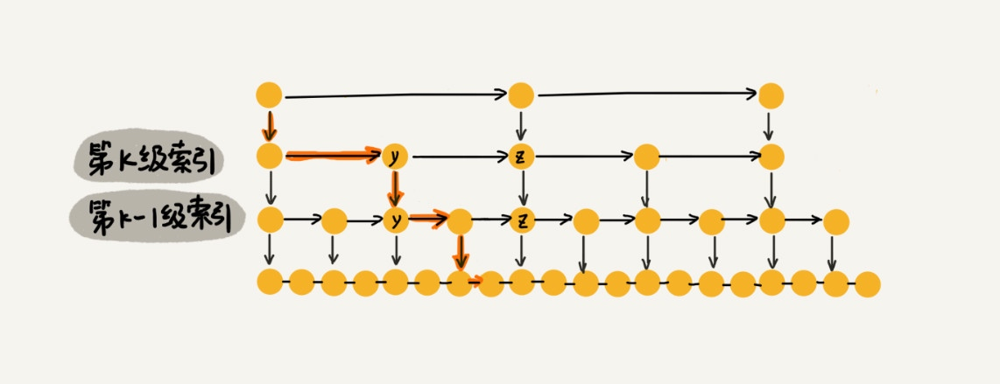

# 跳表（Skip list）

这种链表加多级索引的结构，就是跳表。

基于单链表实现了二分查找

这种查询效率的提升，前提是建立了很多级索引，空间换时间的设计思路

时间复杂度就是 O(logn)
空间复杂度是 O(n) (减少空间复杂度 - 每两个结点抽一个结点到上级索引，如果我们每三个结点或五个结点，抽一个结点到上级索引)

> 在软件开发中，我们不必太在意索引占用的额外空间。在讲数据结构和算法时，我们习惯性地把要处理的数据看成整数，但是在实际的软件开发中，原始链表中存储的有可能是很大的对象，而索引结点只需要存储关键值和几个指针，并不需要存储对象，所以当对象比索引结点大很多时，那索引占用的额外空间就可以忽略了。

## 插入、删除操作的时间复杂度也是 O(logn)。

如果这个结点在索引中也有出现，我们除了要删除原始链表中的结点，还要删除索引中的。

## 跳表索引动态更新

当我们不停地往跳表中插入数据时，如果我们不更新索引，就有可能出现某 2 个索引结点之间数据非常多的情况。极端情况下，跳表还会退化成单链表。

跳表是通过随机函数来维护前面提到的“平衡性”。

通过一个随机函数，来决定将这个结点插入到哪几级索引中，比如随机函数生成了值 K，那我们就将这个结点添加到第一级到第 K 级这 K 级索引中。

# 问题

+ 为什么 Redis 要用跳表来实现有序集合，而不是红黑树？
    + 按照区间来查找数据这个操作，红黑树的效率没有跳表高。（对于按照区间查找数据这个操作，跳表可以做到 O(logn) 的时间复杂度定位区间的起点，然后在原始链表中顺序往后遍历就可以了。这样做非常高效。）

