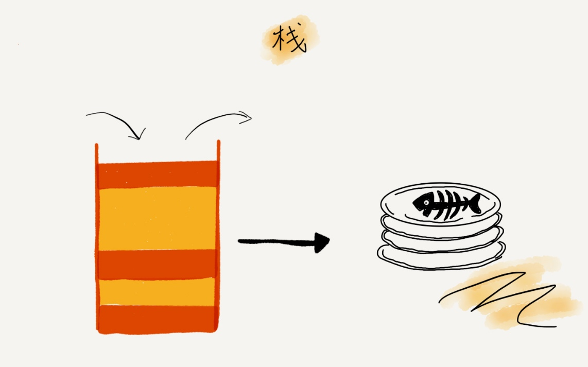
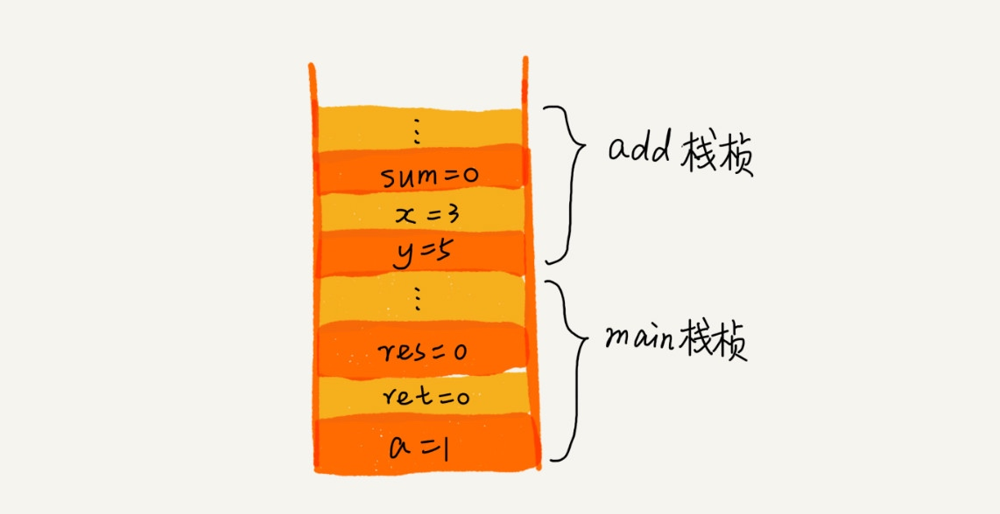
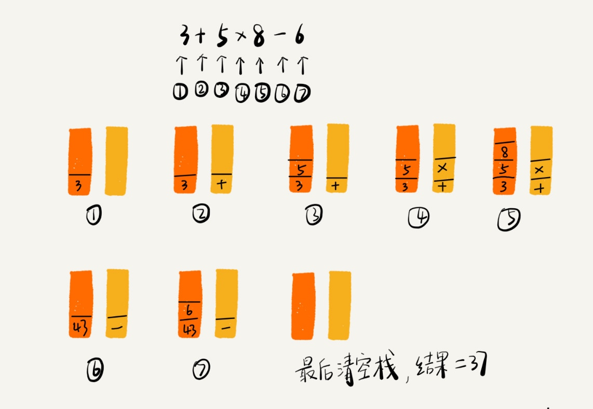

# 栈（Stack）

后进者先出，先进者后出

从栈的操作特性上来看，栈是一种“操作受限”的线性表，只允许在一端插入和删除数据。

**当某个数据集合只涉及在一端插入和删除数据，并且满足后进先出、先进后出的特性，我们就应该首选“栈”这种数据结构。**

入栈和出栈

+ 用数组实现的栈，我们叫作顺序栈。
+ 用链表实现的栈，我们叫作链式栈。

## 应用

+ 函数调用栈

+ 表达式求值
    + 3+5`*`8-6 （如果比运算符栈顶元素的优先级高，就将当前运算符压入栈；如果比运算符栈顶元素的优先级低或者相同，从运算符栈中取栈顶运算符，从操作数栈的栈顶取 2 个操作数，然后进行计算，再把计算完的结果压入操作数栈，继续比较。）

+ 括号匹配
+ 浏览器的前进、后退功能（两个栈）

## 堆栈

+ 内存中的堆栈和数据结构堆栈不是一个概念，可以说内存中的堆栈是真实存在的物理区，数据结构中的堆栈是抽象的数据存储结构。

+ 内存空间在逻辑上分为三部分：代码区、静态数据区和动态数据区，动态数据区又分为栈区和堆区。

    + 代码区：存储方法体的二进制代码。高级调度（作业调度）、中级调度（内存调度）、低级调度（进程调度）控制代码区执行代码的切换。
    + 静态数据区：存储全局变量、静态变量、常量，常量包括final修饰的常量和String常量。系统自动分配和回收。
    + 栈区：存储运行方法的形参、局部变量、返回值。由系统自动分配和回收。
    + 堆区：new 一个对象的引用或地址存储在栈区，指向该对象存储在堆区中的真实数据。

## 实现

+ 顺序栈。
+ 链式栈。
+ 动态扩容的顺序栈

