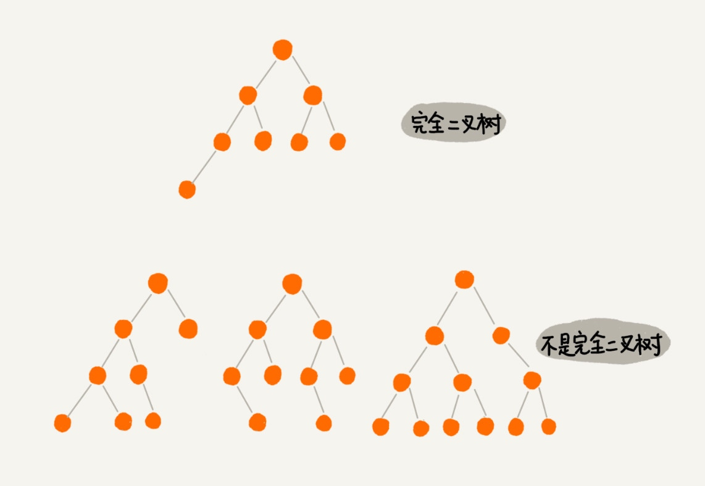
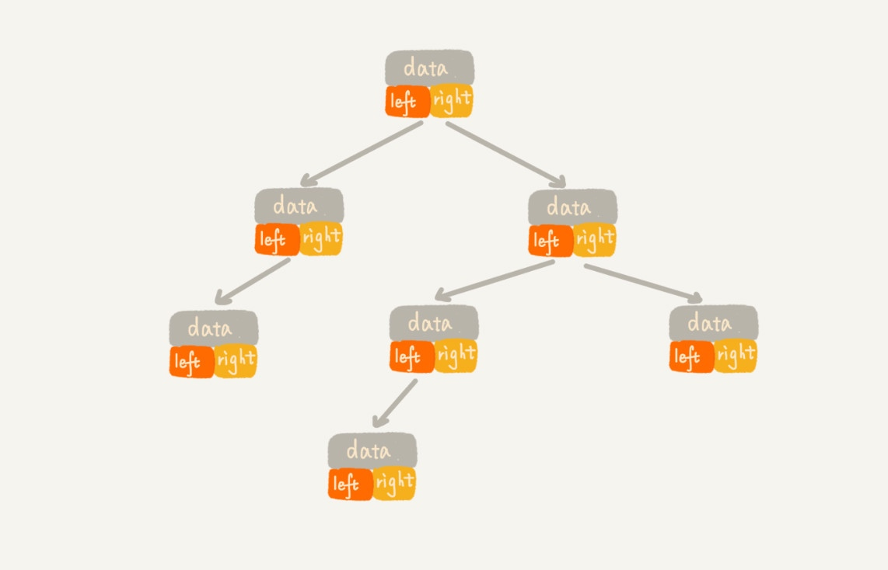
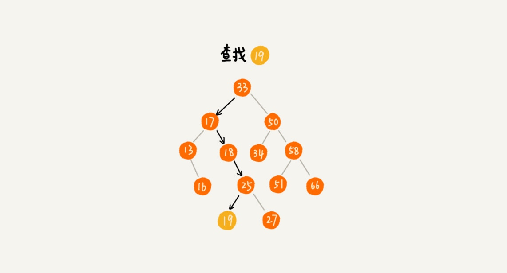
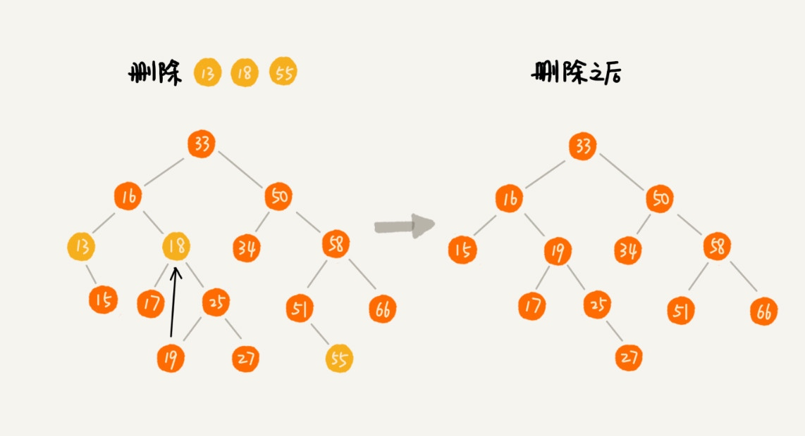
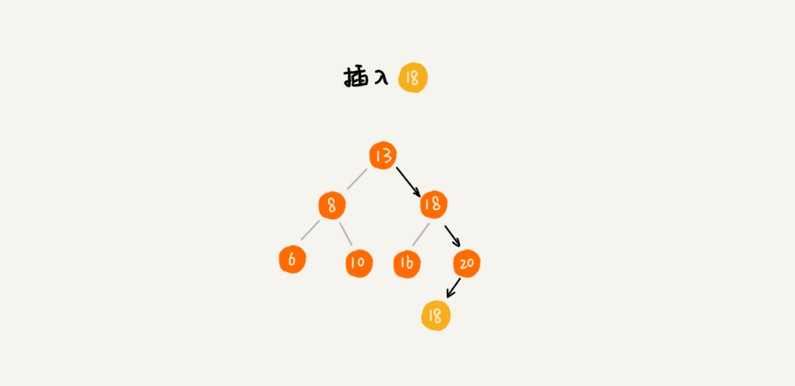
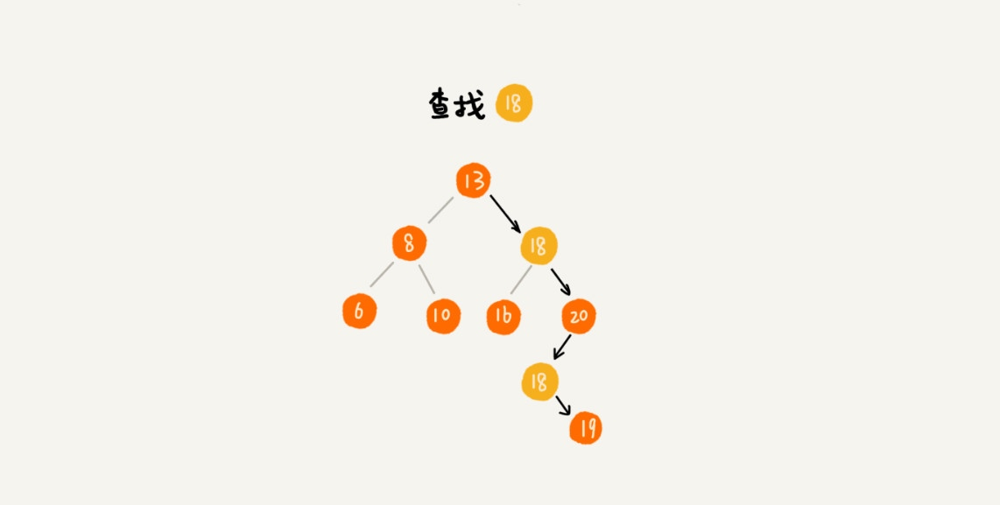
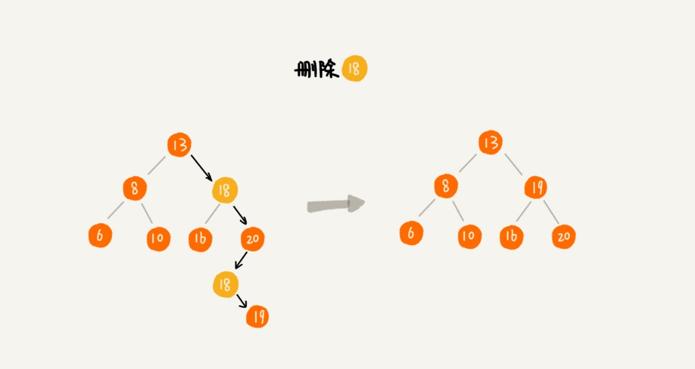

# 二叉树（Binary Tree）

每个节点最多有两个子节点，分别是左子节点和右子节点。



+ 满二叉树
    + 叶子节点全都在最底层
    + 除了叶子节点之外，每个节点都有左右两个子节点

+ 完全二叉树
    + 叶子节点都在最底下两层
    + 最后一层的叶子节点都靠左排列
    + 并且除了最后一层，其他层的节点个数都要达到最大

## 存储一棵二叉树

### 基于指针或者引用的二叉链式存储法



`Node: data/left/right`

### 基于数组的顺序存储法


>如果节点 X 存储在数组中下标为 i 的位置，下标为 2 * i 的位置存储的就是左子节点，下标为 2 * i + 1 的位置存储的就是右子节点。

>反过来，下标为 i/2 的位置存储就是它的父节点。通过这种方式，我们只要知道根节点存储的位置（一般情况下，为了方便计算子节点，根节点会存储在下标为 1 的位置），这样就可以通过下标计算，把整棵树都串起来。

如果是非完全二叉树，其实会浪费比较多的数组存储空间。

+ 如果某棵二叉树是一棵完全二叉树，那用数组存储无疑是最节省内存的一种方式。
+ 因为数组的存储方式并不需要像链式存储法那样，要存储额外的左右子节点的指针。
+ 这也是为什么完全二叉树会单独拎出来的原因，也是为什么完全二叉树要求最后一层的子节点都靠左的原因。

堆其实就是一种完全二叉树，最常用的存储方式就是数组。

# 二叉树的遍历


+ 前序遍历，对于树中的任意节点来说，先打印这个节点，然后再打印它的左子树，最后打印它的右子树。
+ 中序遍历，对于树中的任意节点来说，先打印它的左子树，然后再打印它本身，最后打印它的右子树。
+ 后序遍历，对于树中的任意节点来说，先打印它的左子树，然后再打印它的右子树，最后打印这个节点本身。
+ 按层遍历（可以用队列）

每个节点最多会被访问两次，所以遍历操作的时间复杂度，跟节点的个数 n 成正比，也就是说二叉树遍历的时间复杂度是 O(n)。

# 二叉查找树（Binary Search Tree）

二叉查找树要求，在树中的任意一个节点，其左子树中的每个节点的值，都要小于这个节点的值，而右子树节点的值都大于这个节点的值。



+ 查找


+ 插入



+ 删除
    + 一种方法是 分三种情况（要删除的节点没有子节点 / 要删除的节点只有一个子节点 / 要删除的节点有两个子节点）
    + 第二种方法单纯将要删除的节点标记为“已删除”
+ 快速地查找最大节点和最小节点、前驱节点和后继节点。
+ 还有一个重要的特性，就是中序遍历二叉查找树，可以输出有序的数据序列，时间复杂度是 O(n)，非常高效。因此，二叉查找树也叫作二叉排序树。

## 支持重复数据的二叉查找树

在实际的软件开发中，我们在二叉查找树中存储的，是一个包含很多字段的对象。我们利用对象的某个字段作为键值（key）来构建二叉查找树。我们把对象中的其他字段叫作卫星数据。

+ 第一种方法，二叉查找树中每一个节点不仅会存储一个数据，因此我们通过链表和支持动态扩容的数组等数据结构，把值相同的数据都存储在同一个节点上。








+ 第二种方法，每个节点仍然只存储一个数据。在查找插入位置的过程中，如果碰到一个节点的值，与要插入数据的值相同，我们就将这个要插入的数据放到这个节点的右子树，也就是说，把这个新插入的数据当作大于这个节点的值来处理。
    + 当要查找数据的时候，遇到值相同的节点，我们并不停止查找操作，而是继续在右子树中查找，直到遇到叶子节点，才停止。
    + 对于删除操作，我们也需要先查找到每个要删除的节点，然后再按前面讲的删除操作的方法，依次删除。

## 时间复杂度分析

时间复杂度其实都跟树的高度成正比，也就是 O(height)。

```md
n >= 1+2+4+8+...+2^(L-2)+1
n <= 1+2+4+8+...+2^(L-2)+2^(L-1)

// L 的范围是 [log2(n+1), log2n +1]。完全二叉树的层数小于等于 log2n +1，也就是说，完全二叉树的高度小于等于 log2n。
```

显然，极度不平衡的二叉查找树，它的查找性能肯定不能满足我们的需求。我们需要构建一种不管怎么删除、插入数据，在任何时候，都能保持任意节点左右子树都比较平衡的二叉查找树。

# 为什么还要用二叉查找树呢？

1. 散列表中的数据是无序存储的，如果要输出有序的数据，需要先进行排序。而对于二叉查找树来说，我们只需要中序遍历，就可以在 O(n) 的时间复杂度内，输出有序的数据序列。
2. 散列表扩容耗时很多，而且当遇到散列冲突时，性能不稳定，尽管二叉查找树的性能不稳定，但是在工程中，我们最常用的平衡二叉查找树的性能非常稳定，时间复杂度稳定在 O(logn)。
3. 笼统地来说，尽管散列表的查找等操作的时间复杂度是常量级的，但因为哈希冲突的存在，这个常量不一定比 logn 小，所以实际的查找速度可能不一定比 O(logn) 快。加上哈希函数的耗时，也不一定就比平衡二叉查找树的效率高。
4. 散列表的构造比二叉查找树要复杂，需要考虑的东西很多。比如散列函数的设计、冲突解决办法、扩容、缩容等。平衡二叉查找树只需要考虑平衡性这一个问题，而且这个问题的解决方案比较成熟、固定。最后，为了避免过多的散列冲突，散列表装载因子不能太大，特别是基于开放寻址法解决冲突的散列表，不然会浪费一定的存储空间。

# 问题

+ 给定一组数据，比如 1，3，5，6，9，10。你来算算，可以构建出多少种不同的二叉树？

+ 我们讲了三种二叉树的遍历方式，前、中、后序。实际上，还有另外一种遍历方式，也就是按层遍历，你知道如何实现吗？

+ 求出一棵给定二叉树的确切高度呢？
    + 后序遍历
    + 层次遍历
    + 递归


