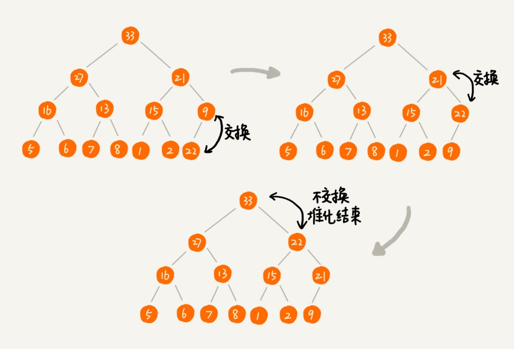
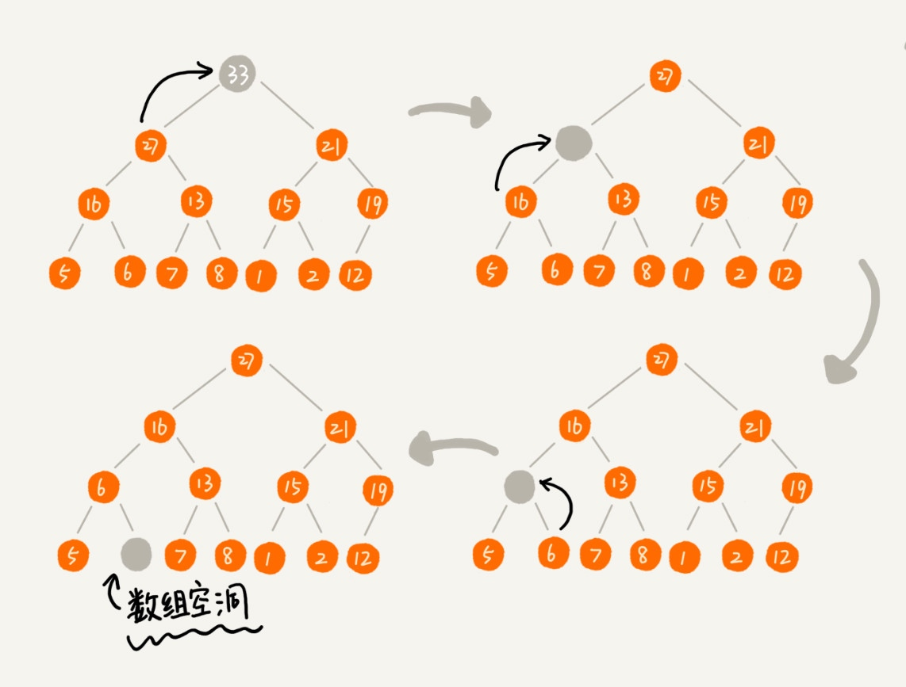
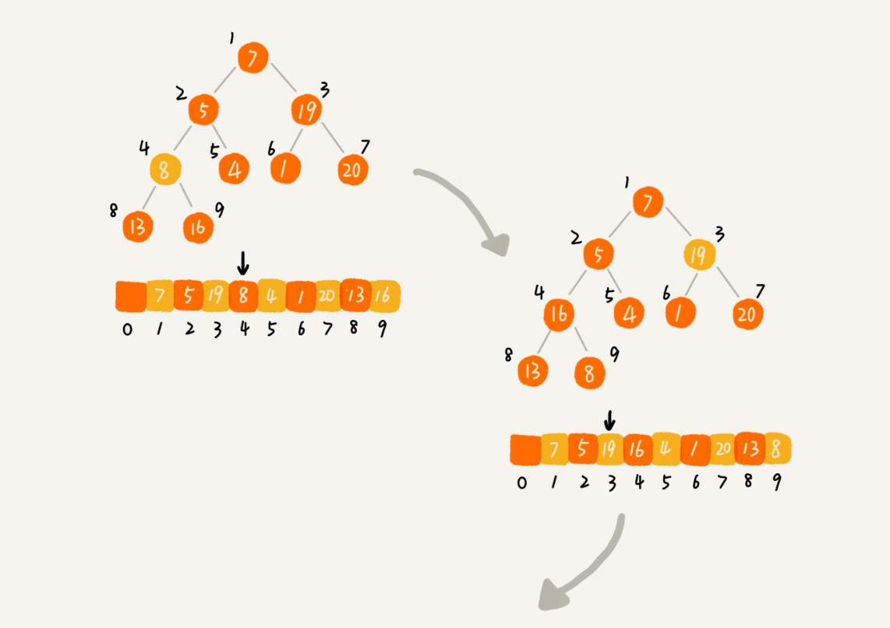
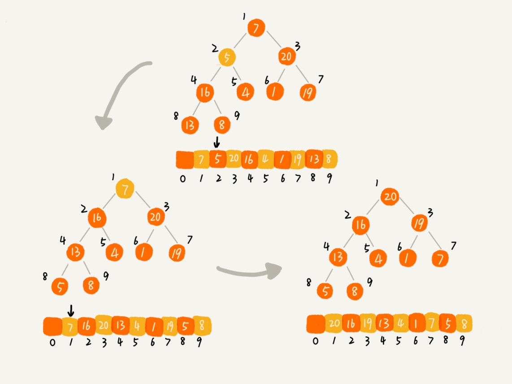

# 堆（Heap）

## 条件

+ 堆是一个完全二叉树
+ 堆中每一个节点的值都必须大于等于（或小于等于）其子树中每个节点的值。 大顶堆 / 小顶堆

## 存储

+ 完全二叉树比较适合用数组来存储。
+ 数组中下标为 i 的节点的左子节点，就是下标为 i∗2 的节点，右子节点就是下标为 i∗2+1 的节点，父节点就是下标为 i/2 的节点。

## 操作

> 堆化（heapify）（时间复杂度 O(logn)）

1. 往堆中插入一个元素 （时间复杂度 O(logn)）
    + 堆化 （从下往上）

2. 删除堆顶元素 （时间复杂度 O(logn)）
    + 堆化 （从上往下）

## 堆排序

+ 是原地排序算法
+ 建堆过程的时间复杂度是 O(n)，排序过程的时间复杂度是 O(nlogn)，所以，堆排序整体的时间复杂度是 O(nlogn)。
+ 不是稳定的排序算法

> 从 0 开始存储
> 如果节点的下标是 i，那左子节点的下标就是 2∗i+1，右子节点的下标就是 2∗i+2，父节点的下标就是 (i−1)/2。

### 建堆 O(n)

+ 第一种建堆思路的处理过程是从前往后处理数组数据，并且每个数据插入堆中时，都是从下往上堆化。
+ 第二种实现思路，是从后往前处理数组，并且每个数据都是从上往下堆化。

### 排序

建堆结束之后，数组中的数据已经是按照大顶堆的特性来组织的。数组中的第一个元素就是堆顶，也就是最大的元素。我们把它跟最后一个元素交换，那最大元素就放到了下标为 nn 的位置。

## 为什么快速排序要比堆排序性能好？

1. 堆排序数据访问的方式没有快速排序友好。
    + 对于快速排序来说，数据是局部顺序访问的。而对于堆排序来说，数据是跳着访问的，对 CPU 缓存是不友好的。
2. 对于同样的数据，在排序过程中，堆排序算法的数据交换次数要多于快速排序。
    + 建堆的过程会打乱数据原有的相对先后顺序，导致原数据的有序度降低。

## 问题

在讲堆排序建堆的时候，我说到，对于完全二叉树来说，下标从 n/2+1 到 n 的都是叶子节点，这个结论是怎么推导出来的呢？

我们今天讲了堆的一种经典应用，堆排序。关于堆，你还能想到它的其他应用吗？

## 堆的应用

### 优先级队列

优先级最高的，最先出队。

1. 合并有序小文件

    假设我们有 100 个小文件，每个文件的大小是 100MB，每个文件中存储的都是有序的字符串。我们希望将这些 100 个小文件合并成一个有序的大文件。这里就会用到优先级队列。

    整体思路有点像归并排序中的合并函数。我们从这 100 个文件中，各取第一个字符串，放入数组中，然后比较大小，把最小的那个字符串放入合并后的大文件中，并从数组中删除。

    这里就可以用到优先级队列，也可以说是堆。我们将从小文件中取出来的字符串放入到小顶堆中，那堆顶的元素，也就是优先级队列队首的元素，就是最小的字符串。我们将这个字符串放入到大文件中，并将其从堆中删除。然后再从小文件中取出下一个字符串，放入到堆中。循环这个过程，就可以将 100 个小文件中的数据依次放入到大文件中。

    删除堆顶数据和往堆中插入数据的时间复杂度都是 O(logn)

2. 高性能定时器

    假设我们有一个定时器，定时器中维护了很多定时任务，每个任务都设定了一个要触发执行的时间点。定时器每过一个很小的单位时间（比如 1 秒），就扫描一遍任务，看是否有任务到达设定的执行时间。如果到达了，就拿出来执行。

    针对这些问题，我们就可以用优先级队列来解决。我们按照任务设定的执行时间，将这些任务存储在优先级队列中，队列首部（也就是小顶堆的堆顶）存储的是最先执行的任务。

### 求 Top K

+ 静态数据集合
    + 维护一个大小为 K 的小顶堆，顺序遍历数组，从数组中取出数据与堆顶元素比较。
    + 遍历数组需要 O(n) 的时间复杂度，一次堆化操作需要 O(logK) 的时间复杂度，所以最坏情况下，n 个元素都入堆一次，时间复杂度就是 O(nlogK)。
+ 动态数据集合（快排效率低）

### 求中位数

维护两个堆，一个大顶堆，一个小顶堆。大顶堆中存储前半部分数据，小顶堆中存储后半部分数据，且小顶堆中的数据都大于大顶堆中的数据。

如果新加入的数据小于等于大顶堆的堆顶元素，我们就将这个新数据插入到大顶堆；否则，我们就将这个新数据插入到小顶堆。

如果 n 是偶数，两个堆中的数据个数都是 n/2；如果 n 是奇数，大顶堆有 n/2+1 个数据，小顶堆有 n/2 个数据。这个时候，我们可以从一个堆中不停地将堆顶元素移动到另一个堆，通过这样的调整，来让两个堆中的数据满足上面的约定。

> 如何快速求接口的 99% 响应时间
> 如果将一组数据从小到大排列，这个 99 百分位数就是大于前面 99% 数据的那个数据。

假设当前总数据的个数是 n，大顶堆中保存 n*99% 个数据，小顶堆中保存 n*1% 个数据。大顶堆堆顶的数据就是我们要找的 99% 响应时间。

