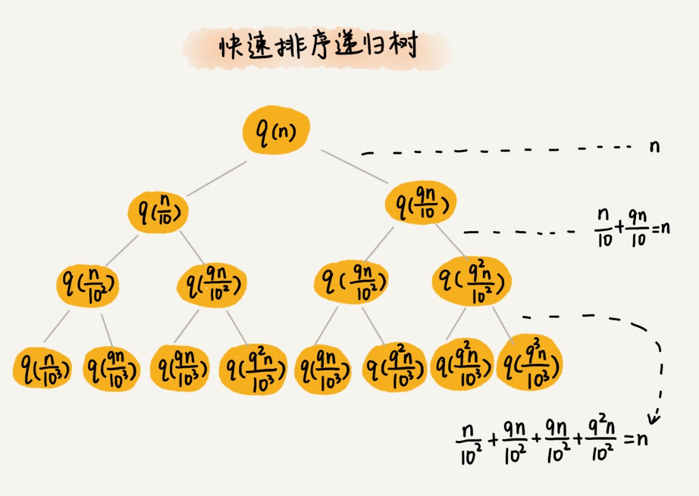

# 递归树（Recursion Tree）

## 实战

+ 分析快速排序的时间复杂度

+ 分析斐波那契数列的时间复杂度
    + f(n) = f(n−1) + f(n−2)

+ 分析全排列的时间复杂度

## 问题

11 个细胞的生命周期是 33 小时，11 小时分裂一次。求 nn 小时后，容器内有多少细胞？请你用已经学过的递归时间复杂度的分析方法，分析一下这个递归问题的时间复杂度。

`f(n) = 2*f(n−1) - f(n−3)`

