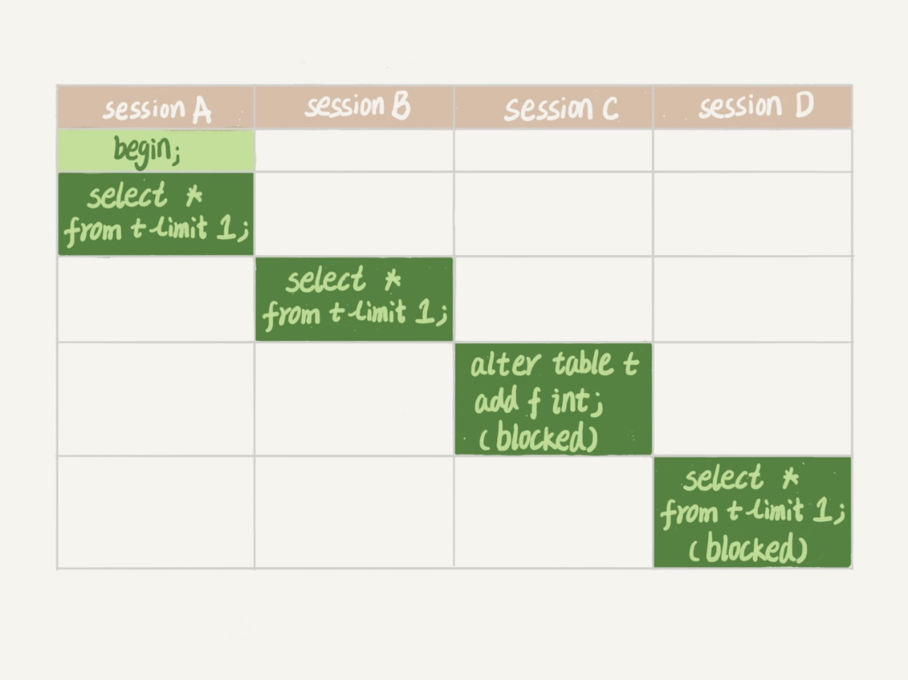

# 全局锁和表锁

数据库锁设计的初衷是处理并发问题。

作为多用户共享的资源，当出现并发访问的时候，数据库需要合理地控制资源的访问规则。而锁就是用来实现这些访问规则的重要数据结构。

## 全局锁

全局锁就是对整个数据库实例加锁。

MySQL 提供了一个加全局读锁的方法，命令是 Flush tables with read lock (FTWRL)。
当你需要让整个库处于只读状态的时候，可以使用这个命令，之后其他线程的以下语句会被阻塞：数据更新语句（数据的增删改）、数据定义语句（包括建表、修改表结构等）和更新类事务的提交语句。

**全局锁的典型使用场景是，做全库逻辑备份。也就是把整库每个表都 select 出来存成文本。**

### 整库都只读的结果

如果你在主库上备份，那么在备份期间都不能执行更新，业务基本上就得停摆；

如果你在从库上备份，那么备份期间从库不能执行主库同步过来的 binlog，会导致主从延迟。

### 在可重复读隔离级别下开启一个事务进行备份

官方自带的逻辑备份工具是 mysqldump。当 mysqldump 使用参数–single-transaction 的时候，导数据之前就会启动一个事务，来确保拿到一致性视图。而由于 MVCC 的支持，这个过程中数据是可以正常更新的。

### 为什么还需要 FTWRL

*一致性读是好，但前提是引擎要支持这个隔离级别。*

比如，对于 MyISAM 这种不支持事务的引擎，如果备份过程中有更新，总是只能取到最新的数据，那么就破坏了备份的一致性。这时，我们就需要使用 FTWRL 命令了。

所以，**single-transaction 方法只适用于所有的表使用事务引擎的库。**如果有的表使用了不支持事务的引擎，那么备份就只能通过 FTWRL 方法。这往往是 DBA 要求业务开发人员使用 InnoDB 替代 MyISAM 的原因之一。

### 既然要全库只读，为什么不使用 set global readonly=true 的方式呢？

1. 在有些系统中，readonly 的值会被用来做其他逻辑，比如用来判断一个库是主库还是备库。因此，修改 global 变量的方式影响面更大，我不建议你使用。
2. 在异常处理机制上有差异。

    如果执行 FTWRL 命令之后由于客户端发生异常断开，那么 MySQL 会自动释放这个全局锁，整个库回到可以正常更新的状态。

    而将整个库设置为 readonly 之后，如果客户端发生异常，则数据库就会一直保持 readonly 状态，这样会导致整个库长时间处于不可写状态，风险较高。

业务的更新不只是增删改数据（DML)，还有可能是加字段等修改表结构的操作（DDL）。不论是哪种方法，一个库被全局锁上以后，你要对里面任何一个表做加字段操作，都是会被锁住的。

## 表级锁

MySQL 里面表级别的锁有两种：一种是表锁，一种是元数据锁（meta data lock，MDL)。

### 表锁

语法是 `lock tables … read/write`。

与 FTWRL 类似，可以用 `unlock tables` 主动释放锁，也可以在客户端断开的时候自动释放。

需要注意，lock tables 语法除了会限制别的线程的读写外，也限定了本线程接下来的操作对象。

### 元数据锁 MDL（metadata lock)

MDL 不需要显式使用，在访问一个表的时候会被自动加上。

MDL 的作用是，保证读写的正确性。你可以想象一下，如果一个查询正在遍历一个表中的数据，而执行期间另一个线程对这个表结构做变更，删了一列，那么查询线程拿到的结果跟表结构对不上，肯定是不行的。

在 MySQL 5.5 版本中引入了 MDL，当对一个表做增删改查操作的时候，加 MDL 读锁；当要对表做结构变更操作的时候，加 MDL 写锁。

+ 读锁之间不互斥，因此你可以有多个线程同时对一张表增删改查。
+ 读写锁之间、写锁之间是互斥的，用来保证变更表结构操作的安全性。

### 给一个小表加个字段，导致整个库挂了

给一个表加字段，或者修改字段，或者加索引，需要扫描全表的数据。在对大表操作的时候，你肯定会特别小心，以免对线上服务造成影响。而实际上，即使是小表，操作不慎也会出问题。

MySQL 5.6



1. 我们可以看到 session A 先启动，这时候会对表 t 加一个 MDL 读锁。由于 session B 需要的也是 MDL 读锁，因此可以正常执行。
2. 之后 session C 会被 blocked，是因为 session A 的 MDL 读锁还没有释放，而 session C 需要 MDL 写锁，因此只能被阻塞。
3. 如果只有 session C 自己被阻塞还没什么关系，但是之后所有要在表 t 上新申请 MDL 读锁的请求也会被 session C 阻塞。前面我们说了，所有对表的增删改查操作都需要先申请 MDL 读锁，就都被锁住，等于这个表现在完全不可读写了。
4. 如果某个表上的查询语句频繁，而且客户端有重试机制，也就是说超时后会再起一个新 session 再请求的话，这个库的线程很快就会爆满。

**事务中的 MDL 锁，在语句执行开始时申请，但是语句结束后并不会马上释放，而会等到整个事务提交后再释放。**

### 如何安全地给小表加字段？

首先我们要解决长事务，事务不提交，就会一直占着 MDL 锁。在 MySQL 的 information_schema 库的 innodb_trx 表中，你可以查到当前执行中的事务。如果你要做 DDL 变更的表刚好有长事务在执行，要考虑先暂停 DDL，或者 kill 掉这个长事务。

*如果你要变更的表是一个热点表，虽然数据量不大，但是上面的请求很频繁，而你不得不加个字段，你该怎么做呢？*

这时候 kill 可能未必管用，因为新的请求马上就来了。比较理想的机制是，在 alter table 语句里面设定等待时间，如果在这个指定的等待时间里面能够拿到 MDL 写锁最好，拿不到也不要阻塞后面的业务语句，先放弃。之后开发人员或者 DBA 再通过重试命令重复这个过程。

MariaDB 已经合并了 AliSQL 的这个功能，所以这两个开源分支目前都支持 DDL NOWAIT/WAIT n 这个语法。

```sql
ALTER TABLE tbl_name NOWAIT add column ...
ALTER TABLE tbl_name WAIT N add column ...
```

### 发现你的应用程序里有 lock tables 这样的语句可能的情况有

1. 要么是你的系统现在还在用 MyISAM 这类不支持事务的引擎，那要安排升级换引擎；
2. 要么是你的引擎升级了，但是代码还没升级。我见过这样的情况，最后业务开发就是把 lock tables 和 unlock tables 改成 begin 和 commit，问题就解决了。

## 备份一般都会在备库上执行，你在用–single-transaction 方法做逻辑备份的过程中，如果主库上的一个小表做了一个 DDL，比如给一个表上加了一列。这时候，从备库上会看到什么现象呢？

```sql
/* 在备份开始的时候，为了确保 RR（可重复读）隔离级别，再设置一次 RR 隔离级别 */
Q1:SET SESSION TRANSACTION ISOLATION LEVEL REPEATABLE READ;
/* 启动事务，这里用 WITH CONSISTENT SNAPSHOT 确保这个语句执行完就可以得到一个一致性视图 */
Q2:START TRANSACTION  WITH CONSISTENT SNAPSHOT；
/* other tables */
/* 设置一个保存点，这个很重要 */
Q3:SAVEPOINT sp;
/* 时刻 1 */
/* show create 是为了拿到表结构 */
Q4:show create table `t1`;
/* 时刻 2 */
/* 正式导数据 */
Q5:SELECT * FROM `t1`;
/* 时刻 3 */
/* 回滚到 SAVEPOINT sp，在这里的作用是释放 t1 的 MDL 锁 */
Q6:ROLLBACK TO SAVEPOINT sp;
/* 时刻 4 */
/* other tables */
```

1. 如果在 Q4 语句执行之前到达，现象：没有影响，备份拿到的是 DDL 后的表结构。
2. 如果在“时刻 2”到达，则表结构被改过，Q5 执行的时候，报 Table definition has changed, please retry transaction，现象：mysqldump 终止；
3. 如果在“时刻 2”和“时刻 3”之间到达，mysqldump 占着 t1 的 MDL 读锁，binlog 被阻塞，现象：主从延迟，直到 Q6 执行完成。
4. 从“时刻 4”开始，mysqldump 释放了 MDL 读锁，现象：没有影响，备份拿到的是 DDL 前的表结构。

## 评论区

Online DDL
1. 拿MDL写锁
2. 降级成MDL读锁
3. 真正做DDL
4. 升级成MDL写锁
5. 释放MDL锁

1、2、4、5如果没有锁冲突，执行时间非常短。第3步占用了DDL绝大部分时间，这期间这个表可以正常读写数据，是因此称为“online ”

---

readonly 对 super 权限无效

---

MDL作用是防止DDL和DML并发的冲突

---

InnoDB会把主键字段放到索引定义字段后面，
当然同时也会去重。

所以，当主键是(a,b)的时候，
定义为c的索引，实际上是（c,a,b);
定义为(c,a)的索引，实际上是(c,a,b)
你看着加是相同的

定义为(c,b）的索引，实际上是（c,b,a)


