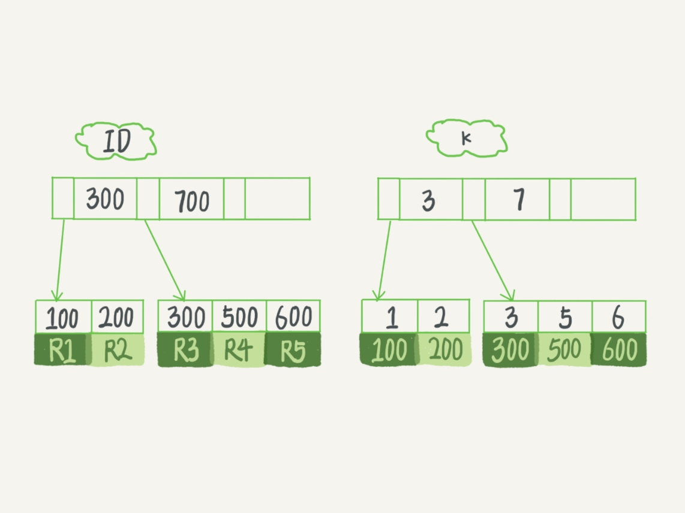
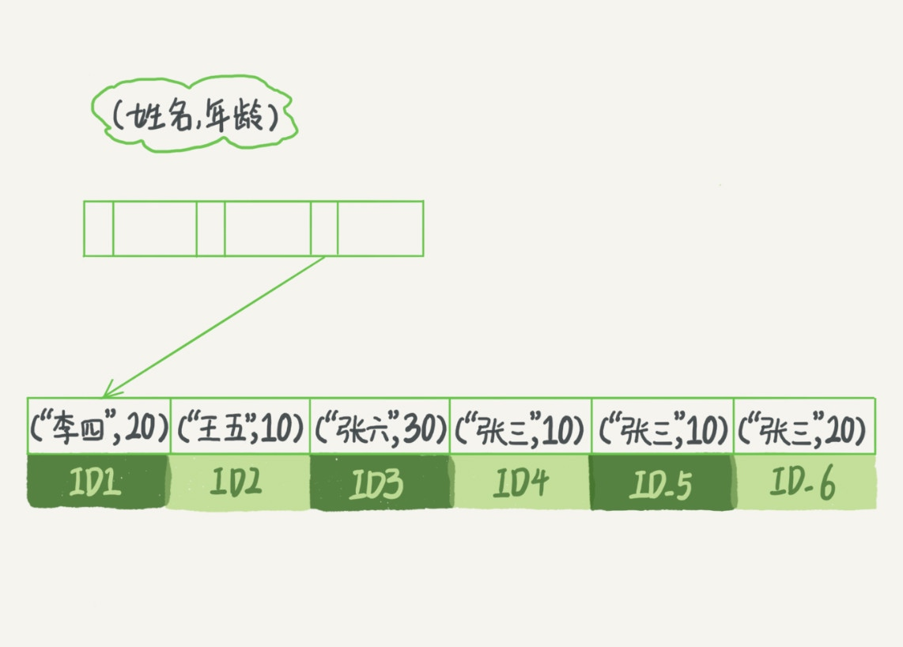

# 索引优化原则

`select * from T where k between 3 and 5` 需要执行几次树的搜索操作，会扫描多少行？

```sql
create table T (
ID int primary key,
k int NOT NULL DEFAULT 0,
s varchar(16) NOT NULL DEFAULT '',
index k(k))
engine=InnoDB;

insert into T values(100,1, 'aa'),(200,2,'bb'),(300,3,'cc'),(500,5,'ee'),(600,6,'ff'),(700,7,'gg');
```



查询语句的执行流程

1. 在 k 索引树上找到 k=3 的记录，取得 ID = 300；
2. 再到 ID 索引树查到 ID=300 对应的 R3；
3. 在 k 索引树取下一个值 k=5，取得 ID=500；
4. 再回到 ID 索引树查到 ID=500 对应的 R4；
5. 在 k 索引树取下一个值 k=6，不满足条件，循环结束。

## 覆盖索引

如果执行的语句是 select ID from T where k between 3 and 5，这时只需要查 ID 的值，而 ID 的值已经在 k 索引树上了，因此可以直接提供查询结果，不需要回表。也就是说，在这个查询里面，索引 k 已经“覆盖了”我们的查询需求，我们称为覆盖索引。

**由于覆盖索引可以减少树的搜索次数，显著提升查询性能，所以使用覆盖索引是一个常用的性能优化手段。**

需要注意的是，在引擎内部使用覆盖索引在索引 k 上其实读了三个记录，R3~R5（对应的索引 k 上的记录项），但是对于 MySQL 的 Server 层来说，它就是找引擎拿到了两条记录，因此 MySQL 认为扫描行数是 2。

### 在一个市民信息表上，是否有必要将身份证号和名字建立联合索引？是不是浪费空间？

```sql
CREATE TABLE `tuser` (
  `id` int(11) NOT NULL,
  `id_card` varchar(32) DEFAULT NULL,
  `name` varchar(32) DEFAULT NULL,
  `age` int(11) DEFAULT NULL,
  `ismale` tinyint(1) DEFAULT NULL,
  PRIMARY KEY (`id`),
  KEY `id_card` (`id_card`),
  KEY `name_age` (`name`,`age`)
) ENGINE=InnoDB
```

如果现在有一个高频请求，要根据市民的身份证号查询他的姓名，这个联合索引就有意义了。它可以在这个高频请求上用到覆盖索引，不再需要回表查整行记录，减少语句的执行时间。

## 最左前缀原则

**B+ 树这种索引结构，可以利用索引的“最左前缀”，来定位记录。**



最左前缀可以是联合索引的最左 N 个字段，也可以是字符串索引的最左 M 个字符。

### 在建立联合索引的时候，如何安排索引内的字段顺序

1. 如果通过调整顺序，可以少维护一个索引，那么这个顺序往往就是需要优先考虑采用的。（索引的复用能力）
2. 空间。比如上面这个市民表的情况，name 字段是比 age 字段大的 ，那我就建议你创建一个（name,age) 的联合索引和一个 (age) 的单字段索引。

## 索引下推

```sql
# 我们还是以市民表的联合索引（name, age）为例。如果现在有一个需求：检索出表中“名字第一个字是张，而且年龄是 10 岁的所有男孩”。那么，SQL 语句是这么写的：

select * from tuser where name like '张%' and age=10 and ismale=1;
```

1. 这个语句在搜索索引树的时候，只能用 “张”，找到第一个满足条件的记录 ID3。
2. 在 MySQL 5.6 之前，只能从 ID3 开始一个个回表。到主键索引上找出数据行，再对比字段值。
3. MySQL 5.6 引入的索引下推优化（index condition pushdown)， 可以在索引遍历过程中，对索引中包含的字段先做判断，直接过滤掉不满足条件的记录，减少回表次数。

## 关于对联合主键索引和 InnoDB 索引组织表

```sql
CREATE TABLE `geek` (
  `a` int(11) NOT NULL,
  `b` int(11) NOT NULL,
  `c` int(11) NOT NULL,
  `d` int(11) NOT NULL,
  PRIMARY KEY (`a`,`b`),
  KEY `c` (`c`),
  KEY `ca` (`c`,`a`),
  KEY `cb` (`c`,`b`)
) ENGINE=InnoDB;

select * from geek where c=N order by a limit 1;
select * from geek where c=N order by b limit 1;
```

主键 a，b 的聚簇索引组织顺序相当于 order by a,b ，也就是先按 a 排序，再按 b 排序，c 无序。

索引 ca 的组织是先按 c 排序，再按 a 排序，同时记录主键。（这个跟索引 c 的数据是一模一样的。）

索引 cb 的组织是先按 c 排序，在按 b 排序，同时记录主键。

结论是 ca 可以去掉，cb 需要保留。

## 评论区

在不影响排序结果的情况下，在取出主键后，回表之前，会在对所有获取到的主键排序，请问是否存在这种情况？

Multi-Range Read (MRR) 策略

