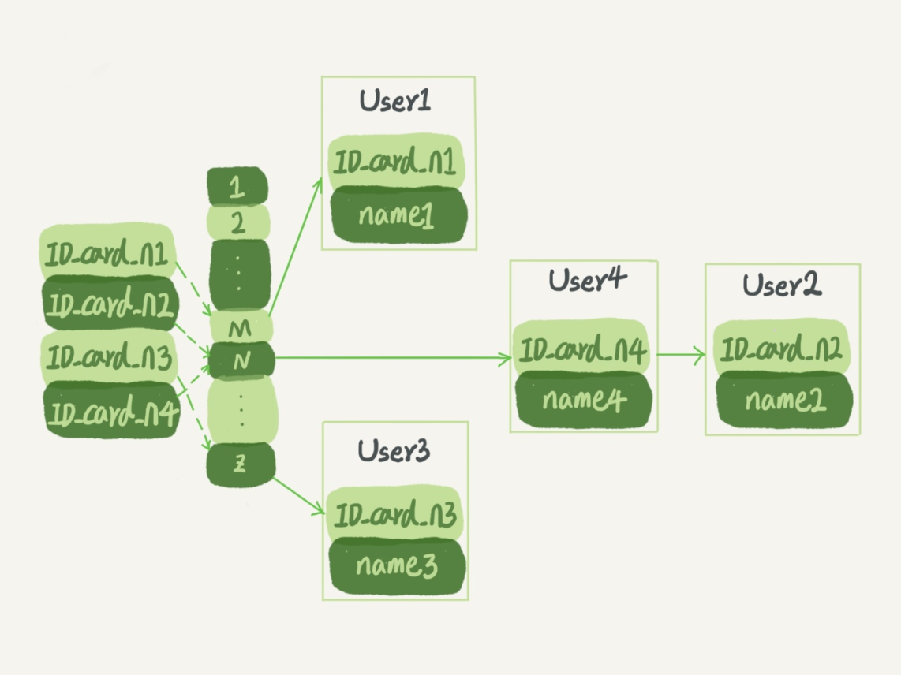
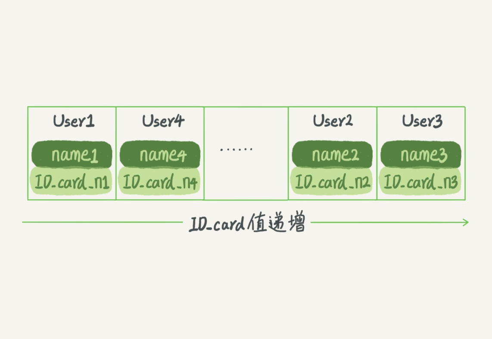
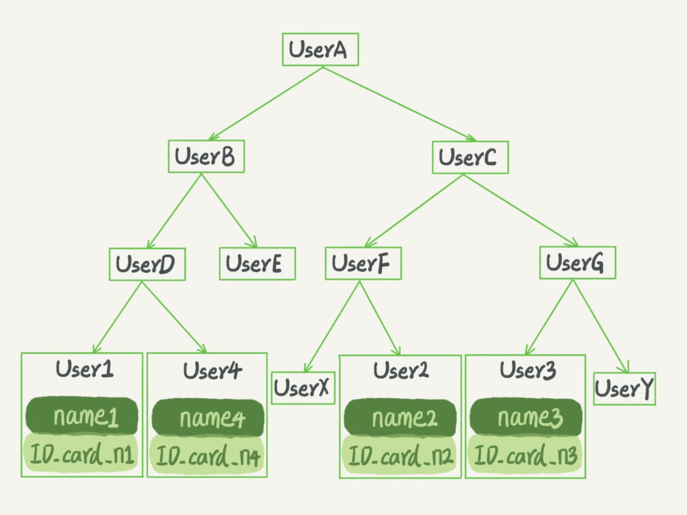
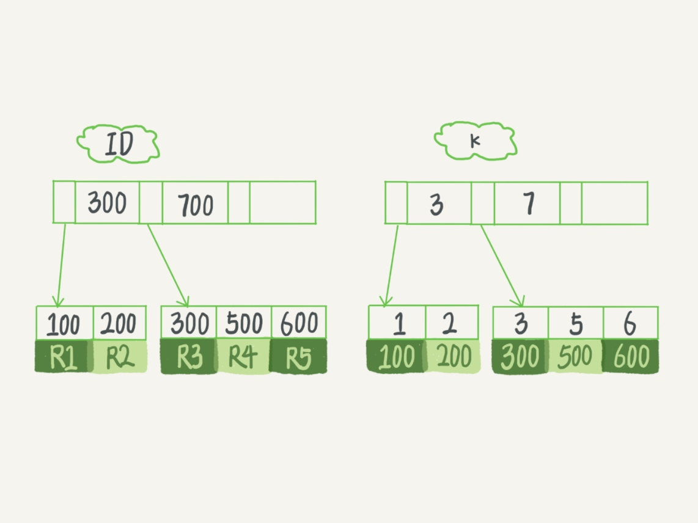

# 索引模型

> 索引的出现其实就是为了提高数据查询的效率，就像书的目录一样。

## 索引的常见模型

### 哈希表



图中四个 ID_card_n 的值并不是递增的，这样做的好处是增加新的 User 时速度会很快，只需要往后追加。

但缺点是，因为不是有序的，所以哈希索引做区间查询的速度是很慢的（必须全部扫描一遍）。

哈希表这种结构适用于只有等值查询的场景，比如 Memcached 及其他一些 NoSQL 引擎。

### 有序数组

有序数组在等值查询（二分法，时间复杂度是 O(log(N))）和范围查询场景中的性能就都非常优秀。



在需要更新数据的时候就麻烦了，你往中间插入一个记录就必须得挪动后面所有的记录，成本太高。

**有序数组索引只适用于静态存储引擎**

### 搜索树



二叉搜索树

当然为了维持 O(log(N)) 的查询复杂度，你就需要保持这棵树是平衡二叉树。为了做这个保证，更新的时间复杂度也是 O(log(N))。

为了让一个查询尽量少地读磁盘，就必须让查询过程访问尽量少的数据块。那么，我们就不应该使用二叉树，而是要使用“N 叉”树。这里，“N 叉”树中的“N”取决于数据块的大小。

以 InnoDB 的一个整数字段索引为例，这个 N 差不多是 1200。这棵树高是 4 的时候，就可以存 1200 的 3 次方个值，这已经 17 亿了。考虑到树根的数据块总是在内存中的，一个 10 亿行的表上一个整数字段的索引，查找一个值最多只需要访问 3 次磁盘。其实，树的第二层也有很大概率在内存中，那么访问磁盘的平均次数就更少了。

**N 叉树由于在读写上的性能优点，以及适配磁盘的访问模式，已经被广泛应用在数据库引擎中了。**

跳表、LSM 树等数据结构也被用于引擎设计中。

*数据库底层存储的核心就是基于这些数据模型的。每碰到一个新数据库，我们需要先关注它的数据模型，这样才能从理论上分析出这个数据库的适用场景。*

## InnoDB 的索引模型

在 InnoDB 中，表都是根据主键顺序以索引的形式存放的，这种存储方式的表称为索引组织表。又因为前面我们提到的，InnoDB 使用了 B+ 树索引模型，所以数据都是存储在 B+ 树中的。

每一个索引在 InnoDB 里面对应一棵 B+ 树。



根据叶子节点的内容，索引类型分为*主键索引*和*非主键索引*。

主键索引的叶子节点存的是整行数据。在 InnoDB 里，主键索引也被称为**聚簇索引**（clustered index）。

非主键索引的叶子节点内容是主键的值。在 InnoDB 里，非主键索引也被称为**二级索引**（secondary index）。

### 基于主键索引和普通索引的查询有什么区别？

+ 如果语句是 select * from T where ID=500，即主键查询方式，则只需要搜索 ID 这棵 B+ 树；
+ 如果语句是 select * from T where k=5，即普通索引查询方式，则需要先搜索 k 索引树，得到 ID 的值为 500，再到 ID 索引树搜索一次。这个过程称为**回表**。

基于非主键索引的查询需要多扫描一棵索引树。因此，我们在应用中应该尽量使用主键查询。

## 索引维护

B+ 树为了维护索引有序性，在插入新值的时候需要做必要的维护。以上面这个图为例，如果插入新的行 ID 值为 700，则只需要在 R5 的记录后面插入一个新记录。如果新插入的 ID 值为 400，就相对麻烦了，需要逻辑上挪动后面的数据，空出位置。

而更糟的情况是，如果 R5 所在的数据页已经满了，根据 B+ 树的算法，这时候需要申请一个新的数据页，然后挪动部分数据过去。这个过程称为**页分裂**。在这种情况下，性能自然会受影响。

除了性能外，页分裂操作还影响数据页的利用率。原本放在一个页的数据，现在分到两个页中，整体空间利用率降低大约 50%。

当然有分裂就有合并。当相邻两个页由于删除了数据，利用率很低之后，会将数据页做合并。合并的过程，可以认为是**分裂过程的逆过程**。

### 哪些场景下应该使用自增主键，而哪些场景下不应该

`NOT NULL PRIMARY KEY AUTO_INCREMENT`

1. 性能
    自增主键的插入数据模式，正符合了我们前面提到的递增插入的场景。每次插入一条新记录，都是追加操作，都不涉及到挪动其他记录，也不会触发叶子节点的分裂。

    而有业务逻辑的字段做主键，则往往不容易保证有序插入，这样写数据成本相对较高。

2. 存储空间
    由于每个非主键索引的叶子节点上都是主键的值。如果用身份证号做主键，那么每个二级索引的叶子节点占用约 20 个字节，而如果用整型做主键，则只要 4 个字节，如果是长整型（bigint）则是 8 个字节。

    主键长度越小，普通索引的叶子节点就越小，普通索引占用的空间也就越小。

#### 适合用业务字段直接做主键的场景

1. 只有一个索引；
2. 该索引必须是唯一索引。

这就是典型的 KV 场景。

由于没有其他索引，所以也就不用考虑其他索引的叶子节点大小的问题。

## 重建索引，方式是否合理

```sql
// 重建索引 k
alter table T drop index k;
alter table T add index(k);

// 重建主键索引
alter table T drop primary key;
alter table T add primary key(id);
```

### why

索引可能因为删除，或者页分裂等原因，导致数据页有空洞，重建索引的过程会创建一个新的索引，把数据按顺序插入，这样页面的利用率最高，也就是索引更紧凑、更省空间。

### how

重建索引 k 的做法是合理的，可以达到省空间的目的。

但是，重建主键的过程不合理。不论是删除主键还是创建主键，都会将整个表重建。所以连着执行这两个语句的话，第一个语句就白做了。

```sql
alter table T engine=InnoDB;
```

## 评论区

没有主键的表，innodb会给默认创建一个Rowid做主键。

---

“N叉树”的N值在MySQL中是可以被人工调整的么？

1， 通过改变key值来调整
N叉树中非叶子节点存放的是索引信息，索引包含Key和Point指针。Point指针固定为6个字节，假如Key为10个字节，那么单个索引就是16个字节。如果B+树中页大小为16K，那么一个页就可以存储1024个索引，此时N就等于1024。我们通过改变Key的大小，就可以改变N的值
2， 改变页的大小
页越大，一页存放的索引就越多，N就越大。

---

自增索引 建议设置 bigint unsigned


