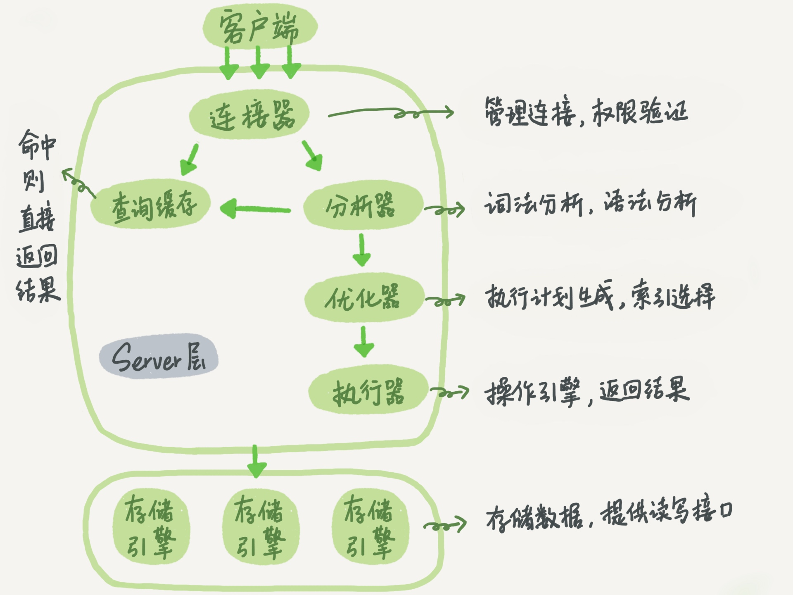

# 基础架构：查询语句执行过程



## Server 层

> 1. 包括连接器、查询缓存、分析器、优化器、执行器等
> 2. 所有的内置函数（如日期、时间、数学和加密函数等）
> 3. 所有跨存储引擎的功能都在这一层实现，比如存储过程、触发器、视图等。

### 1. 连接器

> 负责跟客户端建立连接、获取权限、维持和管理连接。

```sh
mysql -h$ip -P$port -u$user -p
```

1. 完成经典的 TCP 握手后，连接器就要开始认证你的身份，这个时候用的就是你输入的用户名和密码。
2. 如果用户名或密码不对，你就会收到一个"Access denied for user"的错误，然后客户端程序结束执行。
3. 如果用户名密码认证通过，连接器会到权限表里面查出你拥有的权限。之后，这个连接里面的权限判断逻辑，都将依赖于此时读到的权限。（管理员账号修改用户权限，不会影响已经存在连接的权限。）
4. 连接完成后，如果你没有后续的动作，这个连接就处于空闲状态，你可以在 **show processlist** 命令中看到它。（其中的 Command 列显示为“Sleep”的这一行，就表示现在系统里面有一个空闲连接。）
5. 客户端如果太长时间没动静，连接器就会自动将它断开。这个时间是由参数 **wait_timeout** 控制的，默认值是 8 小时。
6. 如果在连接被断开之后，客户端再次发送请求的话，就会收到一个错误提醒： Lost connection to MySQL server during query。这时候如果你要继续，就需要重连，然后再执行请求了。

**长连接**是指连接成功后，如果客户端持续有请求，则一直使用同一个连接。
**短连接则**是指每次执行完很少的几次查询就断开连接，下次查询再重新建立一个。

> 建立连接的过程通常是比较复杂的，所以我建议你在使用中要尽量减少建立连接的动作，也就是尽量使用长连接。

#### 全部使用长连接后，有些时候 MySQL 占用内存涨得特别快

因为 MySQL 在执行过程中临时使用的内存是管理在连接对象里面的。这些资源会在连接断开的时候才释放。所以如果长连接累积下来，可能导致内存占用太大，被系统强行杀掉（OOM），从现象看就是 MySQL 异常重启了。

解决方案

1. 定期断开长连接。使用一段时间，或者程序里面判断执行过一个占用内存的大查询后，断开连接，之后要查询再重连。
2. 如果你用的是 MySQL 5.7 或更新版本，可以在每次执行一个比较大的操作后，通过执行 mysql_reset_connection 来重新初始化连接资源。这个过程不需要重连和重新做权限验证，但是会将连接恢复到刚刚创建完时的状态。

### 2. 查询缓存

1. MySQL 拿到一个查询请求后，会先到查询缓存看看，之前是不是执行过这条语句。之前执行过的语句及其结果可能会以 key-value 对的形式，被直接缓存在内存中。key 是查询的语句，value 是查询的结果。
2. 如果你的查询能够直接在这个缓存中找到 key，那么这个 value 就会被直接返回给客户端。
3. 如果语句不在查询缓存中，就会继续后面的执行阶段。执行完成后，执行结果会被存入查询缓存中。

#### 大多数情况下建议不要使用查询缓存

> 查询缓存的失效非常频繁，只要有对一个表的更新，这个表上所有的查询缓存都会被清空。

MySQL 也提供了这种“按需使用”的方式。你可以将参数 query_cache_type 设置成 DEMAND，这样对于默认的 SQL 语句都不使用查询缓存。而对于你确定要使用查询缓存的语句，可以用 SQL_CACHE 显式指定。

```sql
select SQL_CACHE * from T where ID=10；
```

> MySQL 8.0 版本直接将查询缓存的整块功能删掉了

### 3. 分析器

1. 对 SQL 语句做解析
2. 分析器先会做“词法分析”。你输入的是由多个字符串和空格组成的一条 SQL 语句，MySQL 需要识别出里面的字符串分别是什么，代表什么。（MySQL 从你输入的"select"这个关键字识别出来，这是一个查询语句。它也要把字符串“T”识别成“表名 T”，把字符串“ID”识别成“列 ID”。）
3. 根据词法分析的结果，语法分析器会根据语法规则，判断你输入的这个 SQL 语句是否满足 MySQL 语法。
4. 如果你的语句不对，就会收到“You have an error in your SQL syntax”的错误提醒。

> 一般语法错误会提示第一个出现错误的位置，所以你要关注的是紧接“use near”的内容。

### 4. 优化器

优化器是在表里面有多个索引的时候，决定使用哪个索引；或者在一个语句有多表关联（join）的时候，决定各个表的连接顺序。

### 5. 执行器

1. 开始执行的时候，要先判断一下你对这个表 T 有没有执行查询的权限，如果没有，就会返回没有权限的错误。（(在工程实现上，如果命中查询缓存，会在查询缓存返回结果的时候，做权限验证。查询也会在优化器之前调用 precheck 验证权限)。）
2. 如果有权限，就打开表继续执行。打开表的时候，执行器就会根据表的引擎定义，去使用这个引擎提供的接口。

#### 无索引

1. 调用 InnoDB 引擎接口取这个表的第一行，判断 ID 值是不是 10，如果不是则跳过，如果是则将这行存在结果集中；
2. 调用引擎接口取“下一行”，重复相同的判断逻辑，直到取到这个表的最后一行。
3. 执行器将上述遍历过程中所有满足条件的行组成的记录集作为结果集返回给客户端。

#### 有索引

1. 第一次调用的是“取满足条件的第一行”这个接口。
2. 之后循环取“满足条件的下一行”这个接口，这些接口都是引擎中已经定义好的。

> 在数据库的慢查询日志中看到一个 **rows_examined** 的字段，表示这个语句执行过程中扫描了多少行。这个值就是在执行器每次调用引擎获取数据行的时候累加的。

> 在有些场景下，执行器调用一次，在引擎内部则扫描了多行，因此引擎扫描行数跟 rows_examined 并不是完全相同的。

## 存储引擎层

> 1. 负责数据的存储和提取
> 2. 其架构模式是插件式的，支持 InnoDB、MyISAM、Memory 等多个存储引擎。
> 3. 现在最常用的存储引擎是 InnoDB，它从 MySQL 5.5.5 版本开始成为了默认存储引擎。


