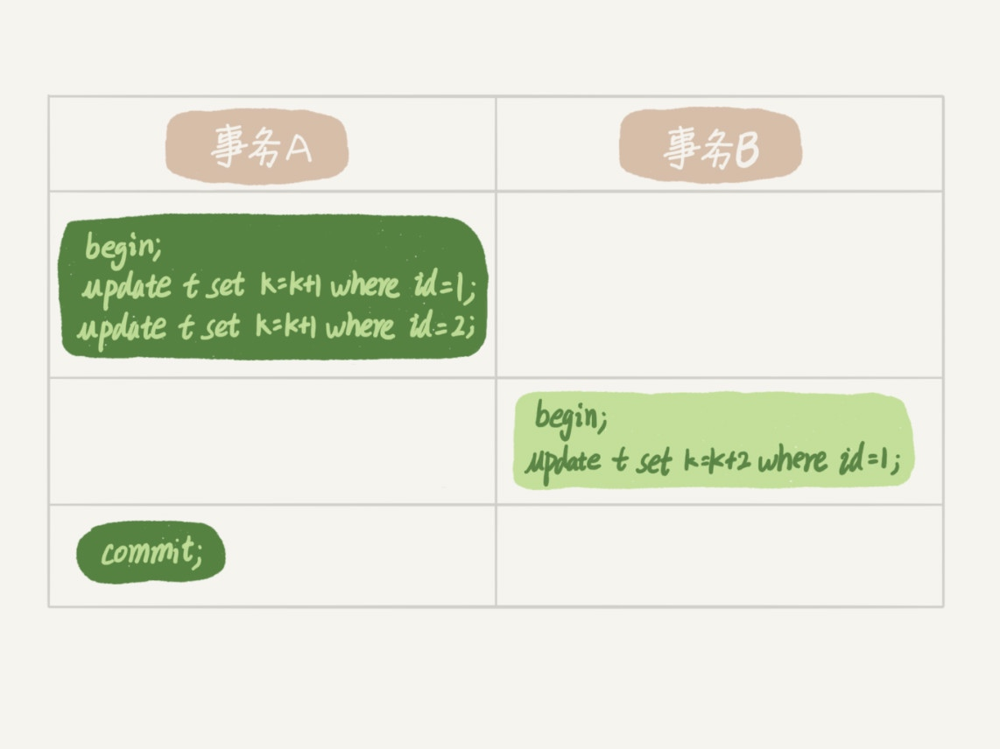
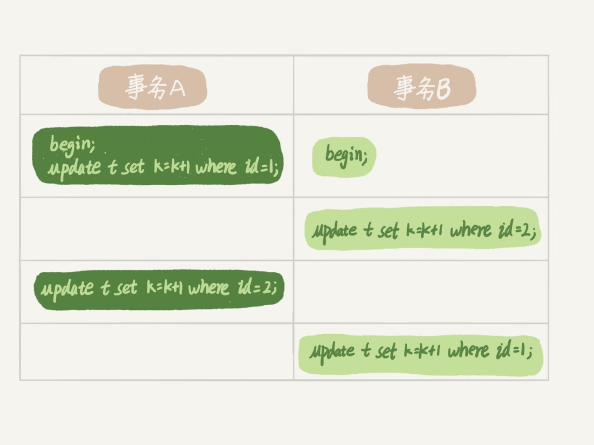

# 行锁

MySQL 的行锁是在引擎层由各个引擎自己实现的。但并不是所有的引擎都支持行锁，比如 MyISAM 引擎就不支持行锁。

不支持行锁意味着并发控制只能使用表锁，对于这种引擎的表，同一张表上任何时刻只能有一个更新在执行，这就会影响到业务并发度。InnoDB 是支持行锁的，这也是 MyISAM 被 InnoDB 替代的重要原因之一。

## 两阶段锁

事务 B 的 update 语句会被阻塞，直到事务 A 执行 commit 之后，事务 B 才能继续执行。

**在 InnoDB 事务中，行锁是在需要的时候才加上的，但并不是不需要了就立刻释放，而是要等到事务结束时才释放。这个就是两阶段锁协议。**

**如果你的事务中需要锁多个行，要把最可能造成锁冲突、最可能影响并发度的锁尽量往后放。**

## 死锁和死锁检测

事务 A 和事务 B 在互相等待对方的资源释放，就是进入了死锁状态。

### 解决策略

1. 直接进入等待，直到超时。这个超时时间可以通过参数 innodb_lock_wait_timeout 来设置。
2. 发起死锁检测，发现死锁后，主动回滚死锁链条中的某一个事务，让其他事务得以继续执行。将参数 innodb_deadlock_detect 设置为 on，表示开启这个逻辑。

在 InnoDB 中，innodb_lock_wait_timeout 的默认值是 50s，意味着如果采用第一个策略，当出现死锁以后，第一个被锁住的线程要过 50s 才会超时退出，然后其他线程才有可能继续执行。对于在线服务来说，这个等待时间往往是无法接受的。

但是，我们又不可能直接把这个时间设置成一个很小的值，比如 1s。这样当出现死锁的时候，确实很快就可以解开，但如果不是死锁，而是简单的锁等待呢？所以，超时时间设置太短的话，会出现很多误伤。

主动死锁检测，innodb_deadlock_detect 的默认值本身就是 on。主动死锁检测在发生死锁的时候，是能够快速发现并进行处理的，但是它也是有额外负担的。

*每当一个事务被锁的时候，就要看看它所依赖的线程有没有被别人锁住，如此循环，最后判断是否出现了循环等待，也就是死锁。*

### 怎么解决由这种热点行更新导致的性能问题呢？

1. 确保这个业务一定不会出现死锁，可以临时把死锁检测关掉。

    这种操作本身带有一定的风险，因为业务设计的时候一般不会把死锁当做一个严重错误，毕竟出现死锁了，就回滚，然后通过业务重试一般就没问题了，这是业务无损的。
    而关掉死锁检测意味着可能会出现大量的超时，这是业务有损的。

2. 控制并发度。

    1. 在客户端做并发控制。（当客户端很多时，这个方法不行，并发控制要做在数据库服务端）
    2. 在中间件实现。
    3. 修改 MySQL 源码（对于相同行的更新，在进入引擎之前排队。）
    4. 可以考虑通过将一行改成逻辑上的多行来减少锁冲突。（这个方案看上去是无损的，但其实这类方案需要根据业务逻辑做详细设计。如果账户余额可能会减少，比如退票逻辑，那么这时候就需要考虑当一部分行记录变成 0 的时候，代码要有特殊处理。）

## 删除一个表里面的前 10000 行数据

第一种，直接执行 delete from T limit 10000;

单个语句占用时间长，锁的时间也比较长；而且大事务还会导致主从延迟。

第二种，在一个连接中循环执行 20 次 delete from T limit 500;

第三种，在 20 个连接中同时执行 delete from T limit 500。

会人为造成锁冲突。

## 评论区

死锁检测innodb_deadlock_detect我想请教一下，是每条事务执行前都会进行检测吗？

如果他要加锁访问的行上有锁，他才要检测。

1. 一致性读不会加锁，就不需要做死锁检测；

2. 并不是每次死锁检测都都要扫所有事务。比如某个时刻，事务等待状态是这样的：

   B在等A，
   D在等C，
   现在来了一个E，发现E需要等D，那么E就判断跟D、C是否会形成死锁，这个检测不用管B和A

---

innodb行级锁是通过锁索引记录实现的。如果update的列没建索引，即使只update一条记录也会锁定整张表吗？

是的

---

MDL锁和表锁是两个不同的结构。

比如：
你要在myisam 表上更新一行，那么会加MDL读锁和表的写锁；
然后同时另外一个线程要更新这个表上另外一行，也要加MDL读锁和表写锁。

第二个线程的*MDL读锁是能成功加上*的，但是被表写锁堵住了。从语句现象上看，就是第二个线程要等第一个线程执行完成。

---

1.如何在死锁发生时,就把发生的sql语句抓出来？

show engine innodb status 里面有信息，不过不是很全…

2. 在使用连接池的情况下,连接会复用.比如一个业务使用连接set sql_select_limit=1,释放掉以后.其他业务复用该连接时,这个参数也生效.请问怎么避免这种情况,或者怎么禁止业务set session？

5.7的reset_connection接口可以考虑一下

