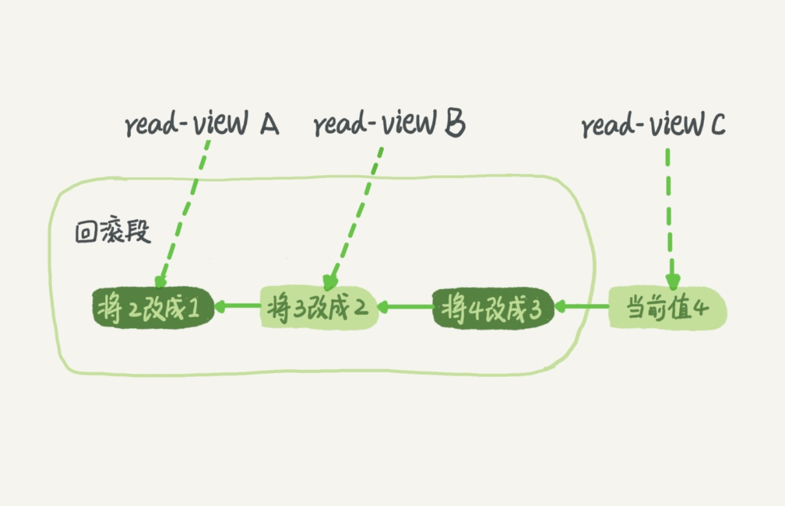

# 事务隔离

在 MySQL 中，事务支持是在引擎层实现的。

MySQL 原生的 MyISAM 引擎就不支持事务，这也是 MyISAM 被 InnoDB 取代的重要原因之一。

## 隔离性与隔离级别

**ACID**（Atomicity、Consistency、Isolation、Durability，即原子性、一致性、隔离性、持久性）

当数据库上有多个事务同时执行的时候，就可能出现*脏读（dirty read）*、*不可重复读（non-repeatable read）*（读-读）、*幻读（phantom read）*（读-写，用写来证实读的是鬼影。）的问题，为了解决这些问题，就有了“隔离级别”的概念。

> [关于幻读，可重复读的真实用例是什么？ - bigcat的回答 - 知乎](https://www.zhihu.com/question/47007926/answer/222348887)

隔离得越严实，效率就会越低。我们要在二者之间寻找一个平衡点。

SQL 标准的事务隔离级别包括：读未提交（read uncommitted）、读提交（read committed）、可重复读（repeatable read）和串行化（serializable ）。

+ **读未提交**是指，一个事务还没提交时，它做的变更就能被别的事务看到。
+ **读提交**是指，一个事务提交之后，它做的变更才会被其他事务看到。
+ **可重复读**是指，一个事务执行过程中看到的数据，总是跟这个事务在启动时看到的数据是一致的。当然在可重复读隔离级别下，未提交变更对其他事务也是不可见的。
+ **串行化**，顾名思义是对于同一行记录，“写”会加“写锁”，“读”会加“读锁”。当出现读写锁冲突的时候，后访问的事务必须等前一个事务执行完成，才能继续执行。


**在实现上，数据库里面会创建一个视图，访问的时候以视图的逻辑结果为准。**

在“可重复读”隔离级别下，这个视图是在事务启动时创建的，整个事务存在期间都用这个视图。
在“读提交”隔离级别下，这个视图是在每个 SQL 语句开始执行的时候创建的。
在“读未提交”隔离级别下直接返回记录上的最新值，没有视图概念；
在“串行化”隔离级别下直接用加锁的方式来避免并行访问。


*Oracle* 数据库的默认隔离级别其实就是“读提交”，因此对于一些从 Oracle 迁移到 MySQL 的应用，为保证数据库隔离级别的一致，你一定要记得将 MySQL 的隔离级别设置为“读提交”。

```sql
show variables like 'transaction_isolation';
```

### “可重复读”的场景

数据校对逻辑的案例。

## 事务隔离的实现

在 MySQL 中，实际上每条记录在更新的时候都会同时记录一条回滚操作。记录上的最新值，通过回滚操作，都可以得到前一个状态的值。



当前值是 4，但是在查询这条记录的时候，不同时刻启动的事务会有不同的 read-view。

如图中看到的，在视图 A、B、C 里面，这一个记录的值分别是 1、2、4，同一条记录在系统中可以存在多个版本，就是数据库的多版本并发控制（MVCC）。

对于 read-view A，要得到 1，就必须将当前值依次执行图中所有的回滚操作得到。同时你会发现，即使现在有另外一个事务正在将 4 改成 5，这个事务跟 read-view A、B、C 对应的事务是不会冲突的。

### 回滚日志什么时候删除

在不需要的时候才删除。也就是说，系统会判断，当没有事务再需要用到这些回滚日志时，回滚日志会被删除。

当系统里没有比这个回滚日志更早的 read-view 的时候。

### 建议你尽量不要使用长事务

长事务意味着系统里面会存在很老的事务视图。由于这些事务随时可能访问数据库里面的任何数据，所以这个事务提交之前，数据库里面它可能用到的回滚记录都必须保留，这就会导致大量占用存储空间。

在 MySQL 5.5 及以前的版本，回滚日志是跟数据字典一起放在 ibdata 文件里的，即使长事务最终提交，回滚段被清理，文件也不会变小。我见过数据只有 20GB，而回滚段有 200GB 的库。最终只好为了清理回滚段，重建整个库。

除了对回滚段的影响，长事务还占用锁资源，也可能拖垮整个库。

## 事务的启动方式

1. 显式启动事务语句， begin 或 start transaction。配套的提交语句是 commit，回滚语句是 rollback。
2. set autocommit=0，这个命令会将这个线程的自动提交关掉。意味着如果你只执行一个 select 语句，这个事务就启动了，而且并不会自动提交。这个事务持续存在直到你主动执行 commit 或 rollback 语句，或者断开连接。

**建议总是使用 set autocommit=1, 通过显式语句的方式来启动事务。**

### commit work and chain 语法

在 autocommit 为 1 的情况下，用 begin 显式启动的事务，如果执行 commit 则提交事务。

如果执行 commit work and chain，则是提交事务并自动启动下一个事务，这样也省去了再次执行 begin 语句的开销。同时带来的好处是从程序开发的角度明确地知道每个语句是否处于事务中。

### 查询长事务

```sql
// 查找持续时间超过 60s 的事务
select * from information_schema.innodb_trx where TIME_TO_SEC(timediff(now(),trx_started))>60;
```

## 如何避免长事务对业务的影响？

### 从应用开发端来看

1. 确认是否使用了 set autocommit=0。这个确认工作可以在测试环境中开展，把 MySQL 的 general_log 开起来，然后随便跑一个业务逻辑，通过 general_log 的日志来确认。一般框架如果会设置这个值，也就会提供参数来控制行为，你的目标就是把它改成 1。
2. 确认是否有不必要的只读事务。有些框架会习惯不管什么语句先用 begin/commit 框起来。我见过有些是业务并没有这个需要，但是也把好几个 select 语句放到了事务中。这种只读事务可以去掉。
3. 业务连接数据库的时候，根据业务本身的预估，通过 SET MAX_EXECUTION_TIME 命令，来控制每个语句执行的最长时间，避免单个语句意外执行太长时间。（为什么会意外？在后续的文章中会提到这类案例）

```sql
show variables like 'general%';
// 开启 general_log
set global general_log=1;

show variables like 'MAX_EXECUTION_TIME%';
```

### 从数据库端来看

1. 监控 information_schema.Innodb_trx 表，设置长事务阈值，超过就报警 / 或者 kill；
2. Percona 的 pt-kill 这个工具不错，推荐使用；
3. 在业务功能测试阶段要求输出所有的 general_log，分析日志行为提前发现问题；
4. 如果使用的是 MySQL 5.6 或者更新版本，把 innodb_undo_tablespaces 设置成 2（或更大的值）。如果真的出现大事务导致回滚段过大，这样设置后清理起来更方便。


