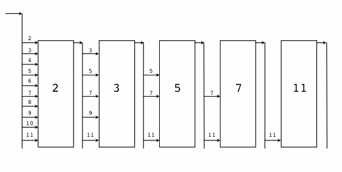

# Concurrent Mode

## Producer Consumer

```golang
// 生产者: 生成 factor 整数倍的序列
func Producer(factor int, out chan<- int) {
    for i := 0; ; i++ {
        out <- i * factor
    }
}

// 消费者
func Consumer(in <-chan int) {
    for v := range in {
        fmt.Println(v)
    }
}

func main() {
    ch := make(chan int, 64) // 成果队列

    go Producer(3, ch) // 生成 3 的倍数的序列
    go Producer(5, ch) // 生成 5 的倍数的序列
    go Consumer(ch)    // 消费 生成的队列

    // Ctrl+C 退出
    sig := make(chan os.Signal, 1)
    signal.Notify(sig, syscall.SIGINT, syscall.SIGTERM)
    fmt.Printf("quit (%v)\n", <-sig)
}
```

## pub/sub - publish-and-subscribe

```golang
type (
    subscriber chan interface{}         // 订阅者为一个管道
    topicFunc  func(v interface{}) bool // 主题为一个过滤器
)

// 发布者对象
type Publisher struct {
    m           sync.RWMutex             // 读写锁
    buffer      int                      // 订阅队列的缓存大小
    timeout     time.Duration            // 发布超时时间
    subscribers map[subscriber]topicFunc // 订阅者信息
}

// 构建一个发布者对象, 可以设置发布超时时间和缓存队列的长度
func NewPublisher(publishTimeout time.Duration, buffer int) *Publisher {
    return &Publisher{
        buffer:      buffer,
        timeout:     publishTimeout,
        subscribers: make(map[subscriber]topicFunc),
    }
}

// 添加一个新的订阅者，订阅全部主题
func (p *Publisher) Subscribe() chan interface{} {
    return p.SubscribeTopic(nil)
}

// 添加一个新的订阅者，订阅过滤器筛选后的主题
func (p *Publisher) SubscribeTopic(topic topicFunc) chan interface{} {
    ch := make(chan interface{}, p.buffer)
    p.m.Lock()
    p.subscribers[ch] = topic
    p.m.Unlock()
    return ch
}

// 退出订阅
func (p *Publisher) Evict(sub chan interface{}) {
    p.m.Lock()
    defer p.m.Unlock()

    delete(p.subscribers, sub)
    close(sub)
}

// 发布一个主题
func (p *Publisher) Publish(v interface{}) {
    p.m.RLock()
    defer p.m.RUnlock()

    var wg sync.WaitGroup
    for sub, topic := range p.subscribers {
        wg.Add(1)
        go p.sendTopic(sub, topic, v, &wg)
    }
    wg.Wait()
}

// 关闭发布者对象，同时关闭所有的订阅者管道。
func (p *Publisher) Close() {
    p.m.Lock()
    defer p.m.Unlock()

    for sub := range p.subscribers {
        delete(p.subscribers, sub)
        close(sub)
    }
}

// 发送主题，可以容忍一定的超时
func (p *Publisher) sendTopic(
    sub subscriber, topic topicFunc, v interface{}, wg *sync.WaitGroup,
) {
    defer wg.Done()
    if topic != nil && !topic(v) {
        return
    }

    select {
    case sub <- v:
    case <-time.After(p.timeout):
    }
}

func main() {
    p := NewPublisher(100*time.Millisecond, 10)
    defer p.Close()

    all := p.Subscribe()
    golang := p.SubscribeTopic(func(v interface{}) bool {
        if s, ok := v.(string); ok {
            return strings.Contains(s, "golang")
        }
        return false
    })

    p.Publish("hello,  world!")
    p.Publish("hello, golang!")

    go func() {
        for msg := range all {
            fmt.Println("all:", msg)
        }
    }()

    go func() {
        for msg := range golang {
            fmt.Println("golang:", msg)
        }
    }()

    // 运行一定时间后退出
    time.Sleep(3 * time.Second)

}
```

## 控制并发数

```golang
type gate chan bool

func (g gate) enter() { g <- true }
func (g gate) leave() { <-g }

type gatefs struct {
    fs vfs.FileSystem
    gate
}

func (fs gatefs) Lstat(p string) (os.FileInfo, error) {
    fs.enter()
    defer fs.leave()
    return fs.fs.Lstat(p)
}
```

不仅可以控制最大的并发数目，而且可以通过带缓存 Channel 的使用量和最大容量比例来判断程序运行的并发率。当管道为空的时候可以认为是空闲状态，当管道满了时任务是繁忙状态，这对于后台一些低级任务的运行是有参考价值的。

## 快速响应

```golang
func main() {
    ch := make(chan string, 32)

    go func() {
        ch <- searchByBing("golang")
    }()
    go func() {
        ch <- searchByGoogle("golang")
    }()
    go func() {
        ch <- searchByBaidu("golang")
    }()

    fmt.Println(<-ch)
}
```

最终我们只从管道取第一个结果，也就是最先返回的结果。

通过适当开启一些冗余的线程，尝试用不同途径去解决同样的问题，最终以赢者为王的方式提升了程序的相应性能。

## 素数筛



```golang

// 素数筛
// 返回生成自然数序列的管道: 2, 3, 4, ...
func GenerateNatural() chan int {
    ch := make(chan int)
    go func() {
        for i := 2; ; i++ {
            ch <- i
        }
    }()
    return ch
}

// 管道过滤器: 删除能被素数整除的数
func PrimeFilter(in <-chan int, prime int) chan int {
    out := make(chan int)
    go func() {
        for {
            if i := <-in; i%prime != 0 {
                out <- i
            }
        }
    }()
    return out
}

func main() {
    ch := GenerateNatural() // 自然数序列: 2, 3, 4, ...
    for i := 0; i < 100; i++ {
        prime := <-ch // 新出现的素数
        fmt.Printf("%v: %v\n", i+1, prime)
        ch = PrimeFilter(ch, prime) // 基于新素数构造的过滤器
    }
}
```

在每次循环迭代开始的时候，管道中的第一个数必定是素数，我们先读取并打印这个素数。然后基于管道中剩余的数列，并以当前取出的素数为筛子过滤后面的素数。不同的素数筛子对应的管道是串联在一起的。

## 安全退出

```golang
func worker(wg *sync.WaitGroup, cannel chan bool) {
    defer wg.Done()

    for {
        select {
        default:
            fmt.Println("hello")
        case <-cannel:
            return
        }
    }
}

func main() {
    cancel := make(chan bool)

    var wg sync.WaitGroup
    for i := 0; i < 10; i++ {
        wg.Add(1)
        go worker(&wg, cancel)
    }

    time.Sleep(time.Second)
    close(cancel)
    wg.Wait()
}
```

## context

```golang
func worker(ctx context.Context, wg *sync.WaitGroup) error {
    defer wg.Done()

    for {
        select {
        default:
            fmt.Println("hello")
        case <-ctx.Done():
            return ctx.Err()
        }
    }
}

func main() {
    ctx, cancel := context.WithTimeout(context.Background(), 10*time.Second)

    var wg sync.WaitGroup
    for i := 0; i < 10; i++ {
        wg.Add(1)
        go worker(ctx, &wg)
    }

    time.Sleep(time.Second)
    cancel()

    wg.Wait()
}
```

```golang
// 返回生成自然数序列的管道: 2, 3, 4, ...
func GenerateNatural(ctx context.Context) chan int {
    ch := make(chan int)
    go func() {
        for i := 2; ; i++ {
            select {
            case <-ctx.Done():
                return
            case ch <- i:
            }
        }
    }()
    return ch
}

// 管道过滤器: 删除能被素数整除的数
func PrimeFilter(ctx context.Context, in <-chan int, prime int) chan int {
    out := make(chan int)
    go func() {
        for {
            if i := <-in; i%prime != 0 {
                select {
                case <-ctx.Done():
                    return
                case out <- i:
                }
            }
        }
    }()
    return out
}

func main() {
    // 通过 Context 控制后台Goroutine状态
    ctx, cancel := context.WithCancel(context.Background())

    ch := GenerateNatural(ctx) // 自然数序列: 2, 3, 4, ...
    for i := 0; i < 100; i++ {
        prime := <-ch // 新出现的素数
        fmt.Printf("%v: %v\n", i+1, prime)
        ch = PrimeFilter(ctx, ch, prime) // 基于新素数构造的过滤器
    }

    cancel()
}
```

当 main 函数完成工作前，通过调用 cancel()来通知后台 Goroutine 退出，这样就避免了 Goroutine 的泄漏。
