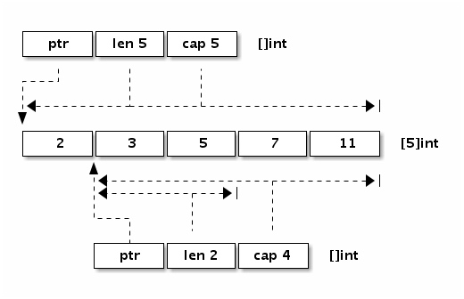

# Slice

**引用类型**

## 底层结构

reflect.SliceHeader

```golang
type SliceHeader struct {
    Data uintptr
    Len  int
    Cap  int
}
```



## 定义方式

```golang
var (
    a []int               // nil切片, 和 nil 相等, 一般用来表示一个不存在的切片
    b = []int{}           // 空切片, 和 nil 不相等, 一般用来表示一个空的集合
    c = []int{1, 2, 3}    // 有3个元素的切片, len和cap都为3
    d = c[:2]             // 有2个元素的切片, len为2, cap为3
    e = c[0:2:cap(c)]     // 有2个元素的切片, len为2, cap为3
    f = c[:0]             // 有0个元素的切片, len为0, cap为3
    g = make([]int, 3)    // 有3个元素的切片, len和cap都为3
    h = make([]int, 2, 3) // 有2个元素的切片, len为2, cap为3
    i = make([]int, 0, 3) // 有0个元素的切片, len为0, cap为3
)
```

在对切片本身赋值或参数传递时，和数组指针的操作方式类似，只是复制切片头信息（reflect.SliceHeader），并不会复制底层的数据。

对于类型，和数组的最大不同是，切片的类型和长度信息无关，只要是相同类型元素构成的切片均对应相同的切片类型。

## append

在容量不足的情况下，append 的操作会导致重新分配内存，可能导致巨大的内存分配和复制数据代价。即使容量足够，依然需要用 append 函数的返回值来更新切片本身，因为新切片的长度已经发生了变化。

```golang
// 开头添加
var a = []int{1,2,3}
a = append([]int{0}, a...)        // 在开头添加1个元素
a = append([]int{-3,-2,-1}, a...) // 在开头添加1个切片

// 中间插入
var a []int
a = append(a[:i], append([]int{x}, a[i:]...)...)     // 在第i个位置插入x
a = append(a[:i], append([]int{1,2,3}, a[i:]...)...) // 在第i个位置插入切片

// 用copy和append组合可以避免创建中间的临时切片
a = append(a, 0)     // 切片扩展1个空间
copy(a[i+1:], a[i:]) // a[i:]向后移动1个位置
a[i] = x             // 设置新添加的元素

a = append(a, x...)       // 为x切片扩展足够的空间
copy(a[i+len(x):], a[i:]) // a[i:]向后移动len(x)个位置
copy(a[i:], x)            // 复制新添加的切片


// 删除开头的元素，原地
a = []int{1, 2, 3}
a = append(a[:0], a[1:]...) // 删除开头1个元素
a = append(a[:0], a[N:]...) // 删除开头N个元素

a = []int{1, 2, 3}
a = a[:copy(a, a[1:])] // 删除开头1个元素
a = a[:copy(a, a[N:])] // 删除开头N个元素


// 删除中间元素，原地
a = []int{1, 2, 3, ...}

a = append(a[:i], a[i+1:]...) // 删除中间1个元素
a = append(a[:i], a[i+N:]...) // 删除中间N个元素

a = a[:i+copy(a[i:], a[i+1:])]  // 删除中间1个元素
a = a[:i+copy(a[i:], a[i+N:])]  // 删除中间N个元素
```

## 技巧

对于切片来说，len 为 0 但是 cap 容量不为 0 的切片则是非常有用的特性。

```golang
func TrimSpace(s []byte) []byte {
    b := s[:0]
    for _, x := range s {
        if x != ' ' {
            b = append(b, x)
        }
    }
    return b
}
```

切片高效操作的要点是要降低内存分配的次数，尽量保证 append 操作不会超出 cap 的容量，降低触发内存分配的次数和每次分配内存大小。

## 避免切片内存泄漏

切片操作并不会复制底层的数据。底层的数组会被保存在内存中，直到它不再被引用。但是有时候可能会因为一个小的内存引用而导致底层整个数组处于被使用的状态，这会延迟自动内存回收器对底层数组的回收。

```golang
// 这段代码返回的[]byte指向保存整个文件的数组。因为切片引用了整个原始数组，导致自动垃圾回收器不能及时释放底层数组的空间。
func FindPhoneNumber(filename string) []byte {
    b, _ := ioutil.ReadFile(filename)
    return regexp.MustCompile("[0-9]+").Find(b)
}

func FindPhoneNumber(filename string) []byte {
    b, _ := ioutil.ReadFile(filename)
    b = regexp.MustCompile("[0-9]+").Find(b)
    return append([]byte{}, b...)
}
```

数据的传值是 Go 语言编程的一个哲学，虽然传值有一定的代价，但是换取的好处是切断了对原始数据的依赖）

在删除切片元素时可能会遇到。假设切片里存放的是指针对象，那么下面删除末尾的元素后，被删除的元素依然被切片底层数组引用，从而导致不能及时被自动垃圾回收器回收（这要依赖回收器的实现方式）：

```golang
var a []*int{ ... }
a = a[:len(a)-1]    // 被删除的最后一个元素依然被引用, 可能导致GC操作被阻碍


// 保险的方式是先将需要自动内存回收的元素设置为nil，保证自动回收器可以发现需要回收的对象，然后再进行切片的删除操作：
var a []*int{ ... }
a[len(a)-1] = nil // GC回收最后一个元素内存
a = a[:len(a)-1]  // 从切片删除最后一个元素
```

当然，如果切片存在的周期很短的话，可以不用刻意处理这个问题。因为如果切片本身已经可以被 GC 回收的话，切片对应的每个元素自然也就是可以被回收的了。

## 切片类型强制转换

为了安全，当两个切片类型[]T 和[]Y 的底层原始切片类型不同时，Go 语言是无法直接转换类型的。不过安全都是有一定代价的，有时候这种转换是有它的价值的——可以简化编码或者是提升代码的性能。

比如在 64 位系统上，需要对一个 `[]float64`切片进行高速排序，我们可以将它强制转为[]int 整数切片，然后以整数的方式进行排序（因为 float64 遵循 IEEE754 浮点数标准特性，当浮点数有序时对应的整数也必然是有序的）。

```golang
// +build amd64 arm64

import "sort"

var a = []float64{4, 2, 5, 7, 2, 1, 88, 1}

func SortFloat64FastV1(a []float64) {
    // 强制类型转换
    var b []int = ((*[1 << 20]int)(unsafe.Pointer(&a[0])))[:len(a):cap(a)]

    // 以int方式给float64排序
    sort.Ints(b)
}

func SortFloat64FastV2(a []float64) {
    // 通过 reflect.SliceHeader 更新切片头部信息实现转换
    var c []int
    aHdr := (*reflect.SliceHeader)(unsafe.Pointer(&a))
    cHdr := (*reflect.SliceHeader)(unsafe.Pointer(&c))
    *cHdr = *aHdr

    // 以int方式给float64排序
    sort.Ints(c)
}
```

Go 语言实现中非 0 大小数组的长度不得超过 2GB，因此需要针对数组元素的类型大小计算数组的最大长度范围（[]uint8 最大 2GB，[]uint16 最大 1GB，以此类推，但是[]struct{}数组的长度可以超过 2GB）。

## 数组和切片的异同点

数组可以被叫做切片的底层数组，而切片也可以被看作是对数组的某个连续片段的引用。

### 共同点

都属于集合类的类型，并且，它们的值也都可以用来存储某一种类型的值（或者说元素）。

### 不同点

1. 数组类型的值（以下简称数组）的长度是固定的，而切片类型的值（以下简称切片）是可变长的。

2. 数组的长度在声明它的时候就必须给定，并且之后不会再改变。可以说，数组的长度是其类型的一部分。比如， `[1]string` 和 `[2]string` 就是两个不同的数组类型。而切片的类型字面量中只有元素的类型，而没有长度。切片的长度可以自动地随着其中元素数量的增长而增长，但不会随着元素数量的减少而减小。

3. Go 语言的切片类型属于引用类型，同属引用类型的还有字典类型、通道类型、函数类型等；而 Go 语言的数组类型则属于值类型，同属值类型的有基础数据类型以及结构体类型。

如果传递的值是引用类型的，那么就是“传引用”。如果传递的值是值类型的，那么就是“传值”。从传递成本的角度讲，引用类型的值往往要比值类型的值低很多。

在数组和切片之上都可以应用索引表达式，得到的都会是某个元素。我们在它们之上也都可以应用切片表达式，也都会得到一个新的切片。

通过调用内建函数 len，得到数组和切片的长度。通过调用内建函数 cap，我们可以得到它们的容量。但要注意，数组的容量永远等于其长度，都是不可变的。切片的容量却不是这样，并且它的变化是有规律可寻的。

```golang
s3 := []int{1, 2, 3, 4, 5, 6, 7, 8}
s4 := s3[3:6] // 左开右闭
fmt.Printf("The length fo s4: %d \n", len(s4))
fmt.Printf("The capacity fo s4: %d \n", cap(s4))
fmt.Printf("The value fo s4: %d \n", s4)
```

**有一个窗口，你可以通过这个窗口看到一个数组，但是不一定能看到该数组中的所有元素，有时候只能看到连续的一部分元素，一个切片的容量可以被看作是透过这个窗口最多可以看到的底层数组中元素的个数。**

切片的容量代表了它的底层数组的长度，但这仅限于使用 make 函数或者切片值字面量初始化切片的情况。

`s4[0:cap(s4)]`

## 切片容量的增长

扩容会生成一个容量更大的切片，然后将把原有的元素和新元素一并拷贝到新切片中。

在一般的情况下，你可以简单地认为新切片的容量（以下简称新容量）将会是原切片容量（以下简称原容量）的 2 倍。

当原切片的长度（以下简称原长度）大于或等于 1024 时，Go 语言将会以原容量的 1.25 倍作为新容量的基准（以下新容量基准）。

如果我们一次追加的元素过多，以至于使新长度比原容量的 2 倍还要大，那么新容量就会以新长度为基准。

更多细节可参见 runtime 包中 slice.go 文件里的 growslice 及相关函数的具体实现。

## 切片的底层数组什么时候会被替换？

它只是把新的切片作为了新底层数组的窗口，而没有对原切片，及其底层数组做任何改动。

在无需扩容时，append 函数返回的是指向原底层数组的新切片，而在需要扩容时，append 函数返回的是指向新底层数组的新切片。只要新长度不会超过切片的原容量，那么使用 append 函数对其追加元素的时候就不会引起扩容。这只会使紧邻切片窗口右边的（底层数组中的）元素被新的元素替换掉。

append 函数总会返回新的切片，而且如果新切片的容量比原切片的容量更大那么就意味着底层数组也是新的了。
