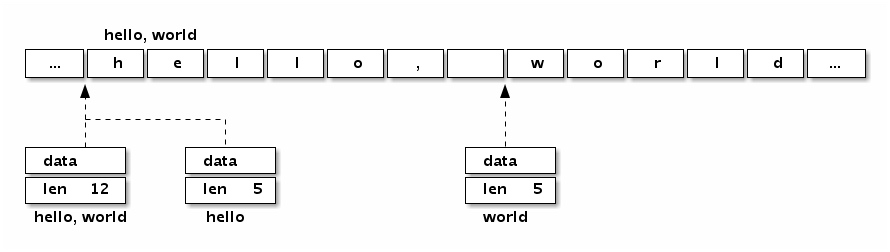

# string

一个字符串是一个不可改变的字节序列，字符串通常是用来包含人类可读的文本数据。和数组不同的是，字符串的元素不可修改，是一个只读的字节数组。每个字符串的长度虽然也是固定的，但是字符串的长度并不是字符串类型的一部分。

由于 Go 语言的源代码要求是 UTF8 编码，导致 Go 源代码中出现的字符串面值常量一般也是 UTF8 编码的。源代码中的文本字符串通常被解释为采用 UTF8 编码的 Unicode 码点（rune）序列。

因为字节序列对应的是只读的字节序列，因此字符串可以包含任意的数据，包括 byte 值 0。

我们也可以用字符串表示 GBK 等非 UTF8 编码的数据，不过这种时候将字符串看作是一个只读的二进制数组更准确，因为 for range 等语法并不能支持非 UTF8 编码的字符串的遍历。

## 底层结构

reflect.StringHeader

```golang
type StringHeader struct {
    Data uintptr
    Len  int
}
```

字符串结构由两个信息组成：第一个是字符串指向的底层字节数组，第二个是字符串的字节的长度。

字符串其实是一个结构体，因此字符串的赋值操作也就是 reflect.StringHeader 结构体的复制过程，并不会涉及底层字节数组的复制。在前面数组一节提到的[2]string 字符串数组对应的底层结构和[2]reflect.StringHeader 对应的底层结构是一样的，可以将字符串数组看作一个结构体数组。



字符串虽然不是切片，但是支持切片操作，不同位置的切片底层也访问的同一块内存数据（因为字符串是只读的，相同的字符串面值常量通常是对应同一个字符串常量）

字符串和数组类似，内置的 len 函数返回字符串的长度。也可以通过 reflect.StringHeader 结构访问字符串的长度（这里只是为了演示字符串的结构，并不是推荐的做法）：

```golang
fmt.Println("len(s):", (*reflect.StringHeader)(unsafe.Pointer(&s)).Len)   // 12
```

提到 Go 字符串时，我们一般都会假设字符串对应的是一个合法的 UTF8 编码的字符序列。可以用内置的 print 调试函数或 fmt.Print 函数直接打印，也可以用 for range 循环直接遍历 UTF8 解码后的 Unicode 码点值。

也可以在字符串面值中直指定 UTF8 编码后的值（源文件中全部是 ASCII 码，可以避免出现多字节的字符）。

```golang
fmt.Println("\xe4\xb8\x96") // 打印: 世
```

Go 语言的字符串中可以存放任意的二进制字节序列，而且即使是 UTF8 字符序列也可能会遇到坏的编码。如果遇到一个错误的 UTF8 编码输入，将生成一个特别的 Unicode 字符‘\uFFFD’，这个字符在不同的软件中的显示效果可能不太一样，在印刷中这个符号通常是一个黑色六角形或钻石形状，里面包含一个白色的问号‘�’。

如果不想解码 UTF8 字符串，想直接遍历原始的字节码，可以将字符串强制转为[]byte 字节序列后再行遍历（这里的转换一般不会产生运行时开销）：

```golang
for i, c := range []byte("世界abc") {
    fmt.Println(i, c)
}
```

## 类型转换

字符串相关的强制类型转换主要涉及到[]byte 和[]rune 两种类型。每个转换都可能隐含重新分配内存的代价，最坏的情况下它们的运算时间复杂度都是 O(n)。

不过字符串和[]rune 的转换要更为特殊一些，因为一般这种强制类型转换要求两个类型的底层内存结构要尽量一致，显然它们底层对应的[]byte 和[]int32 类型是完全不同的内部布局，因此这种转换可能隐含重新分配内存的操作。
