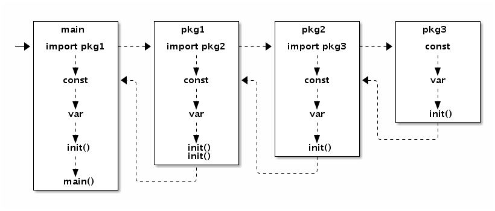

# Memory Mode

## 包初始化流程



在 main.main 函数执行之前所有代码都运行在同一个 goroutine，也就是程序的主系统线程中。因此，如果某个 init 函数内部用 go 关键字启动了新的 goroutine 的话，新的 goroutine 只有在进入 main.main 函数之后才可能被执行到。

如果某个 init 函数内部用 go 关键字启动了新的 Goroutine 的话，新的 Goroutine 和 main.main 函数是并发执行的。

## 顺序一致性

### 不同的 Goroutine 之间

原子操作同步保障有一个前提：顺序一致性的内存模型。

```golang
var a string
var done bool

func setup() {
    a = "hello, world"
    done = true
}

func main() {
    go setup()
    for !done {}
    print(a)
}
```

Go 语言并不保证在 main 函数中观测到的对 done 的写入操作发生在对字符串 a 的写入的操作之后，因此程序很可能打印一个空字符串。更糟糕的是，因为两个线程之间没有同步事件，setup 线程对 done 的写入操作甚至无法被 main 线程看到，main 函数有可能陷入死循环中。

在 Go 语言中，同一个 Goroutine 线程内部，顺序一致性内存模型是得到保证的。但是不同的 Goroutine 之间，并不满足顺序一致性内存模型，需要通过明确定义的同步事件来作为同步的参考。

如果两个事件不可排序，那么就说这两个事件是并发的。为了最大化并行，Go 语言的编译器和处理器在不影响上述规定的前提下可能会对执行语句重新排序（CPU 也会对一些指令进行乱序执行）。

```golang
func main() {
    go println("你好, 世界")
}
```

根据 Go 语言规范，main 函数退出时程序结束，不会等待任何后台线程。因为 Goroutine 的执行和 main 函数的返回事件是并发的，谁都有可能先发生，所以什么时候打印，能否打印都是未知的。

### Goroutine 和当前 Goroutine 对应函数返回的事件

go 语句会在当前 Goroutine 对应函数返回前创建新的 Goroutine。

```golang
var a string

func f() {
    print(a)
}

func hello() {
    a = "hello, world"
    go f()
}
```

执行 go f()语句创建 Goroutine 和 hello 函数是在同一个 Goroutine 中执行, 根据语句的书写顺序可以确定 Goroutine 的创建发生在 hello 函数返回之前, 但是新创建 Goroutine 对应的 f()的执行事件和 hello 函数返回的事件则是不可排序的，也就是并发的。调用 hello 可能会在将来的某一时刻打印"hello, world"，也很可能是在 hello 函数执行完成后才打印。

### Channel

happens-before

**对于从无缓冲 Channel 进行的接收，发生在对该 Channel 进行的发送完成之前。**

```golang
var done = make(chan bool)
var msg string

func aGoroutine() {
    msg = "你好, 世界"
    done <- true
}

func main() {
    go aGoroutine()
    <-done
    println(msg)
}
```

```golang
var done = make(chan bool)
var msg string

func aGoroutine() {
    msg = "hello, world"
    <-done
}
func main() {
    go aGoroutine()
    done <- true
    println(msg)
}
```

交换两个Goroutine中的接收和发送操作也是可以的（但是很危险），也可保证打印出“hello, world”。因为 main 线程中 done <- true 发送完成前，后台线程<-done 接收已经开始，这保证 msg = "hello, world"被执行了，所以之后 println(msg)的 msg 已经被赋值过了。简而言之，后台线程首先对 msg 进行写入，然后从 done 中接收信号，随后 main 线程向 done 发送对应的信号，最后执行 println 函数完成。

对于带缓冲的 Channel，对于 Channel 的第 K 个接收完成操作发生在第 K+C 个发送操作完成之前，其中 C 是 Channel 的缓存大小。

可以根据控制 Channel 的缓存大小来控制并发执行的 Goroutine 的最大数目。

```golang
var limit = make(chan int, 3)

func main() {
    for _, w := range work {
        go func() {
            limit <- 1
            w()
            <-limit
        }()
    }
    select{}
}
```

select{}是一个空的管道选择语句，该语句会导致 main 线程阻塞，从而避免程序过早退出。还有 for{}、<-make(chan int)等诸多方法可以达到类似的效果。因为 main 线程被阻塞了，如果需要程序正常退出的话可以通过调用 os.Exit(0)实现。

严谨的并发程序的正确性不应该是依赖于 CPU 的执行速度和休眠时间等不靠谱的因素的。严谨的并发也应该是可以静态推导出结果的：根据线程内顺序一致性，结合 Channel 或 sync 同步事件的可排序性来推导，最终完成各个线程各段代码的偏序关系排序。如果两个事件无法根据此规则来排序，那么它们就是并发的，也就是执行先后顺序不可靠的。
