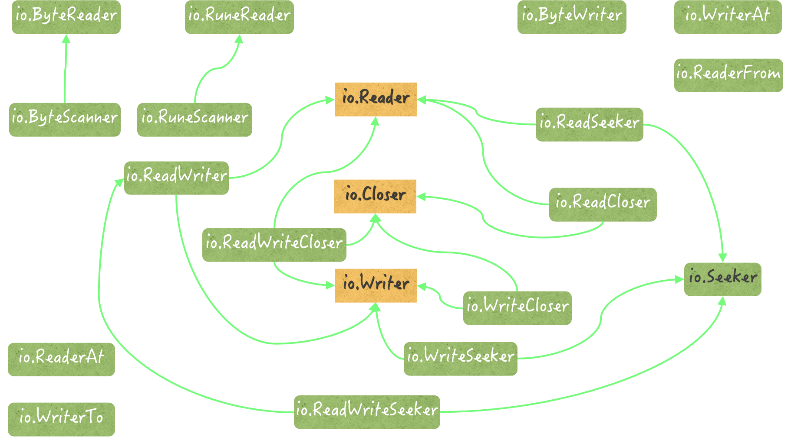

# io

面向接口编程

使用小接口加接口组合的方式

## 在 io 包中，io.Reader 的扩展接口和实现类型都有哪些？它们分别都有什么功用？

### 扩展接口

-   io.ReadWriter：此接口既是 io.Reader 的扩展接口，也是 io.Writer 的扩展接口。换句话说，该接口定义了一组行为，包含且仅包含了基本的字节序列读取方法 Read，和字节序列写入方法 Write。
-   io.ReadCloser：此接口除了包含基本的字节序列读取方法之外，还拥有一个基本的关闭方法 Close。后者一般用于关闭数据读写的通路。这个接口其实是 io.Reader 接口和 io.Closer 接口的组合。
-   io.ReadWriteCloser：很明显，此接口是 io.Reader、io.Writer 和 io.Closer 这三个接口的组合。
-   io.ReadSeeker：此接口的特点是拥有一个用于寻找读写位置的基本方法 Seek。更具体地说，该方法可以根据给定的偏移量基于数据的起始位置、末尾位置，或者当前读写位置去寻找新的读写位置。这个新的读写位置用于表明下一次读或写时的起始索引。Seek 是 io.Seeker 接口唯一拥有的方法。
-   io.ReadWriteSeeker：显然，此接口是另一个三合一的扩展接口，它是 io.Reader、io.Writer 和 io.Seeker 的组合。

### 实现类型

1. `*io.LimitedReader`：此类型的基本类型会包装 io.Reader 类型的值，并提供一个额外的受限读取的功能。所谓的受限读取指的是，此类型的读取方法 Read 返回的总数据量会受到限制，无论该方法被调用多少次。这个限制由该类型的字段 N 指明，单位是字节。

2. `*io.SectionReader`：此类型的基本类型可以包装 io.ReaderAt 类型的值，并且会限制它的 Read 方法，只能够读取原始数据中的某一个部分（或者说某一段）。这个数据段的起始位置和末尾位置，需要在它被初始化的时候就指明，并且之后无法变更。该类型值的行为与切片有些类似，它只会对外暴露在其窗口之中的那些数据。

3. `*io.teeReader`：此类型是一个包级私有的数据类型，也是 io.TeeReader 函数结果值的实际类型。这个函数接受两个参数 r 和 w，类型分别是 io.Reader 和 io.Writer。其结果值的 Read 方法会把 r 中的数据经过作为方法参数的字节切片 p 写入到 w。可以说，这个值就是 r 和 w 之间的数据桥梁，而那个参数 p 就是这座桥上的数据搬运者。

4. `io.multiReader`：此类型也是一个包级私有的数据类型。类似的，io 包中有一个名为 MultiReader 的函数，它可以接受若干个 io.Reader 类型的参数值，并返回一个实际类型为 io.multiReader 的结果值。当这个结果值的 Read 方法被调用时，它会顺序地从前面那些 io.Reader 类型的参数值中读取数据。因此，我们也可以称之为多对象读取器。

5. `io.pipe`：此类型为一个包级私有的数据类型，它比上述类型都要复杂得多。它不但实现了 io.Reader 接口，而且还实现了 io.Writer 接口。实际上，io.PipeReader 类型和 io.PipeWriter 类型拥有的所有指针方法都是以它为基础的。这些方法都只是代理了 io.pipe 类型值所拥有的某一个方法而已。又因为 io.Pipe 函数会返回这两个类型的指针值并分别把它们作为其生成的同步内存管道的两端，所以可以说，`*io.pipe` 类型就是 io 包提供的同步内存管道的核心实现。

6. `io.PipeReader`：此类型可以被视为 io.pipe 类型的代理类型。它代理了后者的一部分功能，并基于后者实现了 io.ReadCloser 接口。同时，它还定义了同步内存管道的读取端。

## 问题：io 包中的接口都有哪些？它们之间都有着怎样的关系？

简单接口

核心接口

io 包中的核心接口只有 3 个，它们是：io.Reader、io.Writer 和 io.Closer。

针对的 I/O 操作的不同，我还把简单接口分为了四大类。这四大类接口针对的操作分别是：读取、写入、关闭和读写位置设定。
