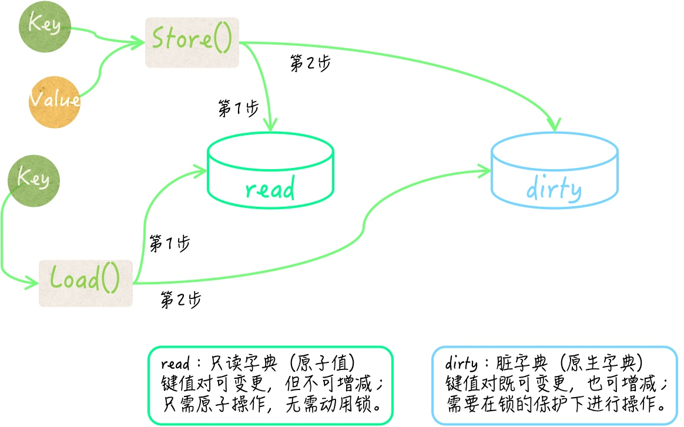
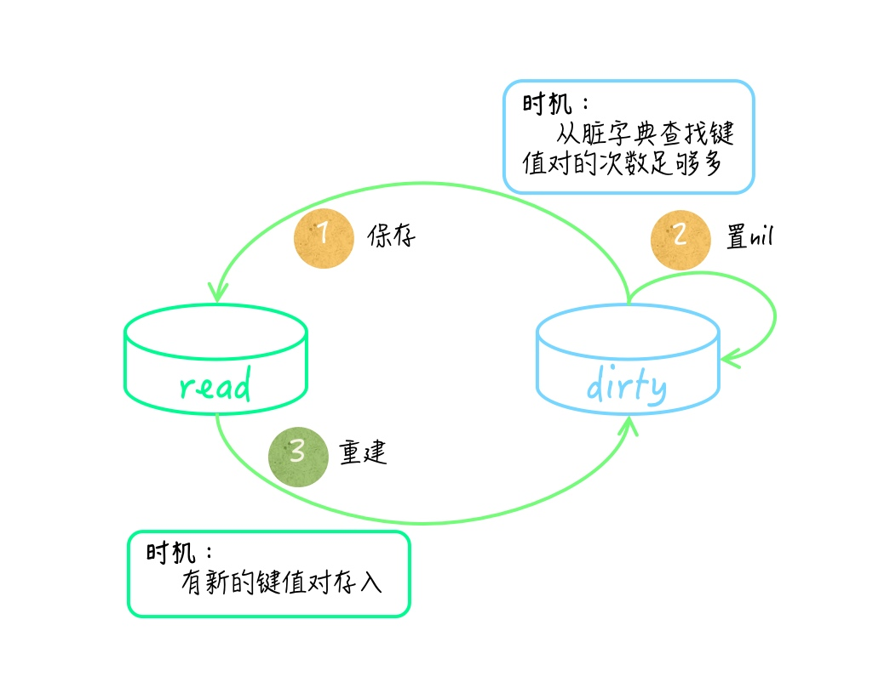

# sync.Map

## 并发安全字典对键的类型有要求吗？

键的实际类型不能是函数类型、字典类型和切片类型。Go 语言的原生字典的键类型不能是函数类型、字典类型和切片类型。

由于并发安全字典内部使用的存储介质正是原生字典，又因为它使用的原生字典键类型也是可以包罗万象的 interface{}；所以，我们绝对不能带着任何实际类型为函数类型、字典类型或切片类型的键值去操作并发安全字典。

由于这些键值的实际类型只有在程序运行期间才能够确定，所以 Go 语言编译器是无法在编译期对它们进行检查的，不正确的键值实际类型肯定会引发 panic。

把并发安全字典封装在一个结构体类型中，往往是一个很好的选择。

总之，我们必须保证键的类型是可比较的（或者说可判等的）。如果你实在拿不准，那么可以先通过调用 reflect.TypeOf 函数得到一个键值对应的反射类型值（即：reflect.Type 类型的值），然后再调用这个值的 Comparable 方法，得到确切的判断结果。

## 问题 1：怎样保证并发安全字典中的键和值的类型正确性？

1. 使用类型断言表达式。
2. 反射操作来保证它们的类型正确性。

```golang
type ConcurrentMap struct {
    m sync.Map
    keyType reflect.Type
    valueType reflect.Type
}
```

它的字段 keyType 和 valueType，分别用于保存键类型和值类型。这两个字段的类型都是 reflect.Type，我们可称之为反射类型。这个类型可以代表 Go 语言的任何数据类型。并且，这个类型的值也非常容易获得：通过调用 reflect.TypeOf 函数并把某个样本值传入即可。

反射操作或多或少都会降低程序的性能。我们往往需要根据实际的应用场景，通过严谨且一致的测试，来获得和比较程序的各项指标，并以此作为方案选择的重要依据之一。

## 问题 2：并发安全字典如何做到尽量避免使用锁？

sync.Map 类型在内部使用了大量的原子操作来存取键和值，并使用了两个原生的 map 作为存储介质。

这两个字典在存储键和值的时候都只会存入它们的某个指针，而不是基本值。



### read 只读字典（使用原子值）

健值对可变更，但不可增减；只需原子操作，无需动用锁。

只读字典在存储键值对的时候，还在值之上封装了一层。它先把值转换为了 unsafe.Pointer 类型的值，然后再把后者封装，并储存在其中的原生字典中。如此一来，在变更某个键所对应的值的时候，就也可以使用原子操作了。

### dirty 脏字典（使用原生字典）

建值对即可变更，也可增减；需要在锁的保护下进行操作。

它存储键值对的方式与 read 字段中的原生字典一致，它的键类型也是 interface{}，并且同样是把值先做转换和封装后再进行储存的。

## sync.Map 中 read 与 dirty 的互换




