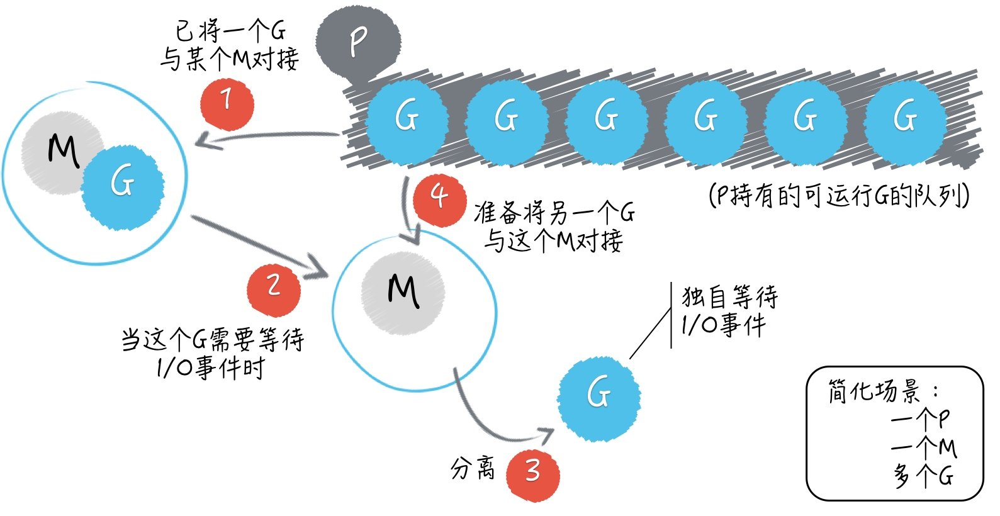

# go

Go 语言不但有着独特的并发编程模型，以及用户级线程 goroutine，还拥有强大的用于调度 goroutine、对接系统级线程的调度器。



这个调度器是 Go 语言运行时系统的重要组成部分，它主要负责统筹调配 Go 并发编程模型中的三个主要元素，即：G（goroutine 的缩写）、P（processor 的缩写）和 M（machine 的缩写）。

## 与线程的不同点

每个系统级线程都会有一个固定大小的栈（一般默认可能是 2MB），这个栈主要用来保存函数递归调用时参数和局部变量。固定了栈的大小导致了两个问题：一是对于很多只需要很小的栈空间的线程来说是一个巨大的浪费，二是对于少数需要巨大栈空间的线程来说又面临栈溢出的风险。

一个 Goroutine 会以一个很小的栈启动（可能是 2KB 或 4KB），当遇到深度递归导致当前栈空间不足时，Goroutine 会根据需要动态地伸缩栈的大小（主流实现中栈的最大值可达到 1GB）。因为启动的代价很小，所以我们可以轻易地启动成千上万个 Goroutine。

Goroutine 采用的是半抢占式的协作调度，只有在当前 Goroutine 发生阻塞时才会导致调度；同时发生在用户态，调度器会根据具体函数只保存必要的寄存器，切换的代价要比系统线程低得多。运行时有一个 runtime.GOMAXPROCS 变量，用于控制当前运行正常非阻塞 Goroutine 的系统线程数目。

## 什么是主 goroutine，它与我们启用的其他 goroutine 有什么不同？

每条 go 语句一般都会携带一个函数调用，这个被调用的函数常常被称为 go 函数。而主 goroutine 的 go 函数就是那个作为程序入口的 main 函数。

当程序执行到一条 go 语句的时候，Go 语言的运行时系统，会先试图从某个存放空闲的 G 的队列中获取一个 G，它只有在找不到空闲 G 的情况下才会去创建一个新的 G。在拿到了一个空闲的 G 之后，Go 语言运行时系统会用这个 G 去包装当前的那个 go 函数，然后再把这个 G 追加到某个存放可运行的 G 的队列中。这类队列中的 G 总是会按照先入先出的顺序，很快地由运行时系统内部的调度器安排运行。

严谨地讲，Go 语言并不会去保证这些 goroutine 会以怎样的顺序运行。由于主 goroutine 会与我们手动启用的其他 goroutine 一起接受调度，又因为调度器很可能会在 goroutine 中的代码只执行了一部分的时候暂停，以期所有的 goroutine 有更公平的运行机会。

## 问题 1：怎样才能让主 goroutine 等待其他 goroutine？

1. 最简单粗暴的办法就是让主 goroutine “小睡”一会儿。
2. Channel。声明一个通道，使它的容量与我们手动启用的 goroutine 的数量相同，之后再利用这个通道，让主 goroutine 等待其他 goroutine 的运行结束。

chan struct{}。其中的类型字面量 struct{} 有些类似于空接口类型 interface{}，它代表了既不包含任何字段也不拥有任何方法的空结构体类型。

注意，struct{} 类型值的表示法只有一个，即：struct{}{}。并且，它占用的内存空间是 0 字节。确切地说，这个值在整个 Go 程序中永远都只会存在一份。虽然我们可以无数次地使用这个值字面量，但是用到的却都是同一个值。

3. sync.WaitGroup

## 问题 2：怎样让我们启用的多个 goroutine 按照既定的顺序运行？

```golang
func main() {

    var count uint32 = 0

    trigger := func(i uint32, fn func()) {
        for {
            if n := atomic.LoadUint32(&count); n == i {
                fn()
                atomic.AddUint32(&count, 1)
                break
            }
            time.Sleep(time.Nanosecond)
        }
    }

    for i := uint32(0); i < 10; i++ {
        go func(i uint32) {
            fn := func() {
                fmt.Println(i)
            }
            trigger(i, fn)
        }(i)
    }

    trigger(10, func(){})
}
```

由于我选用的原子操作函数对被操作的数值的类型有约束，所以我才对 count 以及相关的变量和参数的类型进行了统一的变更（由 int 变为了 uint32 ）。

go 函数的实际执行顺序往往与其所属的 go 语句的执行顺序（或者说 goroutine 的启用顺序）不同，而且默认情况下的执行顺序是不可预知的。
